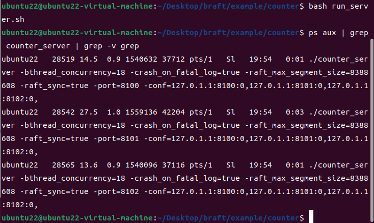
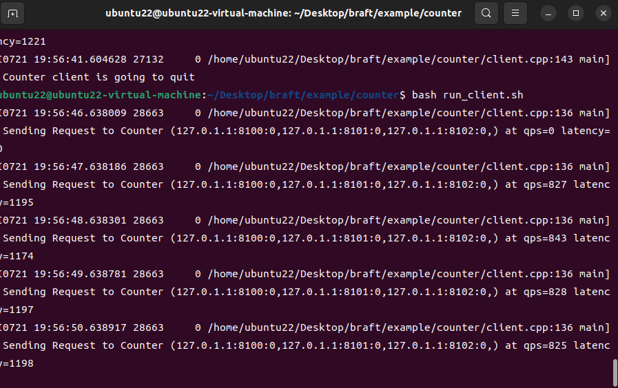
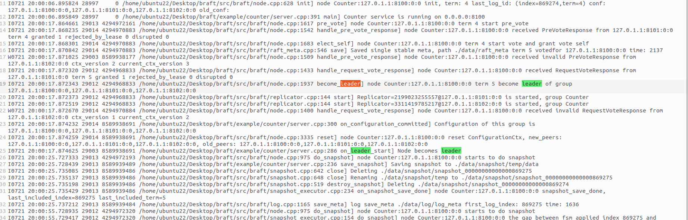
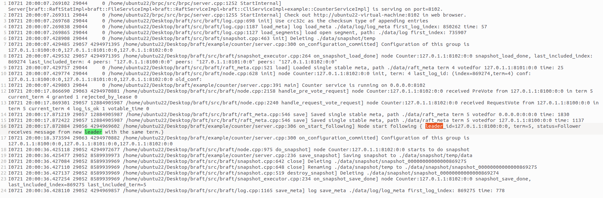
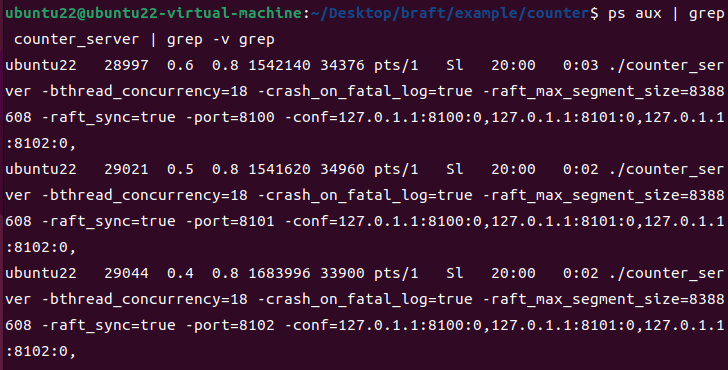
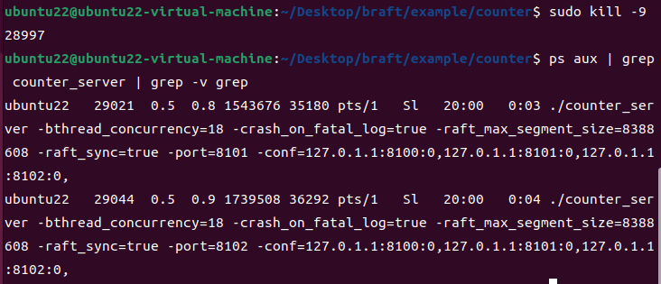
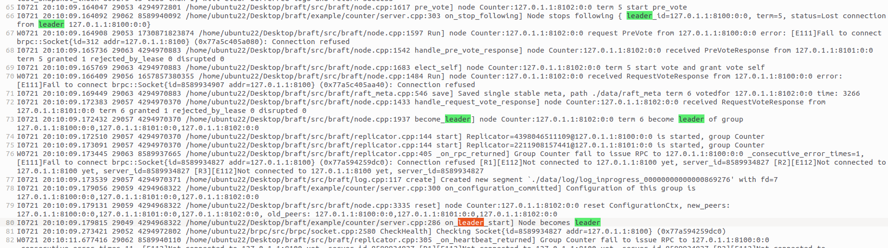
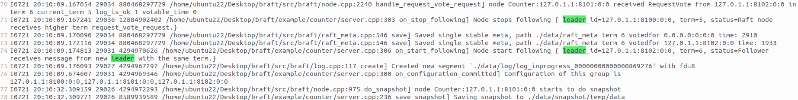

## 1、启动服务端集群

在 终端 1 中，执行启动脚本，默认会启动 3 个服务器节点，分别为端口8100、81001、8102

```
bash run_server.sh
```

同时执行以下命令行，查看所有运行的counter_server进程：

```
ps aux | grep counter_server | grep -v grep
```



## 2、运行客户端发送请求

保持服务端运行，打开终端 2，执行客户端脚本：

```
bash run_client.sh
```



## 3、确定领导人节点

由以下日志可以看出，3 服务端集群运行后，端口为8100的服务器节点被选为领导人：



其他服务器节点成为追随者，由以下日志内容可以体现：



## 4、模拟故障

领导人服务端节点端口为8100，同时由下图确定对应进程PID为：28997（与启动服务端集群使用图片中的运行批次不同，所以PID不同）。



使用强制杀死命令，终止8100端口的服务器进程，模拟出现故障，领导人节点被杀死。

```
sudo kill -9 28997
```



## 5、集群切换 Leader

在8100端口领导人被杀死后，集群重新选出新领导人，业务自动恢复，没有因为领导人的死亡而导致整个集群运行中断，由以下日志可得：端口8102服务器节点成为新领导人



其他节点成为新领导人的追随者：



这个过程中通过构建 → 运行 → 杀 Leader → 观察自动恢复 → 验证多数派 → 清理 这一完整流程，逐步验证了一个基于 Raft 共识算法 的分布式系统具备 高可用（容忍单点故障）、强一致（数据不丢不错） 和 自动容灾（秒级自愈） 的核心能力。