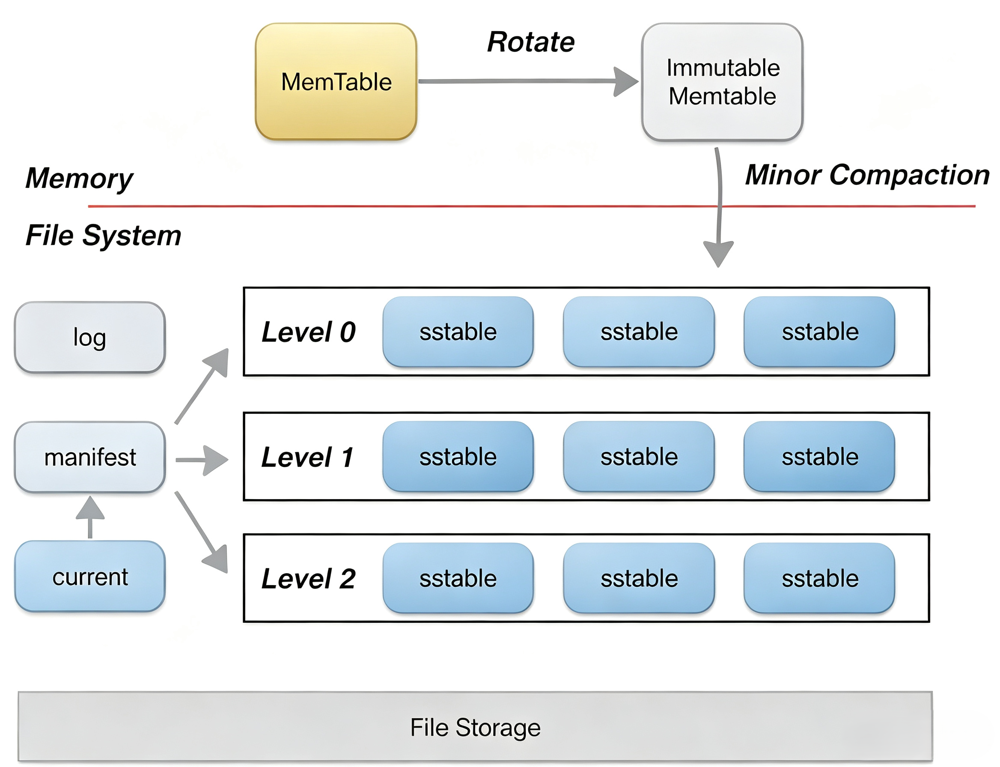
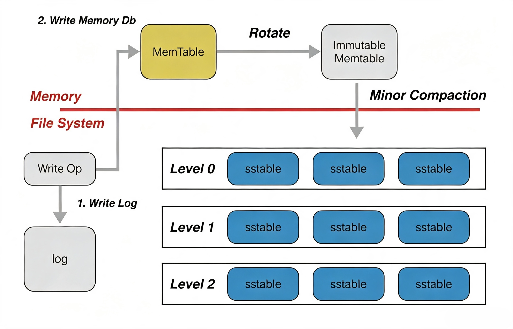
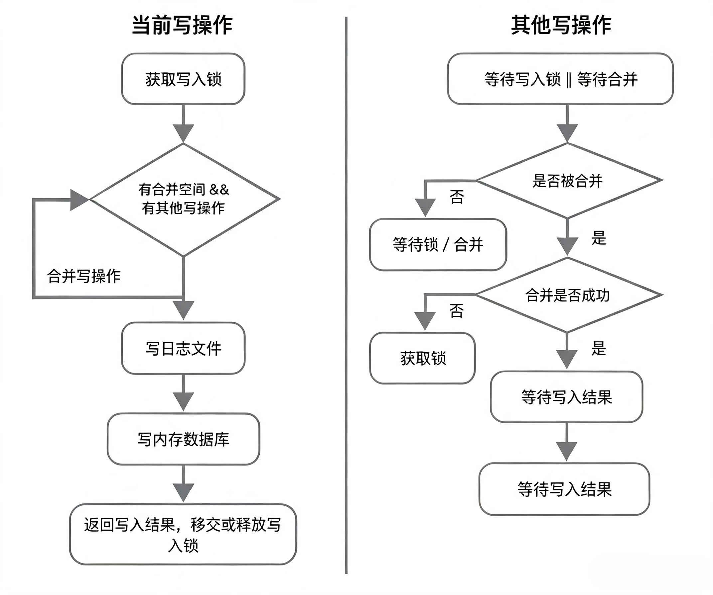

# 一、基本概念

leveldb是一个写性能十分优秀的存储引擎，是典型的LSM树(Log Structured-Merge Tree ”日志结构化合并“)实现。LSM树的核心思想就是放弃部分读的性能，换取最大的写入能力。

LSM树写性能极高的原理，简单地来说就是尽量减少随机写的次数。对于每次写入操作，并不是直接将最新的数据驻留在磁盘中，而是将其拆分成（1）一次日志文件的顺序写（2）一次内存中的数据插入。leveldb正是实践了这种思想，将数据首先更新在内存中，当内存中的数据达到一定的阈值，将这部分数据真正刷新到磁盘文件中，因而获得了极高的写性能（顺序写60MB/s, 随机写45MB/s）。

## 1.1 整体架构

> **图1.1** 这是 **LSM-Tree（日志结构合并树）** 的经典架构图，LevelDB、RocksDB、TiDB、RediSearch 等很多存储引擎都基于该模型，用于高性能键值数据库。主要写入流程为：先写入 WAL 预写日志（防止宕机丢失内存数据），然后写入 MemTable，在MemTable 写满后，轮转切换为 Immutable MemTable，后台线程执行 **Minor Compaction（小合并）**，将不可变内存表持久化为 SSTable，放入 Level0；后台持续执行跨层 **Major Compaction（大合并）**，上层 SSTable 与下层文件合并，清理重复 Key、删除墓碑标记，把数据下沉到更深层级。

leveldb中主要由以下几个重要的部件构成：

- memtable
- immutable memtable
- log(journal)
- sstable
- manifest
- current
  

## 1.2 memtable（内存表）

memtable就是一个在内存中进行数据组织与维护的结构。memtable中，所有的数据按用户定义的排序方法排序之后按序存储，等到其存储内容的容量达到阈值时（默认为4MB），便将其转换成一个**不可修改**的memtable，与此同时创建一个新的memtable，供用户继续进行读写操作。memtable底层使用了一种**跳表**数据结构，内部 Key 有序,这种数据结构效率可以比拟二叉查找树，绝大多数操作的时间复杂度为O(log n)。

> **跳表（Skip List）**是一种概率平衡的有序链表结构，通过维护多层“快速通道”索引，将有序链表的查找性能从 O(n) 提升至 O(log n)。 主要是针对 **有序的单链表** ，实现高效地查找，插入，删除。其根本思想是 **二分查找**的思想，即以空间换时间。具体内容可以参考https://blog.csdn.net/Appleeatingboy/article/details/119948340

## 1.3 immutable memtable（不可变内存表）

immutable memtable是由写满的 memTable 轮转切换而来，其结构定义与memtable完全一样，区别只是immutable memtable是只读的，等待后台线程执行 Minor Compaction（小合并），把整张表的数据导出，持久化到磁盘，生成 SSTable。在完成落盘之前，如果进程宕机，依靠 `log` 文件恢复这份数据。

## 1.4 log（预写日志）

全称 Write-Ahead Log，预写日志，存放在磁盘。leveldb在写内存之前会首先将所有的写操作写到日志文件中。当发生异常情况时，可以通过日志文件进行恢复，因为MemTable / Immutable MemTable 在内存中，断电、进程崩溃数据会直接丢失，重启数据库时，可以重放 log 文件，把尚未持久化到 SSTable 的数据恢复到内存。

## 1.5 sstable（磁盘持久化文件）

sstable磁盘上的静态持久化文件，LSM-Tree 磁盘端最核心的数据文件。文件内所有 Key 有序，支持二分查找。虽然在内存中，所有的数据都是按序排列的，但是当多个memetable数据持久化到磁盘后，对应的不同的sstable之间是存在交集的，在读操作时，需要对所有的sstable文件进行遍历，严重影响了读取效率。因此leveldb后台会“定期“整合这些sstable文件，该过程也称为**compaction**。采用**分层管理**，sstable文件在逻辑上被分成若干层，由内存数据直接dump出来的文件称为level 0层文件，后期整合而成的文件为level i 层文件，这也是**leveldb**这个名字的由来。

## 1.6 manifest（清单元数据文件）

manifest是数据库**核心元数据文件**，保存在磁盘。用于记录全部数据库元信息，每一层（Level0/1/2…）包含哪些 SSTable 文件、每个 SSTable 的 Key 区间、文件编号、文件状态等。每次发生 Compaction（新增 / 删除 SSTable），会生成一条新的元数据变更记录写入新的 manifest 文件。数据库启动时，加载 manifest，才能知道磁盘上所有 SSTable 的分布。

## 1.7 current（当前指针文件）

current是磁盘上一个极小的文本文件，只有一行字符串。用于记录**当前正在生效的最新 manifest 文件名称**。因为每次leveldb启动时，都会创建一个新的Manifest文件。因此数据目录可能会存在多个Manifest文件。Current则用来指出哪个Manifest文件才是我们关心的那个Manifest文件。

# 二、读写操作

levelDB的基础API只提供`Put`（写入）、`Get`（读取）、`Delete`（删除）三个最基础的操作，设计极简。具体体现在读写操作，以下为具体介绍。

## 2.1 写操作

### 2.1.1 概述

LevelDB 以高性能写入为核心优势，写入模块重点拆解三大维度：完整写入流程、底层数据编码结构、高性能写入优化方案。

### 2.1.2 写入整体流程

写入整体流程可以用以下结构图表示：

一次完整写入分为串行两步，顺序不可调换：

1. 将写入操作持久化写入 **WAL 日志文件**
2. 将操作落地至内存数据库（MemTable）

**补充说明**

- 先写日志设计的两大价值：保障宕机后数据不丢失、优化随机 IO 为顺序 IO，大幅提升写入性能。

> 【关键注解：写入丢失风险】
>
> 1. 仅**非同步写**模式存在数据丢失隐患：写入 WAL 后数据仅存操作系统页缓存，未刷入磁盘；此时整机系统宕机，缓存数据丢失，写入操作永久丢失。
> 2. 若仅进程异常退出（系统正常运行）：无丢失风险，操作系统会自动刷写缓存数据。
> 3. 开启同步刷盘（sync）可规避该风险，但会牺牲部分写入性能。

### 2.1.3 写入对外接口

**基础单条写入接口**

共两类基础接口，底层逻辑统一：

1. `Put(key, value)`：新增 / 更新键值对
2. `Delete(key)`：删除指定 Key

- 底层等价转换：Delete 会被编码为 **value 为空的 Put 操作**，无单独删除存储结构。

**批量原子写入：Batch**

- 作用：批量打包多条 Put/Delete，**整批操作原子执行**，要么全部生效、要么全部失败。
- 底层约束：所有单条 / 批量写入，都会封装为 `Batch` 实例，Batch 是 LevelDB 写入的最小执行单元。

### 2.1.4 Batch结构

在batch中，每一条数据项都按照下表格式进行编码：

| type | key length | key  | value length | value |
| :--: | :--------: | :--: | :----------: | :---: |

> - type：每条数据项的类型（更新还是删除）；
> - key length：数据项key的长度；
> - key：数据项key的内容；
> - value length：上value的长度；
> - value：value的内容。

1. Batch 内置 `size` 字段：记录批量数据总占用大小
2. size 计算规则：所有 Key、Value 长度累加 + 每条操作固定额外 8 字节元数据

### 2.1.5 内部键编码：InternalKey

用户传入的原始 Key 不会直接存储，写入内存前统一转换为内部编码， 即在leveldb内部，所有数据项的key是经过特殊编码的，这种格式称为internalKey。`InternalKey`：

| uKey | sequence number(7 bytes) | type(1 byte) |
| :--: | :----------------------: | :----------: |

- 格式：`用户原始Key + 尾部固定8字节附加信息`

- 8 字节附加信息分为两部分：

  1. Sequence Number（序列号）
  2. 当前操作类型（新增 / 删除）

  

**Sequence Number 核心作用**

1. 全局自增计数器：每执行一次写入操作，序列号 + 1；
2. 多版本存储：LevelDB 采用追加写入，**不原地覆盖旧数据**，同一个 Key 会保存多条不同序列号记录；序列号越大，数据版本越新；
3. 快照（Snapshot）底层实现：leveldb的快照（snapshot）也是基于这个sequence number实现的，即一个序列号对应数据库某一时刻完整状态。

### 2.1.6. 并发写入优化：合并写（Write Grouping）

**优化背景**

同一时间仅允许一个线程执行真实落盘（写 WAL + 写 MemTable），大量并发小写入会产生频繁小型 IO，拖慢性能。

**核心思路**

获取写锁的主线程，合并其他阻塞等待的写入请求，一次性批量提交，减少磁盘 IO 次数。

**获取写锁的主线程执行逻辑**

1. 抢占全局写入锁；
2. 判断：当前批量数据未达合并上限、且存在其他写操作 pending （等待）写入；则合并其他线程 Batch 数据；
3. 终止合并条件：数据超出合并上限 / 无等待写入线程；
4. 统一批量写入 WAL 日志、写入 MemTable；
5. 分发写入结果给所有被合并的线程，移交 / 释放写锁。

**等待中的其他写线程逻辑**

1. 阻塞等待写锁，或等待被主线程合并；
2. 若成功合并：阻塞等待统一写入完成，接收结果；
3. 若合并失败（主线程数据超限）：直接接管写锁，自行执行写入；
4. 未触发合并：持续阻塞等待。

可概括为下图：

### 2.1.7 写入原子性保障（WAL 日志实现）

leveldb中单个 Batch 所有操作会作为**日志内一条完整记录**落盘，天然保证原子性，分两种异常场景说明：

1. 场景 1：日志写入未完成 / 写入一半，进程崩溃

   数据库重启恢复时校验日志完整性，残缺日志记录直接丢弃，整批写入全部失效，不会出现部分写入。

2. 场景 2：日志完整写入，但数据停留在系统缓存未刷盘

   重启后通过 WAL redo（重做）日志回放完整操作，保证整批数据全部落地。

------

## 2.2 读操作

### 2.2.1 两类读取接口

leveldb提供给用户两种进行读取数据的接口：

1. 普通 `Get(key)`：隐式创建当前最新数据库快照，基于快照读取；
2. 快照读取：手动创建 `Snapshot`，基于指定快照调用`Get(key)`；

- 底层本质：两种读取逻辑完全一致，所有读取操作均依赖快照机制隔离数据版本。

### 2.2.2. 快照 Snapshot 核心原理

快照定义

快照 = 数据库某一瞬时的只读稳定状态，读取快照时，后续新写入的数据不会干扰本次查询结果。

快照实现机制

1. 快照直接绑定一个全局 `Sequence Number`，创建快照时记录当前最新序列号；
2. 查询时构建 InternalKey，限定仅读取**序列号 ≤ 快照序列号**的数据，过滤快照创建后新增的所有数据；
3. 业务价值：实现并发读写隔离，读不阻塞写、写不影响历史读。

**示例：**

序列号 98 时创建快照，后续对同一 Key 新增、删除操作（序列号＞98），快照读取仍返回序列号 98 的旧值。

| seg:100 | key:"name" |   Delete    |
| :-----: | :--------: | :---------: |
| seg:99  | key:"name" | value:"dog" |
| seg:98  | key:"name" | value:"cat" |

### 2.2.3. 读取

leveldb完整读取三步查找流程（自上而下查找，命中即终止）:

1. 在活跃内存 memory db 中查找匹配 Key；命中直接返回数据；
2. 在冻结内存 Immutable MemTable（内存表写满后切换的只读内存表）查找；命中直接返回；
3. 磁盘 SSTable 文件分层查找（从 L0 层至高层依次检索）；无匹配数据则返回 Not Found。

> 【注解】每层内会依次检索 SSTable 文件，但 L0 与高层逻辑差异巨大
>
> L0 层（底层磁盘文件）
>
> - 特性：不同 SSTable 之间 Key 区间存在重叠；
> - 检索规则：**文件编号从大到小查找**，编号越大代表数据越新，优先匹配最新版本。
>
> L1 及以上高层
>
> - 特性：同一层级所有 SSTable 的 Key 区间完全不重叠；
> - 检索优化：借助 SSTable 元数据（文件最小 Key、最大 Key）快速定位，**每层仅需检索单个 SSTable**，查询效率极高。

无论内存表还是 SSTable 检索，都会基于快照序列号构造 InternalKey，筛选满足两个条件的数据：

1. 用户原始 Key 完全匹配；
2. 数据记录序列号 ≤ 快照绑定序列号。

# 参考资料

本笔记仅作个人学习使用，所有第三方文档版权归原作者，以下为参考的相关资料和文章：

[1]《LevelDB Handbook 中文手册》 原文链接：https://leveldb-handbook.readthedocs.io/zh/latest/

[2]《跳表的原理与实现 [图解]》 原文链接：https://blog.csdn.net/Appleeatingboy/article/details/119948340