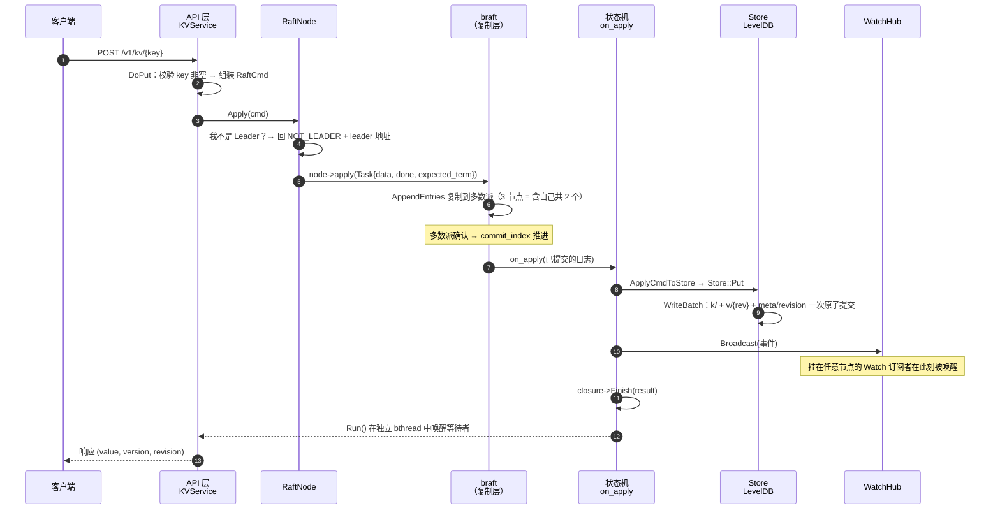
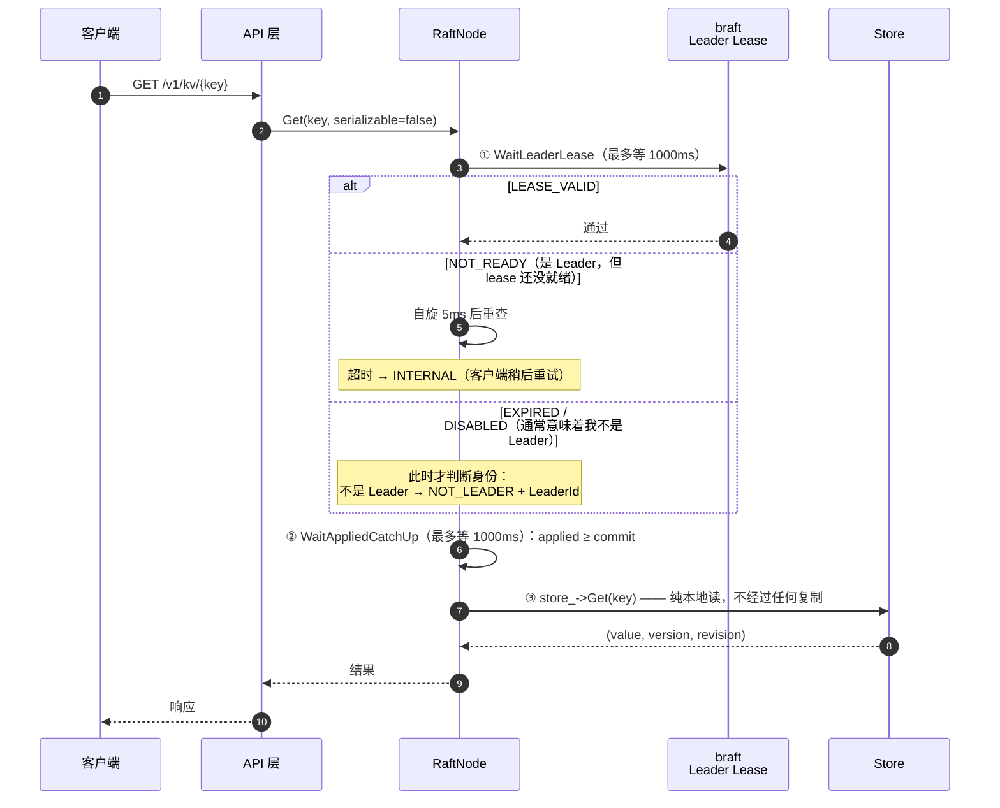
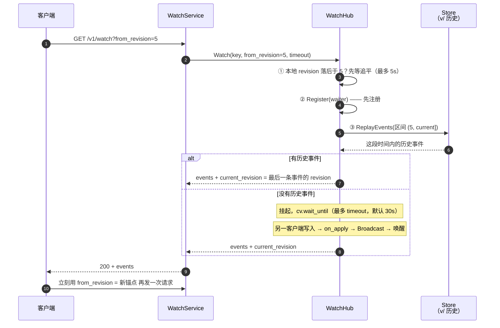
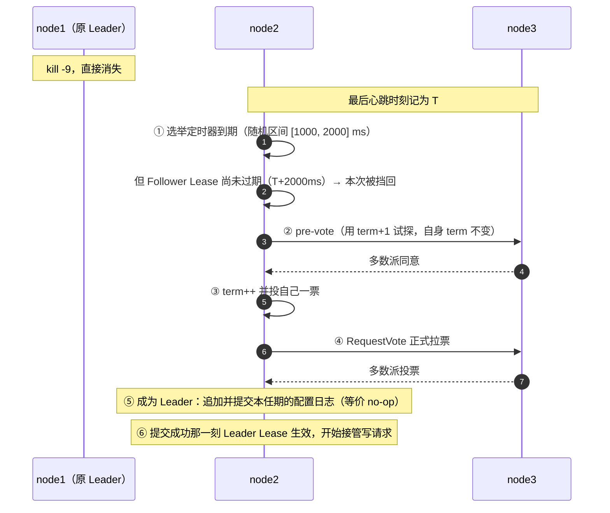

# 00 · 总览与核心链路

> 本册是整套资料的入口。读完之后，你应该能回答三个问题：**这个系统是做什么的**、**它由哪几块组成**、**一次请求怎么从客户端流到磁盘再流回来**。后面 7 册的每一册，都只是把本册里的一条线或一个模块拆开细讲。
>
> 阅读方式：本册内容密度最高、覆盖面最广，第一遍读不必记住所有细节，只要建立"地图感"；读到后面某册卡住时，回到本册对应的那张图再看一遍。

---

## 速览

读完本册，你应该记住下面这 7 条结论：

1. **Configraft 是一个对标 etcd 的分布式配置中心。** 它解决的是：微服务的配置散落在各自的本地文件里，改一次要重启、没有集中视图、没有历史版本、改错了回不去。
2. **它由三个现成组件拼装而成**：braft（Raft 共识）、brpc（RPC 框架）、LevelDB（本地存储）。项目自己写的是**这三者之间的那一层**——数据怎么编码、请求怎么路由、一致性怎么落实。
3. **一个进程同时提供两种协议**：gRPC 与 HTTP REST 跑在同一个端口上，节点之间的 Raft 复制也走这个端口——运维只需要开一个口。客户端不需要预先知道谁是 Leader：**写请求打错节点会被当场拒答，并附上 Leader 的地址**，由客户端重发（详见第五节）。
4. **系统的状态只在 `on_apply` 一处被修改**：所有写请求先被转成一条日志，复制到多数派节点，再按同一个顺序在每个副本上执行。这条铁律是整个一致性设计的根基。
5. **数据放在 LevelDB 里，用四个 Key 前缀组织**：`k/` 存当前值、`v/` 存历史版本、`cfg/` 存配置版本索引、`meta/` 存全局时钟。LevelDB 本身被零改造使用，MVCC 是项目自己在这一层裸 KV 之上实现的。
6. **读不走日志复制**，直接从本地状态机读，靠 *Leader Lease* 保证读到的不落后。这是读吞吐能到 27 万 QPS 的直接原因，也是它依赖时钟的前提。
7. **代价与边界（本册最后一条，也是最重要的一条）**：无鉴权、无 TLS，只面向受信内网；线性一致读依赖时钟漂移有界；`--raft_sync=false` 只用于压测，默认关闭。这是一份功能闭环的工程实现，不是可以直接上生产的产品——哪些是有意不做、哪些是已知缺陷，第 07 册逐条交代。

---

## 一、概念铺垫：先认识这几个词

后面的所有册都会反复用这些词。这里给一次性定义，之后不再重复解释。

| 词 | 一句话定义 | 在本项目里 |
|---|---|---|
| **配置中心** | 把配置集中存起来，让所有服务从同一个地方读、在一个地方改 | 本项目本身 |
| **节点 / 集群** | 一台跑着 Configraft 进程的机器 / 若干节点组成的一个整体 | 集群通常是 3 或 5 个节点 |
| **Leader / Follower** | 集群里唯一能接受写请求的节点 / 其余只跟随复制的节点 | 集群启动后自动选出，不需要人工指定 |
| **日志（log）** | 一串有序的、持久化了的操作记录 | 每次写先变成一条日志，而不是直接改数据 |
| **提交 / 应用** | 日志被多数派确认（提交） / 日志被真正执行到状态机里（应用） | 提交 ≠ 已生效，中间隔着一个应用的过程 |
| **revision** | 全局逻辑时钟，每发生一次写就 +1，**跨 key 单调递增** | MVCC、Watch、CAS 三者共同的锚点 |
| **version** | **单个 key** 的修改序号，从 1 开始 | 配置发布/回滚看的是它，不是 revision |
| **Watch** | 客户端订阅某个 key（或全部），一变就收到通知 | 通过长轮询实现，不是长连接推送 |
| **tombstone** | 墓碑：删除时不真的删记录，而是写一条"已删除"的标记 | 所以删掉的历史仍然查得到 |

> 易混点先标出来：**revision 是全局的，version 是单 key 的**。这两个数字在后面的册里会反复出现，混淆它们是理解 MVCC 最大的障碍。

---

## 二、背景与目标

### S · 背景：问题出在哪

微服务架构下，每个服务的配置（限流阈值、功能开关、数据库连接串、灰度比例……）如果散落在本地文件或环境变量里，会同时踩中四个坑：

- **改配置要改文件、重启进程**，慢且容易改错；
- **没有集中视图**，几十个服务里没人说得清谁配了什么；
- **没有审计**，出了事故查不到"谁在什么时候把某个值从 X 改成了 Y"；
- **改错了回不去**，没有历史版本可以比对和回滚。

行业的成熟解法是引入"配置中心"——etcd、ZooKeeper、Consul、Apollo 都属于这一类。其中 **etcd** 是事实标准：Raft 共识 + MVCC 多版本 + Watch 订阅。

### T · 目标：做成什么样，以及明确不做什么

**要做的**：在 C++ 技术栈下实现 etcd 的一个精简子集，专注"分布式配置中心"这一种形态，做到四件事——**集中管理、实时生效、可回滚、强一致**。

具体的边界：

| 做 | 不做，以及为什么 |
|---|---|
| KV 读写、批量写、CAS 原子更新 | 不做事务、不做范围扫描（proto 里没有 List/Scan 接口，"列"的需求由配置历史与变更事件两条路径分担） |
| 配置多版本发布、按版本读、回滚 | 不做配置模板、不做依赖注入 |
| Watch 实时推送（长轮询 + 断点续传） | 不做 gRPC 流式推送（理由见第 05 册） |
| 3/5 节点强一致集群、成员动态变更 | 不做多数据中心、不做跨地域拓扑 |
| 线性一致读（默认） | 不追求大规模订阅下的实时性（明确承认这是工程权衡） |
| **不做的**：鉴权、TLS、权限模型 | 定位是受信内网；要做到生产可用，第一优先级就是把这块补上 |

> "不做"和"忘了做"是两回事。上面表中每一行"不做"都有明确的理由，第 07 册会把"有意不做"和"已知缺陷"分开列表。

---

## 三、整体架构

### 3.1 分层结构（单节点视角，物理上 × N 个副本）

```text
                        ┌──────────────────────────────────────────────┐
                        │        客户端 / 浏览器 / Dashboard            │
                        │   gRPC(h2) · HTTP REST · Watch 长轮询         │
                        └────────────────┬─────────────────────────────┘
                                         │  同一端口（集群 8001-8003）
┌────────────────────────────────────────▼──────────────────────────────────┐
│  API 服务层  src/server/                                                   │
│  KVService     ConfigService    WatchService    AdminService   Dashboard   │
│  (Put/Get/…)   (Publish/…)      (长轮询)         (/healthz 等)  (静态页面)   │
│  对外：brpc 单端口；REST 由统一 Rest 方法按 method + path 手工分发            │
└────────────────────────────────────────┬──────────────────────────────────┘
                                         │  只依赖抽象接口 ConfigNode
┌────────────────────────────────────────▼──────────────────────────────────┐
│  状态机层  src/raft/state_machine.cpp                                      │
│  on_apply：把 RaftCmd 串行喂给 Store → 产生 Watch 事件 → 唤醒等待者           │
│  全系统唯一修改状态的地方                                                    │
└────────────────────────┬──────────────────────────┬───────────────────────┘
                         │ Leader                    │ Follower
┌────────────────────────▼──────────────────────────▼───────────────────────┐
│  共识层  src/raft/  （braft 1.1.2）                                         │
│  RaftNode：Apply 提交日志 / 线性一致读（Lease 校验 + 追平）/ 成员变更          │
│  多数派提交 → on_apply 串行执行 → WatchHub 广播                             │
└────────────────────────┬──────────────────────────────────────────────────┘
                         │ 本机直调
┌────────────────────────▼──────────────────────────────────────────────────┐
│  存储层  src/store/ + src/common/storekey                                  │
│  LevelDB（MVCC 布局，LevelDB 本身零改造）：                                   │
│    k/{key} 当前值 · v/{rev}/{key} 历史 · cfg/{key}/{ver} 配置版本             │
│    meta/revision 全局时钟 · meta/compact_rev 回收水位                       │
└───────────────────────────────────────────────────────────────────────────┘
```

### 3.2 代码的依赖方向

依赖是自上而下的单行道，**唯一的"倒置"点在 `src/raft/node.h`**：

```text
main → server → { raft, watch, store } → store → common
                 ↑
        node.h 在这里定义接口，却被上层和下层同时依赖
```

`node.h` 定义了抽象接口 `ConfigNode`，它有两个实现：`LocalNode`（单机，直接同步调用 Store）和 `RaftNode`（集群，走 braft 复制日志）。**API 服务层只持有一个 `ConfigNode*`，永远不知道底下是哪一个**（`src/server/kv_service_impl.h:40`）。这是全项目最重要的可扩展性设计，也是第 02 册的主题。

### 3.3 模块职责一览

| 模块 | 代码位置 | 一句话职责 |
|---|---|---|
| `ConfigNode`（抽象接口） | [src/raft/node.h](../../src/raft/node.h) | 服务层唯一依赖的接口：写 / 读 / Watch / 元信息，共 15 个方法 |
| `RaftNode` | [src/raft/raft_node.cpp](../../src/raft/raft_node.cpp) | 集群实现：提交复制日志、Lease 线性一致读、成员变更 |
| `LocalNode` | [src/raft/local_node.cpp](../../src/raft/local_node.cpp) | 单机实现：加一把锁后直接同步调 Store（调试与测试用） |
| `ConfigraftStateMachine` | [src/raft/state_machine.cpp](../../src/raft/state_machine.cpp) | `on_apply`——状态机的唯一入口 |
| `Store` | [src/store/store.cpp](../../src/store/store.cpp) | LevelDB 封装：MVCC 读写、CAS、Compaction、快照 |
| `ApplyCmdToStore` | [src/store/store_ops.cpp](../../src/store/store_ops.cpp) | 把一条 `RaftCmd` 分派到 Store 的对应写方法 |
| `StoreKeys` | [src/common/storekey.cpp](../../src/common/storekey.cpp) | LevelDB 的 Key 编码规则 |
| `WatchHub` | [src/watch/watch_hub.cpp](../../src/watch/watch_hub.cpp) | Watch 长轮询的分发中心：注册 / 重放 / 背压 / 续传 |
| 五个 Service | [src/server/](../../src/server/) | 对外协议实现；`server.cpp` 负责组装与 REST 路由 |

> 注意上表里 **`ApplyCmdToStore` 被两处共用**：`LocalNode::Apply` 和 `ConfigraftStateMachine::on_apply` 都调用它。这保证了单机模式和集群模式下的写语义完全一致——这是设计出来的，不是巧合。

---

## 四、核心链路

这是本册的核心。四条链路覆盖了这套系统 90% 的行为，也是最值得亲手画一遍的部分。

### 4.1 一次写：从 HTTP 请求到落盘



**读图要点**：

1. **只有 Leader 能提交日志**。写请求打到 Follower 会被拒绝，并返回 Leader 的地址让客户端重定向。
2. **"多数派"在 3 节点时是 2 个**（含 Leader 自己）。所谓"确认"，指的是对方已经把这条日志持久化了。
3. **`on_apply` 在每个副本上都会执行**，不是只在 Leader 上。这是最容易讲错的一点：Leader 独有的只是"这条日志是自己提交的、带了回执，所以能把结果填回去唤醒本地等待者"。Follower 同样要执行 `ApplyCmdToStore`、同样要广播 Watch 事件——**这正是"Watch 可以挂在任意节点"的基础**。
4. **`Broadcast` 在 `Finish` 之前**（[state_machine.cpp:40](../../src/raft/state_machine.cpp#L40) 早于 [state_machine.cpp:47](../../src/raft/state_machine.cpp#L47)）。也就是说，**本副本**在唤醒写请求的等待者之前，已经把自己产生的事件广播了出去。（"跨副本"之间不存在这种先后关系——每个副本按自己的 apply 进度广播。）
5. 数据写入、revision 递增、Watch 事件产生，这三件事在**同一个串行步骤**里完成，所以它们之间的顺序天生一致，不需要额外协调。

> 这条链路里的 `expected_term` 字段值得单独记一笔：`apply` 是异步的，从"把日志交给 braft"到"复制完成"之间，本节点可能已经不是那个任期的 Leader 了。`expected_term` 就是让 braft 在任期对不上时拒绝这条日志——防止旧任期 Leader 的写入被当成新任期生效。详见第 03 册。

### 4.2 一次线性一致读：为什么可以不复制



**读图要点**：

1. **读完全不经过 Raft 复制**，所以比写快一个多数量级（实测 HTTP 读约 27 万 QPS，而集群写约 1 万）。正确性不靠"复制"保证，而靠前面两道闸门把"过期读"挡在门外。
2. **"我是不是 Leader"的判别不在方法开头**，而在"等 lease 失败"之后。这个顺序有实际含义：Follower 调 `WaitLeaderLease` 会立刻拿到 `EXPIRED`，不必白等满 1000ms。（很多讲解会画成"先判断身份"，结果一样但控制流不同；详见第 04 册 4.1。）
3. **闸门 ①（Lease）** 保证：本任期的 no-op 日志已经提交，且我最近和多数派确认过——于是"不存在一个我不知道的新 Leader 已经提交了写"。
4. **闸门 ②（追平）** 保证：那些已经提交的日志，真的已经进了我的状态机，而不只是躺在日志里。
5. 如果两道闸门都没过，**读会返回失败而不是返回过期值**——牺牲可用性，保住正确性。
6. 通过 `?serializable=true` 可以主动降级为"任意节点本地读、允许轻微过期"，用于监控这类不在乎一致性的场景。

第 04 册会把"为什么这两道闸门就等价于线性一致"完整推导一遍——那是全项目理论密度最高的一段。

### 4.3 一次 Watch 长轮询：断线了怎么不丢



**读图要点**：

1. **长轮询的本质**：请求发出去后服务端不立即返回，而是挂起等待，有事件就推、超时返回空。客户端拿到响应后**立刻再发一次**，形成循环。这样既能实时拿到事件，又不需要维护长连接。
2. **`from_revision` 是断点续传的锚点**。客户端每次都用"上一轮最后一条事件的 revision"作为下一次的起点。
3. **锚点为什么要取"最后一条事件的 revision"，而不是当前 store 的 revision**？因为在这两者之间可能又发生了新的写，用 store 当前值会**跳过**那些事件。
4. **先注册、后重放**（②在③之前）是为了堵住一个缝隙：否则在"重放完毕"和"注册完成"之间到达的新事件会丢失。
5. **慢消费者不会被宽容**：每个订阅者的缓冲上限是 1024 条，溢出就断开并返回当前锚点，让它重连重放——**绝不让慢消费者拖住 `on_apply`**。

### 4.4 一次 Leader 故障转移



**读图要点**：

1. **braft 的选举比教科书多一步 pre-vote**：超时后不是立刻 `term+1` 转候选人，而是先用 `term+1` 试探性地问一圈，**自身 term 不变**；拿到多数派同意才真正升 term。这防止了网络抖动的节点反复推翻健康的 Leader。
2. **两套 lease 要分清**：Leader Lease（1000ms，供读使用）和 Follower Lease（2000ms，决定能不能投票）。前者是给读路径用的"我仍是唯一 Leader"的凭证，后者是给选票用的"我暂时不参与改朝换代"的凭证。
3. **关键的一步是 ⑤**：新 Leader 必须先提交一条本任期的配置日志，等价于 Raft 论文里的 no-op。它既是"把上一任期遗留的日志推到已提交"的前提，也是线性一致读 Lease 能成立的前提。
4. **实测数据**（来源：项目内的选举计时记录，是运行时测量值，本册未独立复现）：`kill -9` 掉 Leader 后约 **2.17 秒**选出新 Leader，term 从 2 变 3（3 节点集群，本机环回）。首次启动时 init 到发起选举只需 1010~1512ms。
5. **节点初始 term 是 1 而不是 0**，所以 3 节点集群第一次选举的结果**通常是 term=2**（pre-vote 不推进 term，真正自投时才 +1；若首轮出现分裂票，理论上可能落到更高的 term）。实测 14 次独立启动，14 次都是 term=2。

> 选举的时间参数（选举超时 [1000,2000]ms、心跳 100ms、Follower Lease 2000ms）来自 braft 源码，第 03 册会给出逐项出处。这里先记住一个量级：**故障切换是"秒级"，不是"毫秒级"**。

---

## 五、层间通讯：一次写请求怎么找到 Leader

这一节回答一个具体的机制问题：**客户端把写请求发出去，系统凭什么保证它最终落在 Leader 上？** 答案分三层，从最近的讲到最远的。

### 5.1 进程内：同一节点里，层与层靠指针直接调用

同一个节点内部，从 API 层走到存储层**没有任何网络**，全是 C++ 对象方法调用：

```text
KVServiceImpl ──持有 ConfigNode*──► RaftNode ──持有 Store*──► Store
                   node_->Apply()               store_->Get()
on_apply ──持有 WatchHub*──► WatchHub::Broadcast()
```

服务层构造函数拿到的是一个 `ConfigNode*`（[kv_service_impl.h:40](../../src/server/kv_service_impl.h#L40)），**这是同一个进程里的裸指针，不是 RPC**。它指向 `LocalNode` 还是 `RaftNode`，在 `server.cpp` 装配时就定死了。所以"层间通讯"在进程内这一层，成本约等于一次虚函数调用。

### 5.2 跨节点：Raft 复制走的是同一个业务端口

节点之间要互发 AppendEntries（复制日志）、RequestVote（拉票）、InstallSnapshot（传快照）。这些**不是外部客户端请求，是 braft 自己发起的 RPC**。

它们和业务请求**共用同一个监听端口**：

```cpp
// src/server/server.cpp:70 —— 必须在 server_.Start() 之前调用
RaftNode::AddServiceToServer(&server_, port);  // 内部调 braft::add_service(server, port)
```

`braft::add_service` 把 Raft 的 RPC service 注册进同一个 `brpc::Server`（[raft_node.cpp:121](../../src/raft/raft_node.cpp#L121)）。于是 **8001 这一个端口同时承载三路流量**：客户端 gRPC、客户端 HTTP、节点间 Raft 通信。运维只需要开一个口、配一套防火墙规则。

节点怎么知道彼此的地址？靠启动参数里的 **peers 列表**（如 `--peers=127.0.0.1:8001,127.0.0.1:8002,127.0.0.1:8003`，定义在 [server.h:27](../../src/server/server.h#L27)），braft 用 `initial_conf.parse_from(peers)` 把它解析成初始成员集合（[raft_node.cpp:93](../../src/raft/raft_node.cpp#L93)）。

### 5.3 客户端 → 集群：写请求怎么落到 Leader 上

这是最常被追问的一环。**注意：并不存在"某个参数在节点之间同步 Leader 地址"这回事。** 真实机制是——每个节点各自维护一个 Leader 标识，写请求打错节点就**当场拒答并附上正确地址**，由客户端重发。

**① 每个节点怎么知道谁是 Leader？**

答案在 braft 内部的一个字段 `_leader_id` 上。它有三个更新时机：

| 时机 | 发生什么 | 位置 |
|---|---|---|
| 自己当选 | `become_leader()` 中 `_leader_id = _server_id`，指向自己 | braft `node.cpp:1865` |
| 收到 Leader 的消息 | Follower 处理 AppendEntries / InstallSnapshot 时经 `check_step_down()`，若本地还没有 leader 就记为对端地址 | braft `node.cpp:2357`、`2563` → `1834` |
| 选举超时 | 清空，表示"我和 Leader 失联了" | braft `node.cpp:1028` |

> **行号口径**：braft 源码由 [`scripts/build_deps.sh`](../../scripts/build_deps.sh) 下载到 `third_party/src/braft/`（该目录不入 git，clone 后需先跑一次构建脚本）。上表行号对应这一份 v1.1.2，也就是项目**实际编译的那一份**——网上另有一份更新的 braft master，两者行号并不相同，引用前先确认版本。

> **关键点**：Follower 不需要任何人通知它 Leader 是谁，它是**从心跳里自己"学到"的**。这就是为什么不需要一张中心化的地址表。

**② 应用层怎么读它、怎么拒答？**

```cpp
// src/raft/raft_node.cpp:130-136
if (!IsLeader()) {                    // node_->is_leader()：看内部状态是否 STATE_LEADER
    out->code = Code::NOT_LEADER;
    out->leader_id = LeaderId();      // node_->leader_id().to_string()
    return;                           // 直接返回，这条写根本没进 braft 日志
}
```

`IsLeader()` 判断的是 braft 的内部状态（[raft_node.cpp:271](../../src/raft/raft_node.cpp#L271)），`LeaderId()` 取的就是上面那个 `_leader_id`（[raft_node.cpp:273-278](../../src/raft/raft_node.cpp#L273-L278)）。结果通过 `ApplyResult::leader_id` 这个字段（[node.h:19](../../src/raft/node.h#L19)）往上传。

**③ 地址怎么交到客户端手里？**

应用层把地址拼进响应的 message 文本：

```cpp
// src/server/rest_util.h:110-112
} else if (r.code == Code::NOT_LEADER && !r.leader_id.empty()) {
    resp->set_message("not leader, leader=" + r.leader_id);
}
```

客户端读到 `code = NOT_LEADER` 加这段 message，解析出地址，向新地址重发。读路径同理（[kv_service_impl.cpp:32-34](../../src/server/kv_service_impl.cpp#L32-L34)）。

**④ 一个特意避开的反例**

如果"我就是 Leader，只是 lease 还没就绪"，**绝不能**把 `LeaderId()` 填成自己——客户端会把请求打回同一个节点，形成死循环。所以这条路径返回的是 `INTERNAL`（让客户端稍后重试），而不是 `NOT_LEADER`（[raft_node.cpp:172-181](../../src/raft/raft_node.cpp#L172-L181)）。这个分支极易讲反，第 04 册会给完整对照。

### 5.4 兜底：并不是所有请求都需要找 Leader

| 请求类型 | 需要 Leader 吗 | 说明 |
|---|---|---|
| 写（Apply） | **是** | 只有 Leader 能定序 |
| 线性一致读（Get 默认） | **是** | 只有 Leader 能证明"我是唯一且最新的" |
| 降级读（`?serializable=true`） | 否 | 任意节点本地读 |
| 配置读（GetConfig） | 否 | 纯本地读，不做 lease 校验 |
| Watch | **否** | 每节点本地事件流随 apply 推进，以 revision 对齐（[node.h:74-77](../../src/raft/node.h#L74-L77)） |
| 元信息（`/healthz`） | 否 | 但 `Peers()` 是例外：braft 只对 Leader 返回成员列表，Follower 返回空 |

最后这张表解释了一个常见现象：**在非 Leader 节点上打开 Dashboard，节点列表会是空的**——因为那台机器的 `Peers()` 拿不到成员列表。这是设计上的已知缺口，不是故障。

---

## 六、关键接口与字段

### 6.1 对外接口一览

一个 service 同时挂在 gRPC 和 HTTP 两套协议上。下表是 HTTP 视角（客户端的 gRPC 调用与之等价）。

| 接口 | 语义 | 设计要点 |
|---|---|---|
| `POST /v1/kv/{key}` | 写一个 KV | body 是 `{"value": "..."}`；空 key 在入口就被拒绝，返回 `INVALID_ARGUMENT` |
| `GET /v1/kv/{key}` | 读，默认线性一致 | 加 `?serializable=true` 降级为任意节点本地读 |
| `DELETE /v1/kv/{key}` | 删除 | 写的是 tombstone，不物理删，历史仍可查 |
| `POST /v1/kv/{key}/cas` | 比较并交换 | **比较的是值字符串，不是版本号**；失败不消耗 revision |
| `POST /v1/kv/batch` | 批量写 | 单批内的 revision 用本地递增，因为 batch 未提交时读不到 |
| `POST /v1/config/{key}` | 发布一个配置版本 | **只有这个接口会写 `cfg/` 索引**，普通 KV 写不产生配置版本 |
| `GET /v1/config/{key}?version=N` | 按版本读配置 | `version<=0` 表示读当前值 |
| `POST /v1/config/{key}/rollback` | 回滚到某个版本，目标版本在 body 里（`{"target_version": N}`） | 不删历史，而是把目标版本的值**重新发布成一个新版本** |
| `GET /v1/watch?from_revision=N` | 订阅变更 | 默认超时 30s；`from_revision=0` 表示"只看新事件，不重放历史" |
| `GET /healthz` · `/addpeer` · `/removepeer` | 运维接口 | 设计上**只能走 HTTP**；用 gRPC 调这三个方法会返回 Unimplemented（Method not found），原因见第 02 册 |

### 6.2 三个必须记准的字段（含实现形式）

| 字段 | 语义 | 实现形式与代码位置 | 设计要点 |
|---|---|---|---|
| `revision` | 全局逻辑时钟，每写 +1，跨 key 单调 | **不随数据走**，单独存在 LevelDB 的 `meta/revision` 键里，8 字节大端整数；每次写由 `NextRevisionLocked` 读出 +1，并**并入本次业务写的同一个 WriteBatch** 一起提交（[store.cpp:75-83](../../src/store/store.cpp#L75-L83)，编解码 [storekey.cpp:41-58](../../src/common/storekey.cpp#L41-L58)） | 三条链路（MVCC / Watch / CAS）共用同一个锚点，避免各自维护一套序号；并入同一批次是为了杜绝"时钟推进了但数据没落盘"的节点发散 |
| `version` | **单个 key** 的修改序号，从 1 起；删除也计一次 | KV 消息里的 `int64` 字段（[configraft.proto:28-34](../../proto/configraft.proto#L28-L34)），取值 `existed ? old.version()+1 : 1`，写入主索引与历史两份记录（[store.cpp:103](../../src/store/store.cpp#L103)，Delete 同理 [store.cpp:142](../../src/store/store.cpp#L142)） | 配置的发布与回滚是按 key 版本操作的，与全局时钟解耦；删除也计一次是为了让"回滚到删除前"有版本可依 |
| `deleted` | 墓碑标记 | KV 消息里的 `bool` 字段；`Delete` 写的是 `deleted=true` 的完整 KV，进 `k/` 和 `v/` 两个位置（[store.cpp:136](../../src/store/store.cpp#L136)、[store.cpp:150-151](../../src/store/store.cpp#L150-L151)）；读时看到它就当作不存在并返回 `KEY_NOT_FOUND`（[store.cpp:486-491](../../src/store/store.cpp#L486-L491)） | Raft 日志是 append-only 的，物理删除会破坏"按顺序重放"，所以用墓碑代替真删 |

> 这三行就是"字段的实现形式"。**每一处都给了精确的 `file:line`**——读到这里如果想知道 `NextRevisionLocked` 到底怎么写的、WriteBatch 里塞了什么，把这个位置连同上下文丢给 AI 就能得到逐行解读，不需要在文档里抄整段代码。

> **最容易踩的语义坑**：`PUT /v1/kv/foo` 之后，`GET /v1/config/foo?version=1` 会返回 `VERSION_NOT_FOUND`。因为普通 KV 写只写 `k/` 和 `v/`，不写 `cfg/`——配置版本是 `Publish` 独有的行为。演示和自测时务必用 `/v1/config/` 而不是 `/v1/kv/`。

---

## 七、结果：验证与代价

### 7.1 验证方式

| 手段 | 做什么 | 能证明什么 |
|---|---|---|
| 单元测试（47 用例 / 4 个可执行） | 存储语义、Watch 语义、HTTP 路由、并发 CAS | 分层隔离的正确性 |
| 混沌测试（4 个场景） | kill Leader / kill Follower / 网络分区（`SIGSTOP`）/ 重启追赶 | 故障下仍然不丢、不乱序 |
| 压力测试 | gRPC 与 HTTP 两条路径、3/5 节点、fsync 开与关 | 吞吐上限与代价来源 |

两个后台校验程序持续做黑盒断言：一个不断"写后立即读"，读到空或读到旧值就记一次违例；另一个持续长轮询，校验事件的 revision 必须严格递增。**跑完全部场景后，违例数必须为 0**。

### 7.2 结果与代价（数据出处：`docs/性能压测报告.md`，2026-08 阿里云 8 vCPU / 16G / NVMe SSD，多节点进程同机环回）

| 场景 | 吞吐 | P99 |
|---|---|---|
| HTTP 读 GET（3 节点） | 275k QPS | 0.5 ms |
| gRPC 读 Get ×64（3 节点） | 45.2k QPS | 2.8 ms |
| gRPC 写 Put ×64（3 节点，默认持久化） | 10.0k QPS | 11.6 ms |
| gRPC 写 Put ×64（3 节点，关闭 fsync） | 28.2k QPS | 4.7 ms |
| gRPC 写 Put ×64（单机） | 41.8k QPS | 3.1 ms |

**三条结论，以及各自的代价**：

1. **读远高于写**（HTTP 读 27 万 vs 写 1.2k~31k），符合配置中心"读多写少"的形态。代价是读的正确性依赖 Leader Lease——它要求节点间时钟漂移有界，且所有节点必须一致地开启这个开关。
2. **Raft 复制有实打实的开销**。5 节点写吞吐比 3 节点低 **约 12%~33%**（随并发档位变化；多数派从 2/3 变成 3/5）。代价换来的是容错能力从"容忍 1 个故障"变成"容忍 2 个"。
3. **fsync 是写路径最大的开销**。关闭后低并发（c8）能快 8~10 倍，但高并发（×64）只快约 2.8 倍——**报这个倍数必须带上并发度，否则会自相矛盾**。代价是：关闭 fsync 时崩溃会丢已提交的日志，所以它只用于压测，生产必须开启。

> 数据口径提醒：上表来自代码加固之后（commit `e5d737b`）的复测。加固前后对比中，**集群写路径没有任何一项变慢**（最大单格 +7%，是变快）。原始证据（环境指纹 + 二进制 md5 + 完整 stdout）存档在 [`docs/压测结果_云主机_20260820.txt`](../压测结果_云主机_20260820.txt)。

---

## 八、通用知识

以下知识点脱离本项目依然成立，是理解本册内容需要的最小背景。后续各册会用到，但不再重复解释。

**分布式共识**
- 复制状态机（SMR）：相同的初始状态 + 相同的输入序列 + 确定性的状态机 = 各副本状态一致。所以同步的是"操作序列"而不是"状态"。
- 多数派（quorum）：任意两个多数派必然相交，所以同一时刻最多只有一个多数派能推进提交——这是杜绝脑裂的根本原因。
- 为什么不用主从异步复制：主库挂了，从库可能还没收到最后几条，要么丢数据，要么出现双主。
- pre-vote：候选人先用 `term+1` 试探，拿到多数派同意才真正升 term，避免网络抖动导致的不必要改朝换代。

**存储与版本**
- LSM-Tree：把随机写转为顺序写，代价是读可能要走多层。
- MVCC（多版本并发控制）：不覆盖旧值，而是每次写产生一个新版本，读按版本号取；好处是历史可查、快照读不阻塞写。
- 逻辑时钟：用一个单调递增的整数给操作排序，不依赖物理时间。

**服务端工程**
- M:N 线程模型（bthread）：用户态协程挂载到少量内核线程上，阻塞式调用会占住底层线程，所以等待原语必须用这套模型自己的实现。
- 长轮询 vs 长连接：长轮询实现简单、对中间设备友好；长连接实时性更好但需要维护连接生命周期。
- 单端口多协议：同一个监听端口上按协议特征分流，简化运维（只开一个口、只需一套防火墙规则）。

---

## 九、这套资料怎么读

| 册 | 讲什么 | 什么时候去读 |
|---|---|---|
| **00 总览与核心链路** | 本册 | 第一遍必读 |
| 01 对外接口与数据模型 | API 长什么样、`revision`/`version` 是什么、Key 在磁盘怎么摆 | 想在脑子里建立数据形状时 |
| 02 系统架构与组装 | 代码怎么分层、`ConfigNode` 抽象为什么存在、单端口怎么跑三种流量 | 想知道"代码是怎么搭起来的"时 |
| 03 一致性与写路径 | 为什么需要共识、一条写怎么变成日志、braft 真实参数 | 写路径卡住时 |
| 04 线性一致读 | 读为什么难、Lease 凭什么成立、CAS 为什么无锁原子 | 想深挖正确性时（最难的一册） |
| 05 Watch 实时推送 | 变更怎么送达、锚点怎么选、慢消费者怎么办 | 涉及实时通知时 |
| 06 存储层 | LevelDB 扮演什么角色、MVCC 怎么自研、快照与并发模型 | 涉及数据落盘时 |
| 07 可靠性与验证 | 踩过哪些坑、怎么定位、数据从哪来、代价是什么 | 想知道"这个项目真实经历了什么"时 |
| 99 附录 | 术语表 / 错误码 / 参数 / 源码地图 | 随时查阅 |

**三条阅读路线**：

- **快速通读**：00 → 01 → 03 → 07。四册覆盖"是什么、数据什么样、写怎么走、怎么验证"。
- **完整精读**：00 → 01 → 02 → 03 → 04 → 05 → 06 → 07。
- **按问题查**：从附录的源码地图反查，直接跳到对应册。

---

## 延伸阅读

| 主题 | 仓库内位置 |
|---|---|
| 全部 service 与消息定义 | [proto/configraft.proto](../../proto/configraft.proto) |
| 抽象接口定义 | [src/raft/node.h](../../src/raft/node.h) |
| Key 编码规则 | [src/common/storekey.h](../../src/common/storekey.h) |
| 项目门面（架构图 / 快速开始 / 性能与验证） | [README.md](../../README.md) |
| 方案层架构决策总纲 | [docs/项目概述.md](../项目概述.md) |
| 性能完整矩阵与复现方法 | [docs/性能压测报告.md](../性能压测报告.md) |
| Raft 原理与 braft 源码精读 | [docs/raft-and-braft.md](../raft-and-braft.md) |

---

**下一篇**：[01-对外接口与数据模型.md](01-对外接口与数据模型.md)——先看清楚这个系统对外承诺了什么、数据长什么样。
