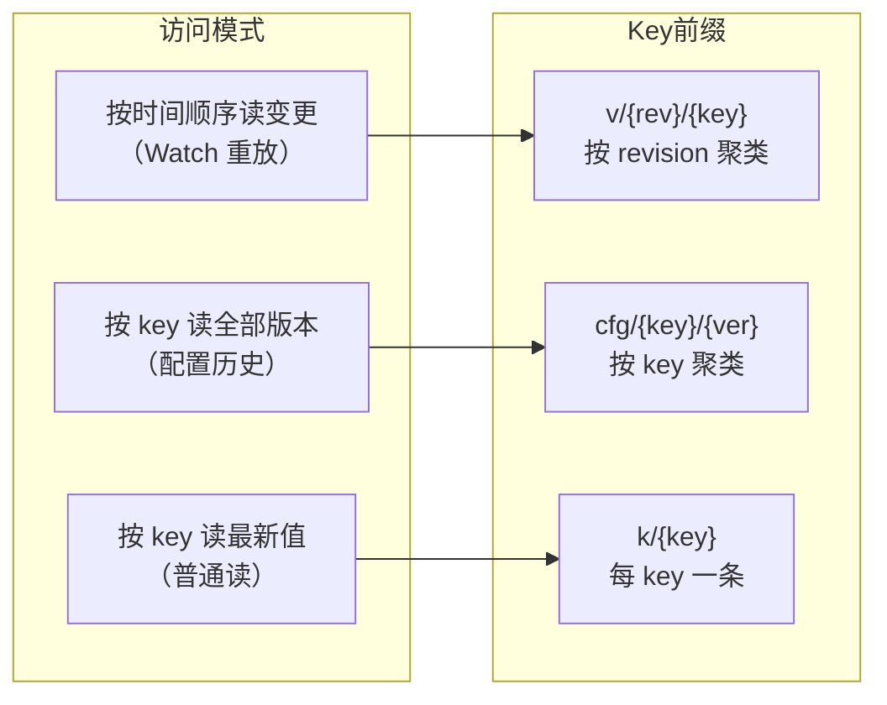
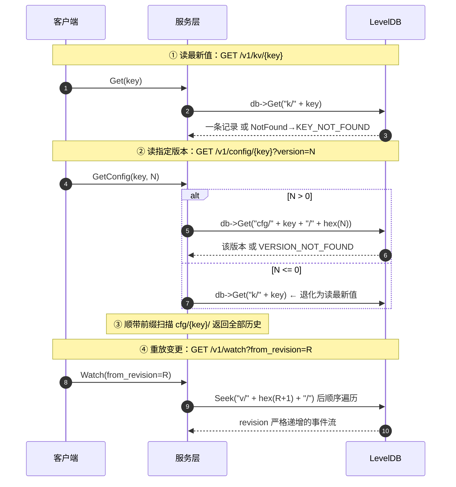

# 01 · 对外接口与数据模型

> 上一册建立了"这个系统由哪几层组成、一次请求怎么流动"的地图。本册把镜头拉近到最底层的两个问题：**这个系统对外承诺了哪些接口**、**它把数据存成了什么形状**。
>
> 先读本册的理由：后面所有册（写路径、Watch、存储）讨论的都是"这些数据怎么被正确地搬运"。如果不先知道数据长什么样，那些讨论会变成悬空的。
>
> 本册涉及的主要文件：[proto/configraft.proto](../../proto/configraft.proto)、[src/common/storekey.h](../../src/common/storekey.h)、[src/common/storekey.cpp](../../src/common/storekey.cpp)。

---

## 速览

1. **协议只有一个真源**：[proto/configraft.proto](../../proto/configraft.proto)。它同时定义对外 API、内部复制指令、错误码、快照格式——gRPC 与 HTTP 两套协议都是从这一份文件生成的。
2. **对外接口分五组 service**：KV（原始读写）、Config（版本化发布/回滚）、Watch（变更订阅）、Admin（运维）、Dashboard（静态页面）。
3. **对外 API 与内部指令是两套 message**：客户端看到 `PutRequest`，写进 Raft 日志的是 `RaftCmd.put`。分开是为了让"协议演进"和"日志格式"互不牵制。
4. **数据有两条编号**：`revision` 是全局逻辑时钟（跨 key 单调），`version` 是单个 key 的修改序号（从 1 起）。MVCC、Watch、CAS 用前者，配置发布与回滚用后者。
5. **Key 空间用四个前缀组织**：`k/` 当前值、`v/` 历史、`cfg/` 配置版本、`meta/` 全局计数器。前缀即命名空间，排序可控。
6. **两个版本前缀的排序方式是相反的，而且是刻意的**：`v/{revision}/{key}` 把 revision 放前面（便于按时间范围扫描），`cfg/{key}/{version}` 把 key 放前面（便于按 key 枚举全部版本）。这是本册最值得记住的一个设计点。
7. **代价与边界**：同一份 KV 会在 `k/` 和 `v/` 各存一份，是明确接受的写放大；`cfg/` 前缀按字符串匹配，层级 key（`app` 与 `app/db`）会有前缀碰撞，靠遍历时校验兜底——这曾经是一个真实缺陷。

---

## 一、概念铺垫：数据模型里的名词

| 名词 | 定义 | 生活化的类比 |
|---|---|---|
| **key** | 配置项的标识符，是一个字符串。**允许含 `/`**，因此可以表达层级（如 `service/db/max_conn`） | 文件路径 |
| **value** | key 对应的内容，也是一个字符串（不限制格式，上层自己解释） | 文件内容 |
| **revision** | **全局**逻辑时钟，每发生一次写就 +1，**跨所有 key 单调递增** | 图书馆的"入库流水号"——每次有人还书就 +1，不分是哪本书 |
| **version** | **单个 key** 的修改序号，从 1 开始 | 某一本书自己的"第几版" |
| **tombstone** | 墓碑。删除时不真的抹掉记录，而是写一条"这个 key 已删除"的标记 | 借书卡上写"已注销"，卡片本身还在 |

> **最容易混的一对**：`revision` 是全局的，`version` 是单 key 的。写 `key=A` 时 revision 变成 100，接着写 `key=B`，revision 变成 101，而 B 自己的 version 可能是 1。**这两个数字回答的是不同的问题**：revision 回答"这是系统第几次写"，version 回答"这是这个 key 第几次被改"。

---

## 二、背景与目标

### S · 背景：数据模型为什么必须先定

一个存储系统的所有上层行为，都由数据怎么摆放决定：

- **能不能高效地"列出某个 key 的所有历史版本"**？取决于版本索引把 key 放在 key 的哪一段。
- **能不能高效地"重放某个时间点之后的全部变更"**？取决于改变记录是不是按全局时钟有序排列。
- **回滚一个配置时，是删掉后面的版本，还是写一个"回到旧值"的新版本**？这决定了 MVCC 的语义边界。

这些决定一旦定下来，改动的成本会传导到写路径、Watch、快照、Compaction 的每一处。所以在动手写业务逻辑之前，先把"数据长什么样"钉死。

### T · 目标：接口要覆盖什么，以及不覆盖什么

**要覆盖**：

| 能力 | 由谁提供 |
|---|---|
| 原始 KV 的增删改查 | `KVService` |
| 配置的版本化发布、按版本读、回滚 | `ConfigService` |
| 变更的实时订阅 | `WatchService` |
| 集群成员与健康状态 | `AdminService` |
| 可视化界面 | `DashboardService` |

**明确不覆盖**：

| 不做 | 为什么 |
|---|---|
| 范围扫描 / 前缀列举（List、Scan） | proto 里没有任何列举接口。"列出"这类需求由两条路径分担：配置历史用 `GetConfig` 返回的 `history`，变更流水用 Watch 的事件重放 |
| 事务（多条写原子成功或失败） | `BatchPut` 提供的是"一个批次一次提交"，语义上是一条 Raft 指令，不是通用事务 |
| 值的格式校验 / schema | value 是不透明字符串，由使用方解释 |
| 鉴权、命名空间隔离 | 见第 07 册的已知局限 |

---

## 三、接口划分

### 3.1 五个 service，各管一段

| service | RPC | 面向谁 |
|---|---|---|
| `KVService` | Put / Get / Delete / BatchPut / CompareAndSwap / Rest | 把配置当"普通数据"用的场景 |
| `ConfigService` | Publish / GetConfig / Rollback / Rest | 需要"版本"概念的场景 |
| `WatchService` | Watch / Rest | 订阅变更 |
| `AdminService` | GetHealth / AddPeer / RemovePeer | 运维（**只有 HTTP 入口**，原因见第 02 册） |
| `DashboardService` | Rest | 托管 `web/` 静态页面 |

`KVService` / `ConfigService` / `WatchService` 这三个 service 除了业务方法，还额外有一个 **`Rest` 方法**（如 [configraft.proto:61](../../proto/configraft.proto#L61)）。它是一个"空请求"的统一入口，原因是 brpc 的 restful 映射不支持按 HTTP 方法分发——细节在第 02 册。

服务端有两个 service 不适用这条规则，需要单独记住：

| service | 情况 |
|---|---|
| `AdminService` | **没有 `Rest` 方法**（[configraft.proto:134-138](../../proto/configraft.proto#L134-L138)）。它的三个方法被直接映射成 `/healthz`、`/addpeer`、`/removepeer` |
| `DashboardService` | `Rest` 是它**唯一**的方法（[configraft.proto:174-176](../../proto/configraft.proto#L174-L176)），没有业务 RPC |

所以"HTTP 请求先进 `Rest`、再按 `method + 路径` 分发"这条规则**只适用于 KV / Config / Watch**。

### 3.2 为什么 `KVService` 和 `ConfigService` 要分开

一个自然的疑问：既然两者都是写一个字符串，为什么不做成一套接口、加个"是否版本化"的开关？

分开的理由是**两种写操作的语义不同**：

| | `Put` | `Publish` |
|---|---|---|
| 语义 | 写入一个值 | **发布**一个版本 |
| 写 `k/` 主索引 | 是 | 是 |
| 写 `v/` 历史 | 是 | 是 |
| 写 `cfg/` 版本索引 | **否** | **是** |
| 能否按版本读 | 不能 | 能 |
| 能否回滚 | 不能 | 能 |

把两者合成一套接口，"写一个值"和"发布一个版本"的区别就会被一个布尔参数掩盖，读代码的人随时会搞混。分开之后，"只有 `Publish` 会产生配置版本"这条规则就没有例外。

> **由此产生一个高频踩坑点**：`PUT /v1/kv/foo` 之后调 `GET /v1/config/foo?version=1` 会返回 `VERSION_NOT_FOUND`（[store.cpp:353-357](../../src/store/store.cpp#L353-L357)）。因为普通 KV 写**根本不写 `cfg/` 索引**。演示或自测时务必用 `/v1/config/` 而不是 `/v1/kv/`。

### 3.3 对外 API 与内部指令是两套 message

proto 里同时存在两类 message，泾渭分明：

- **对外 API**：`PutRequest`、`PublishRequest`、`WatchRequest`……客户端和服务端之间传输的。
- **内部指令 `RaftCmd`**：`oneof cmd` 里六选一（put / delete / cas / publish / rollback / batch_put，[configraft.proto:149-156](../../proto/configraft.proto#L149-L156)），是**写进复制日志、由状态机消费**的。

为什么不合并成一套？三条理由：

1. **协议演进不牵动日志格式**。对外 API 改字段时，历史上已经落盘的日志仍是当时那条 `RaftCmd`，不需要为旧日志写兼容代码。
2. **粒度不同**。一条对外请求映射成一条指令，但指令集合是"状态机能执行的最小动作集"，未来加事务只需加一种 `RaftCmd`，对外接口不用动。
3. **快照与重放只认一个东西**。所有副本、所有恢复路径消费的都是 `RaftCmd` 这个确定性输入——这是复制状态机能成立的前提。

### 3.4 错误码：为什么是这八个

```text
0  OK                 1  KEY_NOT_FOUND      2  CAS_FAILED       3  NOT_LEADER
4  VERSION_NOT_FOUND  5  COMPACTED          6  INVALID_ARGUMENT 100 INTERNAL
```

（[configraft.proto:16-25](../../proto/configraft.proto#L16-L25)）

几个值得说明的取舍：

- **`NOT_LEADER` 要附带 Leader 地址**，客户端才能重定向。这个"附带"是通过响应的 `message` 字段实现的，不是独立字段（[rest_util.h:110-112](../../src/server/rest_util.h#L110-L112)）。
- **`VERSION_NOT_FOUND` 与 `COMPACTED` 必须是两个码**。前者是"某个 key 的某个版本不存在"，后者是"全局 revision 区间已被回收"。混成一个码，客户端就无法判断该重试还是该重建锚点。`COMPACTED` 的响应还会带上 `current_revision` 供客户端从新锚点续传。
- **`INVALID_ARGUMENT` 是后补的**。最初没有这个码，空 key 会一路写下去污染命名空间；后来在写路径入口统一拦截（[kv_service_impl.cpp:14-18](../../src/server/kv_service_impl.cpp#L14-L18)）。
- **`INTERNAL` 直接用 100**，7~99 留空。proto 里对它的注释只有"内部错误"四个字；留出这段空档是否出于"以后细化"的考虑，源码里没有记录（**推测，未验证**）。

---

## 四、Key 空间的布局

这是本册的核心。所有数据最终都落在一个 LevelDB 实例里，靠 **key 前缀**划分命名空间。

### 4.1 四个前缀，五个 key 形态

前缀**命名空间**一共 **4 个**（`k/`、`v/`、`cfg/`、`meta/`），对应 [storekey.cpp:11-15](../../src/common/storekey.cpp#L11-L15) 定义的 5 个常量——多出来的那个是 `meta/`，它下面有两把用途不同的 key。所以实际出现的 **key 形态是 5 种**：

| key 形态 | 属于哪个前缀 | 内容 |
|---|---|---|
| `meta/revision` | `meta/` | 全局逻辑时钟，8 字节大端整数 |
| `meta/compact_rev` | `meta/` | Compaction 已回收的最大 revision（水位线） |
| `k/{key}` | `k/` | 当前值（主索引） |
| `v/{revision:16hex}/{key}` | `v/` | 变更历史（按 revision 排序） |
| `cfg/{key}/{version:16hex}` | `cfg/` | 配置版本索引（按 key 分组） |

key 构造函数声明在 [storekey.h:14-18](../../src/common/storekey.h#L14-L18)，编解码函数声明在 [storekey.h:21-26](../../src/common/storekey.h#L21-L26)。

### 4.2 关键设计：两个版本前缀的排序方向是相反的

对比这两行（[storekey.cpp:23-29](../../src/common/storekey.cpp#L23-L29)）：

```cpp
VersionKey(revision, key) = "v/"  + hex(revision) + "/" + key
ConfigKey(key, version)   = "cfg/" + key + "/" + hex(version)
```

**`v/` 把 revision 放在前面，`cfg/` 把 key 放在前面。** 这不是随手写的，而是被两种访问模式决定的：

| 前缀 | 谁在用 | 访问模式 | 所以要把谁放前面 |
|---|---|---|---|
| `v/{rev}/{key}` | Watch 的历史重放 | 「**从某个 revision 开始，顺序扫描之后的所有变更**」——一次 `Seek` 就够了 | revision |
| `cfg/{key}/{ver}` | 配置历史查询 | 「**给定一个 key，列出它的所有版本**」——一次前缀扫描 | key |

因为 LevelDB 按 key 的字节序排序，把谁放在前面就等于"按谁聚类"。**这两种查询各自只需要一次顺序扫描，代价是同一份数据要在两个前缀下各存一遍。**



### 4.3 为什么用 16 位十六进制

`EncodeOrd` 把整数编成 `%016llx`——固定 16 位的小写十六进制（[storekey.cpp:31-35](../../src/common/storekey.cpp#L31-L35)）。

原因是 **LevelDB 只按字节比较**，如果直接存十进制字符串，会出现 `"10" < "9"` 这种字典序错误。用**定长**编码保证"字符串比较的结果 == 数值比较的结果"，扫描顺序才正确。

选十六进制而不是定长十进制，一个直接的好处是更短：16 位 hex 就能表达 64 位整数，定长十进制则要 20 位。

> 另有一个细节：`meta/revision` 用的是**8 字节大端整数**而不是 hex 字符串（[storekey.cpp:41-47](../../src/common/storekey.cpp#L41-L47)）。因为它是纯粹的计数器，只被读出和写入、从不参与范围扫描，不需要可排序的文本形式。

### 4.4 一次 `Publish` 在 Key 空间里写了什么

这是"数据模型"最直观的一面。观察 [store.cpp:303-305](../../src/store/store.cpp#L303-L305)：

```cpp
batch.Put(storekey::MainKey(key), serialized);                    // k/{key}
batch.Put(storekey::VersionKey(rev, key), serialized);            // v/{rev}/{key}
batch.Put(storekey::ConfigKey(key, new_kv.version()), serialized); // cfg/{key}/{ver}
```

一次 `Publish` = 三条记录 + 一个全局计数器，**在同一个 WriteBatch 里原子提交**：

```text
假设之前没有任何数据，执行 Publish("app/timeout", "500")
  （revision 从 0 → 1，version 从 1 起）

LevelDB 内容：
  meta/revision                     → 1                        （8字节大端）
  k/app/timeout                     → {key, "500", ver=1, rev=1, deleted=false}
  v/0000000000000001/app/timeout    → 同上
  cfg/app/timeout/0000000000000001  → 同上

再执行 Publish("app/timeout", "800")
  （revision 1 → 2，version 1 → 2）

  meta/revision                     → 2
  k/app/timeout                     → {..., "800", ver=2, rev=2}   ← 被覆盖
  v/0000000000000002/app/timeout    → {..., "800", ver=2, rev=2}   ← 新增
  cfg/app/timeout/0000000000000002  → 同上                          ← 新增
  （v/...0001 与 cfg/...0001 保持不动，历史留存）
```

由这张图可以直接读出三个结论：

1. **主索引只有一条，永远是最新值**（读最新值只需一次 `db->Get`）。
2. **历史是追加的，永不覆盖**（同一份 KV 在两个前缀各存一份——这就是写放大）。
3. **配置版本数 = `cfg/` 前缀下的记录数**，天然可数。

### 4.5 一次 `Rollback` 是怎么实现的

`Rollback(key, target_version)` 的实现在 [store.cpp:322-337](../../src/store/store.cpp#L322-L337)：先按 `cfg/{key}/{target_version}` 读出目标版本，**然后把它当作新值重新 `Publish` 一次**。

```cpp
bool Store::RollbackLocked(...) {
    GetConfigLocked(key, target_version, &target, &code);  // 读出目标版本
    return PublishLocked(key, target.value(), out_kv);     // 重新发布为新版本
}
```

也就是说：**回滚不删除任何历史，而是产生一个"内容与旧版本相同的新版本"**。回滚后 `version` 继续递增（不会退回旧值），`revision` 也继续递增。

为什么这么设计？因为底层是 Raft——日志是 append-only、只增不删的，副本之间靠"重放同一个指令序列"保持一致。如果回滚实现成"删掉后面的记录"，那么一个落后的副本重放日志时，就会进入一个与 Leader 不同的状态。**用"追加一条等值的写"来表达回滚，是让语义与存储模型对齐的做法**——项目文档称这与 etcd 的回滚语义一致（etcd 本身的行为未在本仓库内验证）。

### 4.6 四个边界情况

1. **key 里的 `/` 只是普通字符，不构成父子关系**。系统把 key 当作不透明字符串，`app/db` 与 `app` 之间没有任何层级语义——`GetConfig("app")` 不会返回 `app/db` 的版本。层级完全由使用方自己约定，系统只保证不同 key 的历史不会互相串（防护手段见 6.4 的第 1 条）。

2. **删除也占用一个 version**。`Delete` 会让该 key 的 version 加一，并写入一条 `deleted=true` 的记录（[store.cpp:142](../../src/store/store.cpp#L142)）。这样做的好处是"回滚到删除之前"有一个明确的版本号可以指向。

3. **key 不能为空，但 value 可以为空**。空 key 在写路径入口就被拒绝（返回 `INVALID_ARGUMENT`，[kv_service_impl.cpp:14-18](../../src/server/kv_service_impl.cpp#L14-L18)）；value 则是任意字符串，空串合法。

4. **CAS 无法表达"期望值恰好是空串"**。`expect` 字段为空串时的语义被定义为"期望这个 key 不存在"（[store.h:53-54](../../src/store/store.h#L53-L54)）。于是把一个值是空串的 key 用 CAS 改成别的值，就是做不到的——因为"期望它现在等于空串"和"期望它不存在"用的是同一个编码。这是设计上的一处已知歧义，单测里有一条用例把它固化下来，明知如此仍选择保留。

---

## 五、核心链路：一次读请求走哪个前缀

有了上面的布局，三种读请求的路径就一目了然：



**读图要点**：

1. **`GetConfig` 传 `version<=0` 会退化成读最新值**（[store.cpp:347-349](../../src/store/store.cpp#L347-L349)）。所以 `?version=0` 与不传 `version` 是同一个效果。
2. **`GetConfig` 的响应里还带着 `history`**（[store.cpp:388-407](../../src/store/store.cpp#L388-L407)）——它顺手把 `cfg/{key}/` 前缀扫了一遍。所以一次"按版本读"实际上做了两次查询。
3. **Watch 的重放是一次 `Seek` 加顺序遍历**（`v/` 前缀的排序价值在这里兑现），区间是开区间 `(from_revision, current]`。

---

## 六、关键接口与字段

### 6.1 核心字段的实现形式

| 字段 | 语义 | 实现形式与代码位置 | 设计要点 |
|---|---|---|---|
| `KV.key` | 配置项标识 | 字符串，允许含 `/` 表达层级（[configraft.proto:29](../../proto/configraft.proto#L29)）；**空串被入口拒绝**（[kv_service_impl.cpp:14-18](../../src/server/kv_service_impl.cpp#L14-L18)） | 允许层级是为了贴近真实配置的组织方式；但这也带来了 `cfg/` 前缀碰撞问题（见 6.3） |
| `KV.value` | 配置内容 | 不透明字符串，不做任何格式校验 | 系统不假设配置是 JSON 还是纯文本，把解释权交给使用方 |
| `KV.revision` | 写入时的全局时钟 | 来自 `meta/revision` 读 +1（[store.cpp:75-83](../../src/store/store.cpp#L75-L83)），与业务数据同批提交 | 跨 key 单调，是 MVCC / Watch / CAS 的公共锚点 |
| `KV.version` | 该 key 的修改序号 | `existed ? old.version()+1 : 1`（[store.cpp:103](../../src/store/store.cpp#L103)）；**删除也 +1**（[store.cpp:142](../../src/store/store.cpp#L142)） | 删除计 version，是为了让"回滚到删除前"有版本号可依 |
| `KV.deleted` | 墓碑标记 | `Delete` 写 `deleted=true` 的完整 KV（[store.cpp:136](../../src/store/store.cpp#L136)），读时视为不存在（[store.cpp:486-491](../../src/store/store.cpp#L486-L491)） | Raft 日志 append-only，物理删除会破坏重放语义 |
| `Code` | 状态码 | 8 个枚举值，`INTERNAL=100` 留出空档（[configraft.proto:16-25](../../proto/configraft.proto#L16-L25)） | `VERSION_NOT_FOUND`(4) 与 `COMPACTED`(5) 必须分开，否则客户端无法决定"重试"还是"重建锚点" |
| `RaftCmd` | 内部复制指令 | `oneof` 六选一，与对外 message 完全分离（[configraft.proto:141-157](../../proto/configraft.proto#L141-L157)） | 见 3.3 |
| `SnapshotData` | 快照传输格式 | `revision` + `kvs`（主索引）+ `cfg_kvs`（配置版本索引）（[configraft.proto:161-167](../../proto/configraft.proto#L161-L167)） | `cfg_kvs` 是后补的——不加它，新节点装完快照会读不到配置版本（见 6.3） |

### 6.2 Key 编码的实现形式

| 函数 | 产出 | 设计要点 |
|---|---|---|
| `MainKey(key)` | `"k/" + key` | 一 key 一条，读最新值只用一次 `Get` |
| `VersionKey(rev, key)` | `"v/" + hex(rev) + "/" + key` | revision 前置 ⇒ 按时间范围一次 `Seek` 即可顺序重放 |
| `ConfigKey(key, ver)` | `"cfg/" + key + "/" + hex(ver)` | key 前置 ⇒ 按 key 一次前缀扫描即可列出全部版本 |
| `EncodeOrd(v)` | `%016llx` 定长 16 位 hex | LevelDB 按字节比较，定长编码才能让字典序等于数值序 |
| `EncodeUint64(v, out)` | 8 字节大端 | 纯计数器，只存取不排序，用最紧凑的原始字节形式 |

### 6.3 接口的请求与响应

**KV 组**

| HTTP 请求 | 请求体 | 成功响应字段 | 常见失败码 |
|---|---|---|---|
| `POST /v1/kv/{key}` | `{"value":"..."}` | `kv`（含 version / revision） | 6 空 key、3 非 Leader |
| `GET /v1/kv/{key}` | — | `kv` | 1 不存在、3、100 lease 未就绪 |
| `DELETE /v1/kv/{key}` | — | `kv`（墓碑记录） | 6、3 |
| `POST /v1/kv/{key}/cas` | `{"expect":"...","value":"..."}` | `kv` | 2 期望不匹配、6、3 |
| `POST /v1/kv/batch` | `{"entries":[{"key":"...","value":"..."}]}` | `kvs` | 6、3 |

**Config 组**

| HTTP 请求 | 请求体 | 成功响应字段 | 常见失败码 |
|---|---|---|---|
| `POST /v1/config/{key}` | `{"value":"..."}` | `kv` | 6、3 |
| `GET /v1/config/{key}?version=N` | — | `kv` + `history` | 1、4 版本不存在、3 |
| `POST /v1/config/{key}/rollback` | `{"target_version":N}` | `kv` | 4、3 |

**Watch 组**

| HTTP 请求 | 成功响应字段 | 常见失败码 |
|---|---|---|
| `GET /v1/watch[/{key}]?from_revision=N&timeout_ms=MS` | `events[]` + `current_revision` | 5 历史已回收、100 缓冲溢出或本地未追平 |

**Admin 组**（只有 HTTP，没有 gRPC 入口）

| HTTP 请求 | 成功响应字段 |
|---|---|
| `GET /healthz` | `role` / `term` / `commit_index` / `applied_index` / `leader_id` / `peers[]` |
| `POST /addpeer`（body `{"peer":"127.0.0.1:8004"}`） | `code` / `message` |
| `POST /removepeer`（同上传参） | 同上 |

**三个容易记错的细节**：

1. **`serializable` 必须写成字面量 `true`**（[kv_service_impl.cpp:151](../../src/server/kv_service_impl.cpp#L151) 里判断的是 `*s == "true"`）。写 `?serializable=1` 不会生效，请求仍然是线性一致读。
2. **`version` 与 `from_revision` 都缺省为 0，但含义相反**：前者 0 表示"读最新值"，后者 0 表示"只看新事件、不重放历史"。同一个默认值，两种相反的语义。
3. **`/cas` 与 `batch` 是 URL 里的保留字**。`POST /v1/kv/{key}/cas` 走的是 CAS，不是"写一个叫 `{key}/cas` 的 key"；同理，key 恰好叫 `batch` 时 `POST /v1/kv/batch` 会被判成批量写（[kv_service_impl.cpp:168-181](../../src/server/kv_service_impl.cpp#L168-L181)）。这是第 07 册里记录的已知缺口之一。

**`WatchEvent` 的字段**：

| 字段 | 含义 |
|---|---|
| `revision` | 产生这条事件的全局 revision |
| `key` / `value` | 发生变更的 key 与变更后的值 |
| `version` | 该 key 在这次变更之后的版本号 |
| `type` | `"PUT"` 或 `"DELETE"`，是字符串而非枚举（[configraft.proto:98](../../proto/configraft.proto#L98)） |

### 6.4 三个真实的坑（都曾经是缺陷）

1. **`cfg/` 前缀碰撞**。`ConfigKey` 是 `"cfg/" + key + "/" + hex(ver)`，而 key 本身可以含 `/`。于是 `key="app"` 的历史落在 `cfg/app/...`，`key="app/db"` 的落在 `cfg/app/db/...`——**后者的前缀包含前者**。`GetHistory("app")` 若只做前缀扫描，会把 `app/db` 的历史一起返回。修法是在遍历时校验记录内嵌的 key 与目标完全相等（[store.cpp:400-402](../../src/store/store.cpp#L400-L402)）。

2. **快照丢失配置版本**。最初的 `SnapshotData` 只带主索引 `kvs`，新节点装完快照后，`GetConfig(key, version>0)` 全部返回 `VERSION_NOT_FOUND`——因为 `cfg/` 索引没被带过来。修法是加了 `cfg_kvs` 字段随快照一起导出/恢复（[configraft.proto:164-166](../../proto/configraft.proto#L164-L166)）。

3. **`DecodeOrd` 对脏数据会抛异常**。它内部用 `std::stoll` 直接解析（[storekey.cpp:37-39](../../src/common/storekey.cpp#L37-L39)），如果读到格式不对的内容会抛 `std::invalid_argument`。当前没有修复（记录在案，属低优先级）——因为正常情况下这个函数只解析自己写进去的内容。

---

## 七、结果：验证与代价

### 7.1 验证方式

| 验证点 | 手段 |
|---|---|
| `revision` 跨 key 严格单调 | 单元测试 `RevisionMonotonicAcrossKeys` |
| 覆盖写时 `version` +1 | 单元测试 `PutOverwriteIncrementsVersion` |
| 回滚不消耗额外语义、不删历史 | 单测 + 手动验证（回滚后 `version` 继续递增） |
| 层级 key 的历史隔离 | `http_test` 的前缀碰撞回归用例 `HierarchicalKeyHistoryIsolated`（[tests/http_test.cpp:188-195](../../tests/http_test.cpp#L188-L195)）——注意 `store_test` 里**没有**覆盖这一项 |
| 协议与实现一致 | `http_test` 用真实 HTTP 请求打每一个 REST 路由 |

（测试清单见第 07 册。）

### 7.2 代价

1. **写放大**。同一份 KV 在 `k/` 和 `v/` 各存一份，`Publish` 还要再加一份到 `cfg/`——一次发布最多写三条记录。这是为了换取"读最新值最快"和"两种历史查询各一次扫描"。
2. **历史无限增长**。`v/` 前缀只增不减，靠后台 Compaction 每 60 秒回收一次、每 key 保留最近 10 个版本（见第 06 册）。
3. **前缀匹配不是类型系统**。`cfg/` 的碰撞问题说明：在裸 KV 上自造 MVCC，就必须自己承担"命名空间重叠"的风险。目前的兜底是遍历时逐条校验记录内嵌的 key，代价是每次查询都要多一次比较。

---

## 八、通用知识

脱离本项目仍然成立的知识点：

**KV 存储与编码**
- 有序 KV 存储（LevelDB/RocksDB）按**字节序**排列 key，所以任何"要按数值排序"的整数都必须编码成定长字符串。
- 前缀扫描（prefix scan）是这类存储最主要的查询模式；把什么字段放在 key 的前面，就等于决定了数据按什么聚类。
- 墓碑（tombstone）是 append-only 存储实现删除的标准做法，代价是删除的空间要等 Compaction 才真正回收；也意味着"删除"并不比"写入"便宜——本项目里删除同样要写两条记录。

**版本化数据（MVCC）**
- MVCC 用"写新版本、不覆盖旧版本"替代就地更新，换来的是历史可查、快照读不阻塞写。
- 全局逻辑时钟与单实体版本号是两个正交的概念：前者用于全局排序（复制、订阅），后者用于实体自身的版本管理。
- append-only 的复制日志（Raft）与"就地删除"天然冲突，所以回滚、删除这类操作通常都表达成"追加一条新记录"。

**接口设计**
- 协议里的错误码数量应当与"客户端需要做出的不同反应"数量匹配——多一个码就多一个分支，少一个码就逼客户端去解析文本。
- 对外协议与内部数据格式解耦，是让系统能独立演进的基础手段。

**前缀命名空间**
- 在单一 KV 存储上用 key 前缀划分多种逻辑数据，是嵌入式存储上的常见做法。重量级的替代方案是列族（column family），代价是必须预先声明、数量有限。
- 前缀方案的固有风险是"命名空间重叠"：只要被编码的字段本身可能包含分隔符，前缀就不再是可靠的边界，只能靠遍历时校验兜底。

---

## 延伸阅读

| 主题 | 仓库内位置 |
|---|---|
| 协议唯一真源 | [proto/configraft.proto](../../proto/configraft.proto) |
| Key 编码声明与注释 | [src/common/storekey.h](../../src/common/storekey.h) |
| Key 编码实现 | [src/common/storekey.cpp](../../src/common/storekey.cpp) |
| MVCC 读写与 Compaction 实现 | [src/store/store.cpp](../../src/store/store.cpp) |
| 配置服务的协议分发 | [src/server/config_service_impl.cpp](../../src/server/config_service_impl.cpp) |
| 方案层设计说明 | [docs/项目概述.md](../项目概述.md) |

---

**上一篇**：[00-总览与核心链路.md](00-总览与核心链路.md) · **下一篇**：[02-系统架构与组装.md](02-系统架构与组装.md)——从数据形状回到代码结构，看这些抽象是怎么被组装成一个进程的。
