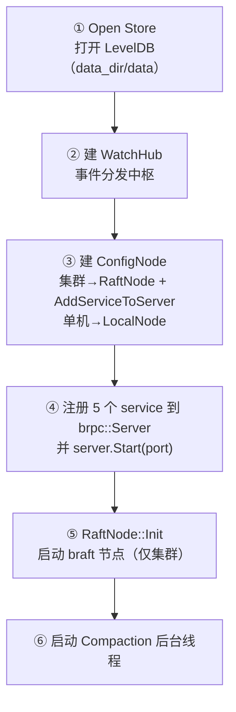
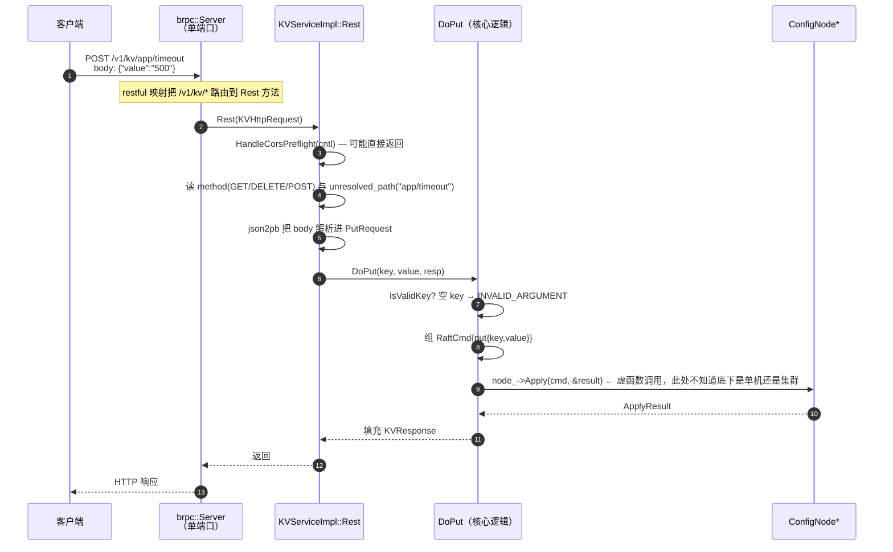

# 02 · 系统架构与组装

> 01 册讲了数据长什么样，本册讲这些数据是被谁搬动的：**代码是怎么从一个个零件装配成一个进程的**。
>
> 具体回答三个问题：分层是怎么分的、`ConfigNode` 这个抽象为什么存在、一个端口凭什么同时跑三种流量。
>
> 主要文件：[src/server/server.cpp](../../src/server/server.cpp)、[src/raft/node.h](../../src/raft/node.h)、[src/main/server_main.cpp](../../src/main/server_main.cpp)。

---

## 速览

1. **代码是自上而下的单行道**：`main → server → {raft, watch, store} → common`。唯一的"倒置"点在 `raft/node.h`——接口定义在被依赖的下层，却由上层面向它编程。
2. **`ConfigNode` 是一个 15 个方法的抽象接口**，有两个实现：`LocalNode`（单机，同步执行）和 `RaftNode`（集群，走 braft 复制）。服务层只持有一个 `ConfigNode*`，从不知道底下是哪一个。
3. **这个抽象不是装饰**：项目从单机演进到集群时，服务层**一行都没改**。这是里程碑能平滑推进的架构原因。
4. **一个端口承载三路流量**：客户端 gRPC、客户端 HTTP、节点间 Raft 复制，全部注册在同一个 `brpc::Server` 上。运维只需要开一个口。
5. **HTTP 的 REST 入口被收敛到一个统一的 `Rest` 方法**里再手工分发，而不是给每个动作映射一个 URL——因为 brpc 的 restful 映射有两个特性（不支持 HTTP 方法前缀；映射具体方法会占用它的 gRPC 路径）。
6. **组装的顺序是刻意安排的**：先开存储 → 建事件中枢 → 建节点 → 注册服务 → 启动监听 → **最后**才启动 Raft 节点。
7. **代价与边界**：`AdminService` 的三个方法被直接映射到 URL，因此**失去了 gRPC 入口**（这是设计取舍，不是缺陷）；单机模式下 Dashboard 的部分功能不可用（`Peers()` 为空）——后者是已知缺口。

---

## 一、概念铺垫：读本册需要的几个词

| 词 | 定义 | 在本项目里 |
|---|---|---|
| **依赖倒置** | 上层不直接依赖下层的具体实现，而是依赖一个双方都认可的接口 | 服务层依赖 `ConfigNode` 而不是 `RaftNode` |
| **组装 / 组合根**（composition root） | 一个程序里唯一负责"把各个零件拼起来"的地方，其余代码只接收拼好的成品 | `ConfigraftServer::Init` |
| **服务注册** | 把一个实现了 RPC 接口的对象交给网络框架，框架负责把请求路由到它 | `server_.AddService(...)` |
| **restful 映射** | 把一个 URL 路径挂到某个 RPC 方法上，使这个 RPC 可以用普通 HTTP 请求触发 | `"/v1/kv/* => Rest"` |
| **BThread / worker** | brpc 的用户态线程模型；`num_threads` 指的是底层内核线程数，不是并发请求数上限 | 本项目设 4 |

---

## 二、背景与目标

### S · 背景：一个绕不开的问题

在任何时刻，这个系统都可能有两种截然不同的运行形态：

- **单机模式**：一个进程直接读写本地 LevelDB，没有集群、没有复制。用于本地调试和单元测试。
- **集群模式**：多个进程通过 Raft 保持一致，写要走复制日志。

如果服务层直接依赖"集群版的节点"，那么单机模式就必须写一套平行的服务代码；反过来也一样。**两套并行代码意味着每个接口改动都要改两处，而且它们的行为会慢慢漂移。**

### T · 目标

- 服务层**只面向一个抽象**编程，永远不关心底下是单机还是集群。
- 切换形态的唯一代价是**启动参数不同**，不是代码不同。
- 抽象层的引入不能带来运行时开销上的实质损失（就是一次虚函数调用）。

**明确不做**：不引入依赖注入框架、不做插件化的动态加载。这个抽象只需要覆盖"两种实现"，用最朴素的虚函数接口就够。

---

## 三、依赖方向与抽象层

### 3.1 依赖是单行道

```text
main  →  server  →  { raft, watch, store }  →  store  →  common
                        ↑
              node.h 在这里定义接口，
              却被上层（server）与下层（local_node/raft_node）同时依赖
```

正常情况下依赖只能向下。`node.h` 是唯一的例外：它是一个**只包含声明**的文件（接口 + 几个结果结构体），不依赖任何实现，所以上层依赖它不算"反向依赖"。

### 3.2 `ConfigNode`：15 个方法，两个实现

接口定义在 [src/raft/node.h:62-101](../../src/raft/node.h#L62-L101)。这 15 个方法按用途分成下面几组（这里把「读」与「配置读」分开列，因为两者的一致性语义不同；源码注释里它们是同一组）：

| 类别 | 方法 | 单机 `LocalNode` 怎么实现 | 集群 `RaftNode` 怎么实现 |
|---|---|---|---|
| 写 | `Apply(cmd, out)` | 加一把 `std::mutex` 锁后直接调 `ApplyCmdToStore` | 提交一条 braft 日志，阻塞等 `on_apply` |
| 读 | `Get(key, serializable, out)` | 直接读本地 Store | 先校验 Leader Lease、再等 applied 追平，然后本地读 |
| 配置读 | `GetConfig(key, version, out)` | 直接读本地 Store | **同样是直接读本地 Store**（不做 lease 校验） |
| 订阅 | `Watch(...)` | 委托 `WatchHub` | 委托 `WatchHub` |
| 维护 | `Compaction(keep_versions)` | 直接调 Store | 直接调 Store |
| 成员变更 | `AddPeer` / `RemovePeer` | 返回 `INTERNAL`（"单机不支持"） | 转发给 braft |
| 元信息 | `IsLeader` / `LeaderId` / `Role` / `Term` / `CommitIndex` / `AppliedIndex` / `Peers` / `CurrentRevision` | 多为常量（`IsLeader()` 恒真、`Term()` 恒 0） | 从 braft 的 `NodeStatus` 取 |

**两个实现的共享点**：它们都调用同一个 `ApplyCmdToStore`（[store_ops.cpp](../../src/store/store_ops.cpp)）来执行写指令。所以"一次写会产生什么效果"这件事只有一份实现，单机和集群不会漂移。

> **一个细节**：`LocalNode::Apply` 为什么要自己加一把 `std::mutex`？因为集群模式下写是由 braft 的 `on_apply` **串行**驱动的，而单机模式下 brpc 的多个 worker 线程会**并发**调用 `Apply`。没有这把锁，`revision` 的"读-改-写"就会竞态，产生重复的 revision。这是代码审查中发现并修复的一个真实缺陷（[local_node.h:50-53](../../src/raft/local_node.h#L50-L53) 有注释记录）。

### 3.3 判据只有 `--node`

`server.cpp` 里决定用哪种实现的代码只有一行（[server.cpp:50](../../src/server/server.cpp#L50)）：

```cpp
const bool cluster = !opts_.node_name.empty();
```

**只看 `--node` 是否为空**。也就是说：只传 `--peers` 而不传 `--node`，得到的仍然是单机模式。这个判据容易记错，值得单独标出来。

---

## 四、组装与路由

### 4.1 `Init` 的六步，以及为什么是这个顺序

（源码里给这些步骤编了 5 个号——它把"建 WatchHub"和"建节点"并在了一步（对应下面的 ②③）。这里拆开，是为了让"事件中枢"与"节点"的创建先后关系更清楚。）

[server.cpp:48-153](../../src/server/server.cpp#L48-L153)：



三个顺序上的讲究：

1. **WatchHub 必须早于节点创建**。因为节点（无论哪种）构造时就要拿到一个 `WatchHub*` 来广播事件。同时 `watch_hub_` 在类成员里**声明在 `node_` 之前**，这样析构时会**最后**销毁——保证 hub 比所有持有它的对象活得久（[server.h:52-55](../../src/server/server.h#L52-L55)）。

2. **Raft 的 RPC service 必须在 `server_.Start()` 之前注册**（[server.cpp:70](../../src/server/server.cpp#L70)）。因为它要和业务服务共享同一个端口，端口一旦监听就没法再挂新服务。

3. **`RaftNode::Init` 放在 `server_.Start()` 之后**（[server.cpp:137-144](../../src/server/server.cpp#L137-L144)）。这是一个很容易忽略但很重要的顺序：braft 节点一启动就可能被选为 Leader 并开始接受写入，如果此时本地服务还没监听，就会出现"集群认为这个节点可用、但它的 API 还接不进来"的窗口。**先让服务就绪，再让节点参与集群。**

### 4.2 一个端口怎么承载三路流量

注册进同一个 `brpc::Server` 的有三类东西：

| 流量 | 谁注册的 | 路径特征 |
|---|---|---|
| 客户端 **gRPC** | 各 service 自身的 protobuf 方法 | `/configraft.v1.KVService/Put` |
| 客户端 **HTTP REST** | 同一批 service，通过 restful 映射 | `/v1/kv/*`、`/healthz`、`/dashboard/*` |
| 节点间 **Raft 复制** | `braft::add_service(&server, port)` | braft 自己定义的内部路径 |

前两者共用同一批 service 对象，只是入口不同；第三者是 braft 注册的独立 service。三者在同一个端口上按请求特征分流，互不干扰。

**这样做的收益**：内网部署时所有节点端口一致，Docker 只需要映射一个端口，防火墙只需要放行一个口。

### 4.3 REST 入口为什么要收敛到 `Rest` 方法

brpc 的 restful 映射有两个特性，直接决定了本项目的 REST 设计：

1. **不支持按 HTTP 方法分发**。写不出 `GET /v1/kv/{key} => Get` 这种映射——同一个路径没法按方法区分。
2. **映射了具体方法，就会占用它的 gRPC 路径**。一旦把 `Put` 映射到某个 URL，该方法就失去了默认的 gRPC 访问路径。

第二条是理解本项目 REST 设计的关键。于是有了两种不同的处理方式：

| service | 映射方式 | 结果 |
|---|---|---|
| KV / Config / Watch | 映射到统一的空方法 `Rest`：`"/v1/kv/* => Rest"` | 具体方法（Put/Get/…）没有被映射，**gRPC 路径完好**；HTTP 请求进 `Rest` 后按 `method + unresolved_path` 手工分发 |
| Admin | 直接映射具体方法：`"/healthz => GetHealth"` | 这三个方法**失去 gRPC 入口**；因为 Admin 是纯运维面、面向 curl 和浏览器，这个取舍可以接受 |
| Dashboard | 映射到 `Rest`，只提供 HTTP | 无业务 RPC 语义 |

**那为什么 Admin 不需要一个 `Rest` 方法？** 因为 brpc 有 `allow_http_body_to_pb` 机制（[server.cpp:26-27](../../src/server/server.cpp#L26-L27) 的注释）：当一个 RPC 方法被映射到 URL 且请求是 HTTP 时，brpc 会自动把 JSON body 解析进该方法的 protobuf 请求参数。

KV / Config / Watch 之所以必须自己解析，是因为它们把多个动作压进了同一个方法——body 该解析成哪个 message，取决于 HTTP 方法和 URL 路径，框架无从判断。Admin 的每个 URL 只对应唯一的方法，框架能直接推出目标 message，所以不需要手工分发。

`Rest` 方法内部的分发逻辑长这样（以 KV 为例，[kv_service_impl.cpp:137-188](../../src/server/kv_service_impl.cpp#L137-L188)）：

```text
GET    /v1/kv/{key}      → Get
DELETE /v1/kv/{key}      → Delete
POST   /v1/kv/{key}/cas  → CompareAndSwap
POST   /v1/kv/batch      → BatchPut
POST   /v1/kv/{key}      → Put（value 从 JSON body 解析）
```

请求体用 `json2pb` 把 JSON 解析进对应的 protobuf message。

> **顺带一提**：这个设计留下了另一条**极易踩的坑**——路由是靠字符串后缀判断的。"batch"、"cas" 这些是保留名，如果某个配置项的 key 恰好叫 `batch`，`POST /v1/kv/batch` 会被判成批量写而不是写 `batch` 这个 key。这个问题目前未修（第 07 册有完整清单）。

### 4.4 两个"本来会失败"的路径名

- **`/healthz` 而不是 `/health`**（[server.cpp:28-29](../../src/server/server.cpp#L28-L29) 有注释）：restful 映射会用路径首段注册 service 短名，而 brpc 1.17 内置的健康检查 service 短名正好是 `health`，冲突会导致服务器启动失败。改用 `/healthz`（也符合 k8s 惯例）。
  > 说明：源码注释只写了"短名冲突"这一层原因；"启动失败"这个后果记录在 [docs/m6.md:61](../m6.md#L61) 的运行记录里。
- **`/dashboard` 而不是 `/`**：根路径被 brpc 内置的 IndexService 占用，无法用 restful 映射覆盖（这是 brpc 内置服务的行为，工程源码里没有对应注释；同项目的记录见 [docs/演示脚本.md:39](../演示脚本.md#L39)）。所以 Dashboard 的入口必须带路径前缀，前端引用静态资源也因此必须用绝对路径（`/dashboard/style.css`），用相对路径在无尾斜杠的 URL 下会 404。

### 4.5 启动时的两个强制设置

[server_main.cpp:23-49](../../src/main/server_main.cpp#L23-L49)：

- **强制打开 Leader Lease**（[server_main.cpp:29](../../src/main/server_main.cpp#L29)）：这一行**必须在解析命令行参数之后**。如果在之前设置，用户传 `--raft_enable_leader_lease=false` 会在解析时覆盖掉它，系统会静默退回"Leader 直接读"的不安全模式。这是第 04 册线性一致读的前提。
- **`num_threads = 4`、关闭内置服务面板**（[server.cpp:124-128](../../src/server/server.cpp#L124-L128)）。关闭内置面板是因为 brpc 默认会在共享端口上开 `/status` `/vars` 等页面，泄露运行参数与内部指标。至于 `num_threads` 为什么是 4：这个数字本身不是关键——调优阶段试过把它加到 16，**并不能解决问题**，因为当时的瓶颈在等待原语用错了（阻塞了内核线程）而不是线程不够。那段经历在第 07 册详述。

---

## 五、层间引用：谁持有什么，谁负责释放

上一节讲的是"怎么把零件拼起来"，这一节讲拼好之后**零件之间是怎么互相引用的**。这在 C++ 项目里不是细节——它直接决定了哪里会出现悬垂指针。

### 5.1 一张对象图

```text
ConfigraftServer（组合根：拥有所有顶层对象）
 ├─ watch_hub_  unique_ptr<WatchHub>              ← 最先声明 ⇒ 最后销毁
 ├─ node_       unique_ptr<ConfigNode>            ← 多态持有（RaftNode 或 LocalNode）
 ├─ kv_svc_ / config_svc_ / watch_svc_ /
 │  admin_svc_ / dash_svc_   unique_ptr<各 ServiceImpl>
 ├─ server_     brpc::Server（值成员，非指针）
 └─ compaction_thread_ + stop_compaction_ + compaction_cv_

RaftNode
 ├─ store_  unique_ptr<Store>                     ← 拥有
 ├─ fsm_    unique_ptr<ConfigraftStateMachine>    ← 拥有（braft 不拥有它，见 5.3）
 ├─ node_   unique_ptr<braft::Node>               ← 拥有
 └─ hub_    WatchHub*          （裸指针，不拥有）

LocalNode
 ├─ store_  unique_ptr<Store>                     ← 拥有
 └─ hub_    WatchHub*          （裸指针，不拥有）

ConfigraftStateMachine
 ├─ store_  Store*             （裸指针，不拥有）
 └─ hub_    WatchHub*          （裸指针，不拥有）

WatchHub
 └─ waiters_  vector<weak_ptr<Waiter>>            ← 弱引用；强引用在发起长轮询的那个 bthread 手里
```

### 5.2 引用关系一览

| 持有者 | 被持有 | 形态 | 为什么是这种形态 |
|---|---|---|---|
| `ConfigraftServer` | `WatchHub` | `unique_ptr` | 进程内唯一的事件中枢，由 Server 独占 |
| `ConfigraftServer` | `ConfigNode` | `unique_ptr` | 需要多态析构，所以用基类指针持有派生对象 |
| 五个 Service | `ConfigNode` | **裸指针** | 服务层只借用，不参与生命周期管理 |
| `RaftNode` / `LocalNode` | `Store` | `unique_ptr` | 存储的唯一所有者 |
| `RaftNode` | `ConfigraftStateMachine` | `unique_ptr` | 状态机随节点存亡 |
| `RaftNode` | `braft::Node` | `unique_ptr` | braft 的节点对象由本项目持有 |
| `StateMachine` | `Store` | 裸指针 | 它只是"用"存储，不是所有者 |
| `RaftNode` / `LocalNode` / `StateMachine` | `WatchHub` | 裸指针 | 三处都要广播事件，但 hub 归 Server 所有 |
| `WatchHub` | `Waiter` | **`weak_ptr`** | 订阅者的生存期由长轮询请求决定，Hub 不该延长它 |

### 5.3 三条所有权约定

1. **顶层对象由 Server 独占，靠声明顺序定析构顺序**。`watch_hub_` 声明在 `node_` 之前，所以逆序析构时它最后销毁——那些持有 `WatchHub*` 的对象（节点、状态机）全都先于它消失（[server.h:52-55](../../src/server/server.h#L52-L55)）。

2. **状态机由 `RaftNode` 拥有，不由 braft 拥有**。braft 的配置里显式设了 `node_owns_fsm = false`（[raft_node.cpp:101](../../src/raft/raft_node.cpp#L101)），所以 braft 只保存状态机的裸指针，真正的所有权在 `RaftNode::fsm_` 这个 `unique_ptr` 上。

3. **订阅者用 `weak_ptr`，这是防悬垂的核心设计**。`WatchHub` 的订阅表里只放 `weak_ptr`；发起长轮询的那个 bthread 才持 `shared_ptr`。长轮询返回前先把自己从表里摘掉（`Unregister`），再丢弃强引用；广播侧先拷贝一份 `weak_ptr` 快照、再逐个 `lock()`，失败的直接跳过（[watch_hub.h:18-23](../../src/watch/watch_hub.h#L18-L23) 把这条约定写成了注释）。

> 第 3 条的意义值得多想一步：**它让"写路径"和"读路径"彻底解耦**。`Broadcast` 是在 `on_apply` 里同步调用的，如果它需要去等某个订阅者，整个写路径就会被拖住。用 `weak_ptr` 之后，广播方只需要"尝试"投递，订阅者死没死都不影响它继续。

### 5.4 层与层之间怎么"调用"

对照 00 册第五节的三层通讯，这里补上每一跳的具体形态：

| 跳 | 形态 | 具体是什么 |
|---|---|---|
| Service → `ConfigNode` | 虚函数调用 | 同一个进程、同一次函数调用；走哪条实现由对象构造时决定 |
| `ConfigNode` → `Store` | 直接方法调用 | 纯本地，无网络 |
| `on_apply` → `WatchHub` | 直接方法调用 | 同步广播，锁的临界区极短 |
| `WatchHub` → 订阅者 | 条件变量唤醒 | 挂起的 bthread 被唤醒后自己取走事件 |
| 节点 → 节点 | RPC（braft 发起） | 走同一个业务端口 |
| 客户端 → 集群 | RPC（客户端发起） | 可能需要重定向到 Leader |

**只有后两跳跨进程。** 前四跳全在同一个进程内，是普通的 C++ 调用——这也是为什么"层间通讯"在绝大多数情况下不需要考虑序列化和超时。

---

## 六、核心链路：一次 HTTP 请求的完整路由



**读图要点**：

1. **`node_->Apply` 是一个虚函数调用**——这就是"抽象"的全部运行时成本。之后走单机还是集群，由对象创建时决定，与这条路径无关。
2. **gRPC 请求走的是另一条入口**：`KVServiceImpl::Put` 直接接收 `PutRequest`，然后调用同一个 `DoPut`。所以 **gRPC 与 HTTP 只在"入口解析"这一步分叉，核心逻辑完全共用**。
3. **CORS 处理在 KV / Config / Watch / Admin 的入口开头**（如 [kv_service_impl.cpp:142](../../src/server/kv_service_impl.cpp#L142)）。这是必须的：Dashboard 页面从一个端口打开、却要请求另一个端口（Leader），浏览器视为跨源。**例外**：Dashboard 托管静态资源的那个 `Rest` 不涉及 CORS，没有调用（[dashboard_service_impl.cpp:67-94](../../src/server/dashboard_service_impl.cpp#L67-L94)）。

---

## 七、关键接口与字段

### 7.1 `ConfigNode` 的方法签名与实现要点

| 方法 | 签名要点 | 实现差异（单机 vs 集群） |
|---|---|---|
| `Apply` | `(const RaftCmd&, ApplyResult*)`，**同步阻塞**直到写完成 | 单机加锁后直接执行；集群提交日志并等 `on_apply`（[raft_node.cpp:130-162](../../src/raft/raft_node.cpp#L130-L162)） |
| `Get` | `(key, bool serializable, GetResult*)` | 单机直接读；集群在 `serializable=false` 时做 Lease + 追平两道检查（[raft_node.cpp:166-199](../../src/raft/raft_node.cpp#L166-L199)） |
| `GetConfig` | `(key, int64 version, ConfigResult*)` | **两者都直接读本地**，不做一致性检查 |
| `Watch` | 6 个参数：key / from_revision / timeout_ms / server_deadline_us / canceled 回调 / 结果 | 两者都委托 `WatchHub` |
| `AddPeer` / `RemovePeer` | `(peer, ConfChangeResult*)` | 单机返回 `INTERNAL`；集群走 braft 成员变更 |
| `Peers` | 返回成员列表 | 单机返回空；集群调 braft 的 `list_peers`，**只有 Leader 拿得到** |

### 7.2 `ServerOptions`：启动参数怎么进来

| 字段 | 来源 flag | 默认值 | 说明 |
|---|---|---|---|
| `port` | `--port` | 8000 | 唯一监听的端口（三路流量共用） |
| `listen_ip` | `--listen_ip` | `127.0.0.1` | 同时也是本节点在 Raft 里的地址 |
| `data_dir` | `--data_dir` | `data` | LevelDB 存 `data_dir/data`，Raft 元数据存 `data_dir/raft` |
| `node_name` | `--node` | 空 | **唯一决定单机还是集群的开关** |
| `peers` | `--peers` | 空 | 形如 `127.0.0.1:8001,127.0.0.1:8002` |
| `election_timeout_ms` | `--election_timeout_ms` | 1000 | 传给 braft 的选举超时基准 |
| `web_dir` | `--web_dir` | `web` | Dashboard 静态资源目录，**相对启动时的工作目录** |

（[server.h:21-30](../../src/server/server.h#L21-L30)、[server_main.cpp:13-21](../../src/main/server_main.cpp#L13-L21)）

### 7.3 以一个 service 为例：薄壳 + 共用内核

打开任何一个 service 的头文件，结构都是一样的（以 [kv_service_impl.h](../../src/server/kv_service_impl.h) 为例）：

```text
KVServiceImpl
├─ 公开：gRPC 入口   Put / Get / Delete / BatchPut / CompareAndSwap
│                     （每个都是薄壳：包一个 ClosureGuard，解析参数，转调 DoXxx）
├─ 公开：REST 入口   Rest（一个方法，内部按 method + 路径分发）
├─ 私有：共用内核    DoPut / DoGet / DoDelete / DoBatchPut / DoCAS
└─ 私有：唯一成员    ConfigNode* node_
```

**关键在这个分层**：`gRPC 方法` 和 `Rest 方法` 都只是入口解析的薄壳，真正的业务逻辑全在 `DoXxx` 里。所以"两种协议行为完全一致"不是靠人肉约定维持的，而是因为它们调用的是同一个函数——改了 `DoPut`，两个协议同时生效。

这也解释了本册第六节那句"gRPC 与 HTTP 只在入口解析这一步分叉"：分叉之后立刻合流。

### 7.4 一处未被清理的痕迹

[local_node.h:43-45](../../src/raft/local_node.h#L43-L45) 声明了三个私有方法 `ApplyPut` / `ApplyDelete` / `ApplyBatch`，但 [local_node.cpp](../../src/raft/local_node.cpp) 里**没有任何一处定义**它们。目前的实现是 `Apply` 统一调用 `ApplyCmdToStore`。

推测（**未验证**）是早期单机模式按指令类型分别处理，后来重构成统一分发，头文件里的声明没删掉。这三个声明不影响编译和运行（没有被调用），但读代码时会让人以为存在一套额外的分支逻辑。

---

## 八、结果：验证与代价

### 8.1 验证方式

| 验证点 | 手段 |
|---|---|
| 单机/集群切换时服务层零改动 | 这是架构约束本身；两种模式共用同一批 service 与同一个 `ApplyCmdToStore` |
| REST 路由的每条分支都能走通 | `http_test`（13 个用例）用真实 HTTP 请求打每个路由，含 CORS、错误码、内置服务 404、gRPC 共存 |
| Raft service 与业务共用端口 | 集群运行验证：同一个端口同时可被 curl 访问 REST、被 gRPC 客户端调用、被其他节点发起复制 |
| 优雅关停 | `http_test` 反复起停 server，验证 Compaction 线程能被立刻唤醒并 join |

### 8.2 代价与边界

1. **`AdminService` 的三个方法没有 gRPC 入口**。这是"映射具体方法"的直接后果。因为 Admin 面向 curl/浏览器，项目选择接受它。
2. **单机模式下 Dashboard 部分不可用**。`LocalNode::Peers()` 返回空、`LeaderId()` 返回空串，前端据此渲染的节点列表会是空的。这是已知缺口，未修。
3. **`--web_dir` 是相对工作目录的路径**。从不同目录启动进程会找不到静态资源——需要从项目根目录启动，或者传绝对路径。

---

## 九、通用知识

**架构模式**
- 依赖倒置：让高层模块和低层模块都依赖同一个抽象；抽象不依赖细节，细节依赖抽象。
- 组合根：把对象图的构建集中到唯一一处（这里的 `Init`），其余代码只做构造注入。这样"什么被创建、什么时候被创建"只需要读一个函数。
- 虚函数接口的运行时成本是一次间接跳转；真正要注意的是**对象生命周期**（谁拥有谁）而不是这点调用开销。

**服务端框架**
- 用户态线程模型下，`num_threads` 控制的是底层内核线程数，与"能并发处理多少请求"不是一回事。
- 多协议共用端口，靠的是框架在同一个监听端点上按协议特征分流，不是靠多个 socket。
- URL 路由方案经常是"框架能力"与"业务需求"折中的结果：框架不支持的能力，就得在业务层自己补一层分发。

**生命周期与所有权**
- 成员声明顺序决定析构顺序（先声明后析构）。当对象之间存在"非拥有指针"的引用关系时，声明顺序就是一种契约——本项目用注释把这条契约写在了类定义里。
- 选择智能指针类型时，真正要回答的问题是"谁负责决定这个对象什么时候销毁"：独占用 `unique_ptr`，共享用 `shared_ptr`，**只借用、不参与寿命决策就用裸指针或 `weak_ptr`**。把裸指针一律换成 `shared_ptr` 并不能消除悬垂，只会把"什么时候释放"变得不可预测。

---

## 延伸阅读

| 主题 | 仓库内位置 |
|---|---|
| 服务组装与 REST 映射 | [src/server/server.cpp](../../src/server/server.cpp) |
| 节点抽象接口 | [src/raft/node.h](../../src/raft/node.h) |
| 单机实现 | [src/raft/local_node.h](../../src/raft/local_node.h)、[local_node.cpp](../../src/raft/local_node.cpp) |
| 启动入口与强制 flag | [src/main/server_main.cpp](../../src/main/server_main.cpp) |
| REST 工具（CORS / key 校验 / 参数读取） | [src/server/rest_util.h](../../src/server/rest_util.h) |
| 双协议与单端口的设计取舍 | [docs/项目概述.md](../项目概述.md)、[README.md](../../README.md) |

---

**上一篇**：[01-对外接口与数据模型.md](01-对外接口与数据模型.md) · **下一篇**：[03-一致性与写路径.md](03-一致性与写路径.md)——把镜头对准最核心的一条链路：一次写是怎么变成复制日志、又怎么变成每个副本上一致的状态的。
