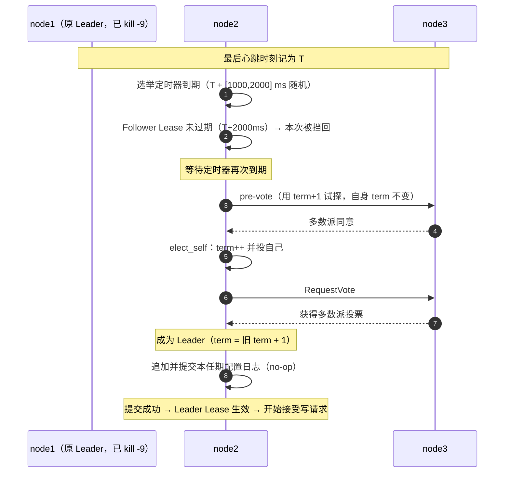

# 03 · 一致性与写路径

> 前两册讲了"数据长什么样"和"代码怎么组装"。从本册开始进入系统的核心：**一次写到底是怎么发生的**。
>
> 本册要回答的问题：为什么写不能直接改数据、必须绕道一条复制日志？一条日志从客户端发起到真正落盘，中间经过了哪些环节？每个环节各自在防什么？
>
> 主要文件：[src/raft/raft_node.cpp](../../src/raft/raft_node.cpp)、[src/raft/state_machine.h](../../src/raft/state_machine.h)、[src/raft/state_machine.cpp](../../src/raft/state_machine.cpp)、[src/store/store_ops.cpp](../../src/store/store_ops.cpp)。

---

## 速览

1. **所有写都必须先变成一条日志，复制到多数派，再按同一个顺序在每个副本上执行**。这是复制状态机（SMR）的基本要求，也是全项目最硬的一条约束。
2. **状态只在一个地方被修改**：`on_apply`。服务层、单机模式、集群模式全都汇聚到这个函数——它保证了"同样的输入序列产生同样的状态"。
3. **`on_apply` 在每个副本上都会执行**，不是只在 Leader 上。Leader 独有的只是"这条日志带了回执，可以把结果填回去唤醒等待者"。
4. **提交与应用是两件事**。日志被多数派确认叫"提交"（commit），被真正执行到状态机里叫"应用"（apply）。中间的间隔是所有异步问题的来源。
5. **写请求是同步等待的**。客户端调用一次写，服务端的那个线程会一直等到 `on_apply` 完成才返回结果。这个等待用的不是标准库的条件变量，而是 brpc 自己的线程原语——用错了会让节点假死。
6. **braft 的选举比教科书多一步 pre-vote**，并且维护着**两个不同的 lease**（一个给读用、一个给投票用）。集群第一次选举的结果总是 term=2，原因是节点初始 term 是 1 而不是 0。
7. **代价与边界**：多数派持久化的代价就是 fsync，这是写路径最大的开销来源；一次写要写多条记录（见第 01 册），加上日志本身的落盘，写放大是明确的；`--raft_sync=false` 能显著提速，但会牺牲崩溃安全性——**该选项默认不启用（也就是 fsync 默认是开的）**。

---

## 一、概念铺垫：共识算法的基本词汇

| 词 | 定义 | 在本项目里 |
|---|---|---|
| **复制状态机（SMR）** | 用"相同的初始状态 + 相同的输入序列 + 确定性的状态机"来保证多个副本最终状态一致 | 输入序列 = Raft 日志，状态机 = `ConfigraftStateMachine` |
| **日志（log）** | 一串有序的、持久化的操作记录 | 每次写先变成一条 `RaftCmd` 日志 |
| **日志下标（log index）** | 日志在序列中的位置，从 1 开始递增 | 每个副本上的下标含义相同，这是"按序执行"的基础 |
| **任期（term）** | 一个单调递增的整数，表示"第几届领导" | 每次选出新 Leader，term 加一 |
| **提交（commit）** | 日志被多数派节点确认，从此不会被撤销 | 提交之后才有可能被应用 |
| **应用（apply）** | 日志被真正执行到状态机里，产生可见的状态变化 | 只有应用之后，读才能读到这次写 |
| **多数派（quorum）** | 超过半数的节点；任意两个多数派必然相交 | 3 节点时是 2，5 节点时是 3 |
| **预投票（pre-vote）** | 候选人先用"假设的下一任期"试探一圈，拿到多数派同意才真正升任期 | braft 默认启用，见 4.2 |

> **为什么多数派能防脑裂**：任意两个多数派一定有交集，所以同一时刻最多只有一个多数派能凑齐、推进提交。如果允许"少数派也能提交"，就会出现两个 Leader 各自提交互相冲突的日志。

---

## 二、背景与目标

### S · 问题：配置中心为什么必须强一致

一个 KV 存储为什么不能像缓存那样最终一致？因为配置中心的语义本身就是"**改一次，全局生效**"：

- 如果节点 A 认为限流阈值是 100、节点 B 认为是 200，那"全局生效"就是一句空话——不同服务会按不同配置运行。
- Watch 的语义依赖"变更严格有序"。如果各节点看到的顺序不同，客户端按 revision 断点续传就会错乱。
- 回滚依赖"所有副本按同一序列重放指令"。如果某个副本自己决定删除记录，它与 Leader 的状态就永久漂移了。

所以配置中心的一致性需求不是"更好"的选择，而是**功能正确性的前提**。

那为什么不用更简单的主从复制？

| 方案 | 问题 |
|---|---|
| 单机 | 挂了就没了，没有容错 |
| 主从异步复制 | 主库挂了，从库可能还没收到最后几条写——要么丢数据，要么选出一个缺数据的从库当新主 |
| 主从半同步 | 稍好，但"谁才是真正的主"仍然没有解决，网络分区时会出双主 |
| **共识（Raft）** | 把"谁说了算"交给多数派投票，任何时刻最多一个 Leader 能提交 |

### T · 目标

- 所有写**线性一致**：一旦某次写返回成功，之后任何读都能看到它。
- 容忍少数节点故障（3 节点容忍 1 个、5 节点容忍 2 个），且**自动恢复**，不需要人工干预。
- 副本之间不允许出现状态漂移——同样的日志序列，必须产生同样的状态。

**明确不做**：不做拜占庭容错（假设节点只会崩溃、不会撒谎）、不做跨数据中心的多组复制、不自己实现 Raft（用 braft 这个成熟实现）。

---

## 三、一次写的完整路径

### 3.1 从入口到提交日志

写请求无论从 gRPC 还是 HTTP 进来，都会汇聚到同一个核心函数（见第 02 册 7.3 的"薄壳 + 共用内核"）。以 `Put` 为例：

```text
KVServiceImpl::DoPut
  ├─ 1. 校验 key 非空                       → 空则回 INVALID_ARGUMENT，不进日志
  ├─ 2. 组装 RaftCmd{ put{key, value} }     → 对外请求 → 内部指令
  └─ 3. node_->Apply(cmd, &result)          → 虚函数调用，进入 RaftNode 或 LocalNode
```

集群模式下进入 `RaftNode::Apply`（[raft_node.cpp:130-162](../../src/raft/raft_node.cpp#L130-L162)）：

```cpp
if (!IsLeader()) {                      // ① 只有 Leader 能定序
    out->code = Code::NOT_LEADER;
    out->leader_id = LeaderId();        //    附带地址供客户端重定向
    return;
}
cmd.SerializeToZeroCopyStream(&wrapper); // ② 序列化成日志数据
auto wait_state = std::make_shared<ApplyClosure::WaitState>();
auto* closure = new ApplyClosure(out, wait_state);
braft::Task task;
task.data = &log;
task.done = closure;
if (term > 0) task.expected_term = term; // ③ 防 ABA，见 3.2
node_->apply(task);                      // ④ 提交给 braft（异步）
ApplyClosure::WaitFor(*wait_state);      // ⑤ 阻塞等待 on_apply 完成
```

**这五行是整个写路径的骨架**。后面几节逐个展开。

### 3.2 `expected_term`：防的是什么 ABA

`node_->apply()` 是**异步**的——把日志交给 braft 就返回了，真正的复制在别的线程进行。于是在"提交"和"复制完成"之间，存在一个窗口，本节点可能已经**不再是那个任期的 Leader**（比如被网络分区挤下台、又立刻重新当选）。

如果不管这个窗口，就可能出现：一个**旧任期 Leader** 提交的日志，被当成有效日志写入。这会绕过节流与安全保证。

`expected_term` 就是补上这个校验：

```cpp
const int64_t term = fsm_->leader_term();   // 当前已知的任期
if (term > 0) task.expected_term = term;
```

braft 在真正处理这条任务时会比对：**如果当前任期不等于 `expected_term`，直接拒绝这条日志**，并让回调立即以失败返回。

一句话概括：**它把"我提交时是 Leader"，升级成了"我提交完成时仍然是同一个任期的 Leader"**。

> 这个 `term` 从哪来？`fsm_->leader_term()` 读的是状态机里一个原子变量——它在 `on_leader_start(term)` 时被写入，在 `on_leader_stop()` 时被置回 -1（[state_machine.h:89-94](../../src/raft/state_machine.h#L89-L94)、[state_machine.cpp:61-69](../../src/raft/state_machine.cpp#L61-L69)）。所以它是一个"本节点认为自己是不是 Leader、在第几任"的本地视图。

### 3.3 `on_apply`：全系统唯一修改状态的地方

braft 把日志复制到多数派后，会在**每个副本**上调用状态机回调 `on_apply`（[state_machine.cpp:16-59](../../src/raft/state_machine.cpp#L16-L59)）。它的骨架是：

```text
for 每一批已提交的日志:
  ① AsyncClosureGuard 托管 iter.done()   ← 保证回调不被同步执行（见下）
  ② 反序列化出 RaftCmd
  ③ ApplyCmdToStore(store_, cmd, &result)  ← 真正改状态
  ④ if 有事件: hub_->Broadcast(events)     ← 广播 Watch（Leader/Follower 都做）
  ⑤ if iter.done(): closure->Finish(result) ← 只有"自己提交的那条"才有回执
     失败时向 braft 上报 EIO
```

四个值得注意的设计点：

**（1）`ApplyCmdToStore` 是单机与集群的共用内核**（[store_ops.cpp:122-148](../../src/store/store_ops.cpp#L122-L148)）。它按 `RaftCmd` 的 `oneof` 分派到 Store 的六个写方法，每个成功的方法返回一条 Watch 事件。`LocalNode::Apply` 调的是同一个函数——**所以单机和集群的写语义不可能漂移**。

**（2）`on_apply` 在每个副本都执行**。这是最容易讲错的一点。Leader 独有的只是 `iter.done()` 非空（这条日志是它提交的，带了回执），所以它能 `Finish` 填结果。Follower 同样执行 `ApplyCmdToStore`、同样 `Broadcast`——**这正是"Watch 可以挂在任意节点"的基础**（[state_machine.cpp:37-41](../../src/raft/state_machine.cpp#L37-L41) 的注释把这层意思写明了）。

**（3）广播在填结果之前**。`Broadcast`（[state_machine.cpp:40](../../src/raft/state_machine.cpp#L40)）早于 `Finish`（[:47](../../src/raft/state_machine.cpp#L47)）。也就是说，**本副本**在唤醒写请求的等待者之前，已经把自己产生的事件推给了订阅者。（注意"跨副本"之间不存在这种先后关系——每个副本按自己的应用进度走。）

**（4）失败必须上报**。如果 `ApplyCmdToStore` 出错（比如 LevelDB 写失败），代码会向 braft 设置 `EIO`（[state_machine.cpp:51-56](../../src/raft/state_machine.cpp#L51-L56)）。理由是：这条日志**已经在集群层面提交了**，如果本节点静默吞掉失败，就会出现"集群认为成功、本节点没有"的状态发散。

### 3.4 同步等待：为什么写请求要等，以及怎么等

一个自然的疑问：既然 `apply` 是异步的，为什么不让服务层也异步——提交完就返回，等 `on_apply` 完成后再通过别的方式通知客户端？

因为**客户端要的就是"写成功了"这个确定结论**。如果写请求异步返回，客户端拿到的是一个"已提交但还不知道结果"的状态，无法决定下一步。所以本项目选择让服务层的那个执行线程**阻塞等待**，直到 `on_apply` 返回结果。

等待的实现有一个关键约束（[state_machine.h:26-28](../../src/raft/state_machine.h#L26-L28) 的注释）：

> **源码注释的要点是：必须用 bthread 的同步原语，不能用 `std::condition_variable`。**

原因是 brpc 的线程模型：`num_threads = 4` 指的是**底层内核线程**的数量，而请求是在用户态线程（bthread）上跑的。如果一个 bthread 阻塞在 `std::cv` 上，它会**占住底层的那个内核线程**。高并发写场景下，4 个阻塞的请求就能把内核线程全部占满——`on_apply` 和网络回调再也拿不到线程执行，节点表现为"能 ping 通但不再响应任何请求"。

换成 `bthread::Mutex` + `bthread::ConditionVariable` 之后，挂起的是 bthread 本身，内核线程被让出去继续跑别的工作。

> 这个问题的发现过程、试错方案和性能代价，记在第 07 册。这里只需要记住结论：**在这套线程模型下，任何会阻塞的等待都必须用框架自己的原语**。

### 3.5 `ApplyClosure` 与 `WaitState`：一次真实的内存安全修复

等待机制还有一个更隐蔽的坑。看一下 `ApplyClosure` 的结构（[state_machine.h:24-67](../../src/raft/state_machine.h#L24-L67)）：

```cpp
class ApplyClosure : public braft::Closure {
    struct WaitState {                      // ← 独立的等待状态
        bthread::Mutex mu;
        bthread::ConditionVariable cv;
        bool done = false;
    };
    ApplyResult* out_;                      // 指向调用方自己的结果对象
    std::shared_ptr<WaitState> st_;         // 共享所有权

    void Finish(const ApplyResult& r) { *out_ = r; }   // 只填结果，不唤醒
    void Run() override {                              // braft 在另一个 bthread 里调
        std::unique_ptr<ApplyClosure> self(this);      // ← 自杀
        ...
        std::unique_lock<bthread::Mutex> lock(st_->mu);
        st_->done = true;
        st_->cv.notify_one();                          // 这里才真正唤醒
    }
};
```

**为什么要拆出一个 `WaitState`？** 因为 braft 可能在 `node_->apply()` **还没有返回**的时候，就已经复制完成并调用了 closure 的 `Run()`——而 `Run()` 的最后会 `delete this`。

于是在等待侧就出现了一个竞态窗口：等待方正准备访问 closure 的成员，而 closure 已经被销毁了。这是典型的 use-after-free，实测表现为高吞吐压测下的段错误。

解法是把"等待所需的全部状态"从 closure 里**挪到一个独立对象**上，用 `shared_ptr` 共享：

- 等待方持有 `shared_ptr<WaitState>`，闭包被提前销毁也不影响它安全等待；
- 闭包自己只保留一个 `ApplyResult* out_`，指向**调用方自己的对象**——这个对象的生命周期归调用方管，本来就不会悬垂。

**两个容易混淆的点**（值得单独记）：

1. **`Finish` 和 `Run` 不是一回事**。`Finish` 只做 `*out_ = result`，**不设标志、不唤醒**；置 `done = true` 并唤醒等待者，都发生在 `Run()` 里，而 `Run()` 由 braft 在**另一个 bthread** 中异步触发。
2. **`WaitState` 只管"信号"，不管"结果"**。它在解耦的是"等待/唤醒"这个信号的存活性，结果本身一直存在调用方的 `ApplyResult` 里。

---

## 四、braft 的接入与真实参数

### 4.1 节点配置

`RaftNode::Init`（[raft_node.cpp:72-117](../../src/raft/raft_node.cpp#L72-L117)）把本项目的数据交给 braft：

| 配置项 | 值 | 说明 |
|---|---|---|
| `initial_conf` | 从 `--peers` 解析 | 初始成员列表 |
| `election_timeout_ms` | 来自 `--election_timeout_ms`，默认 1000 | 选举超时**基准**，不是固定值（见 4.2） |
| `fsm` | `ConfigraftStateMachine*` | 状态机指针 |
| `node_owns_fsm` | **`false`** | braft 不拥有状态机，所有权在本项目的 `fsm_` 上 |
| `snapshot_interval_s` | 30 | 每 30 秒打一次快照 |
| `log_uri` / `raft_meta_uri` / `snapshot_uri` | `local://{data_dir}/raft/{log,raft_meta,snapshot}` | 日志、元数据、快照三个目录 |

`group_` 固定为 `"configraft"`——这是复制组的名字，一个 braft 进程可以承载多个组，本项目只用了一个。

> 顺带一提：这段代码的注释编号是 1、3、4（没有 2）。不是文档疏漏，源码里就是这样——推测是重构时删掉了中间一步、编号没跟着改（**推测，未验证**）。

### 4.2 选举：braft 与教科书的三个差异

Raft 论文描述的是"选举超时 → term+1 → 转候选人 → 拉票"。braft 的实现有三处值得注意的差异：

**差异一：多了一步 pre-vote（预投票）**

节点选举超时后，**不是立刻 `term+1` 转候选人**，而是先用"当前任期 + 1"去试探性地问一圈，**自身任期不变**。只有拿到多数派同意，才真正升任期并投自己一票。

这样做的目的：防止一个被网络抖动隔离的节点反复"推翻"健康的 Leader——它的试探得不到多数派响应，任期就不会升，也就不会干扰集群。

**差异二：维护着两个不同的 lease**

| lease | 时长 | 作用 |
|---|---|---|
| Leader Lease | 1000ms | **给读用的**：有效期内 Leader 可以确认"我还是唯一的 Leader"（第 04 册的核心） |
| Follower Lease | 2000ms | **给投票用的**：有效期内该节点不参与选举、不投给新候选人 |

两个 lease 容易混淆但职责完全不同：前者是"我能提供一致读"的凭证，后者是"我暂时不参与改朝换代"的承诺。

**差异三：随机化的是"超时区间"而不是固定值**

`election_timeout_ms` 是**基准值**，实际每次调度会加上随机抖动。以本项目配置（基准 1000ms）为例：

| 参数 | 实际值 |
|---|---|
| 选举超时 | 每次在 **[1000, 2000] ms** 之间随机取（第一次调度就已随机） |
| 心跳间隔 | **100 ms**（= 选举超时基准 / 10） |
| Follower Lease | **2000 ms**（= 选举超时 1000 + 最大时钟漂移 1000） |
| 候选人等票超时 | [2000, 3000] ms |

（这些数值来自 braft v1.1.2 源码：选举超时随机化 `node.cpp:120-122`，心跳间隔 `:125-127`，两个 lease 的初始化 `:494-495`。braft 源码由构建脚本下载到 `third_party/src/braft/`，不在 git 仓库内。）

### 4.3 为什么集群第一次选举总落在 term=2

这是一个很能体现"读没读过源码"的细节。常见的错误解释是"第一轮 split vote 了，第二次超时才选出来"——**实测推翻了这个说法**。

真实的因果链是：

```text
braft 新建节点时，_current_term 初始化为 1     （不是 0，见 node.cpp:397-398）
        ↓
选举超时 → pre-vote：用 "term+1 = 2" 试探，但自身 term 保持 1 不变
        ↓
拿到多数派同意 → elect_self：_current_term++ → 变成 2，并投自己
        ↓
获多数派投票 → 成为 Leader，term = 2
```

**一轮选举就落在 term=2**，中间没有发生竞争。项目里实测 14 次独立启动，14 次首个 Leader 都在 term 2；其中 13 次只有一个节点的定时器到期，根本不存在 split vote（来源：项目内的选举计时记录，是运行时测量值，本册未独立复现）。

**运行期故障切换则不同**：`kill -9` 掉 Leader 后，其他节点的第一次选举超时**几乎必然被 Follower Lease 挡回**（lease 时长 2000ms，而选举超时的上界也正好是 2000ms——两者在端点相接，能撞上不被挡回的概率约千分之一），要等到 lease 过期后定时器再次到期才发起选举。实测恢复时间约 **2.17 秒**，term 从 2 变 3。

---

## 五、核心链路

### 5.1 一次写的完整时序（含等待原语）

```mermaid
sequenceDiagram
    autonumber
    participant C as 客户端
    participant S as API 层
    participant N as RaftNode
    participant B as braft
    participant F as on_apply
    participant D as Store
    participant W as WatchHub

    C->>S: POST /v1/kv/{key}
    S->>N: Apply(cmd, &result)
    N->>N: IsLeader? 否 → NOT_LEADER + leader 地址
    N->>N: 序列化 RaftCmd
    N->>N: 建 WaitState(shared_ptr) + ApplyClosure
    N->>B: node->apply(Task{data, done, expected_term})
    N->>N: ApplyClosure::WaitFor() —— 阻塞当前 bthread
    B->>B: AppendEntries → 多数派持久化
    Note over B: commit_index 推进
    B->>F: on_apply(iter)
    F->>F: AsyncClosureGuard 托管 iter.done()
    F->>F: 反序列化 RaftCmd
    F->>D: ApplyCmdToStore
    D->>D: WriteBatch：k/ + v/ + meta/revision
    D-->>F: ApplyResult（含 events）
    F->>W: Broadcast(events)          ← 先广播
    Note over W: 订阅者被唤醒，长轮询返回
    F->>F: closure->Finish(result)    ← 只填结果，不唤醒
    F-->>B: 本批日志处理完
    B->>N: Run() 在独立 bthread 中执行
    N->>N: done=true; cv.notify()     ← 这里才真正唤醒
    N-->>S: WaitFor 返回
    S-->>C: 响应 (value, version, revision)
```

**与 00 册简版的差别**，就在最后四步：`Finish` 填结果 → `Run` 在独立 bthread 里唤醒。这两步分开，正是为了在 closure 可能被提前销毁的情况下仍然安全。

### 5.2 一次选举（含 pre-vote 与两个 lease）



**图上的最后一步（追加并提交本任期的配置日志）是所有一致性的枢纽**。新 Leader 必须提交这样一条日志（等价于 Raft 论文里的 no-op），它同时是两件事的前提：

1. 它把**上一任期遗留的日志**一并推成已提交状态（Raft 的安全性要求）；
2. 它让 **Leader Lease 生效**——而 Lease 有效是线性一致读的承重墙（第 04 册）。

---

## 六、关键接口与字段

### 6.1 写路径上的核心字段

| 字段 / 结构 | 所在位置 | 语义 | 设计要点 |
|---|---|---|---|
| `RaftCmd` | proto（oneof 六选一） | 复制日志的内容 | 与对外 API 完全分离，见第 01 册 3.3 |
| `braft::Task.data` | [raft_node.cpp:148](../../src/raft/raft_node.cpp#L148) | 序列化后的日志数据 | 用 `butil::IOBuf` 零拷贝包装，避免多余的内存拷贝 |
| `braft::Task.done` | [raft_node.cpp:149](../../src/raft/raft_node.cpp#L149) | 回调（即 `ApplyClosure`） | 只有 Leader 提交的这条会带回调，Follower 复制过来的日志没有 |
| `braft::Task.expected_term` | [raft_node.cpp:153](../../src/raft/raft_node.cpp#L153) | 期望任期 | 防 ABA：任期对不上则 braft 拒绝该任务 |
| `ApplyResult.leader_id` | [node.h:19](../../src/raft/node.h#L19) | 非 Leader 时的重定向目标 | 由应用层填地址、拼进响应 message |
| `ApplyResult.events` | [node.h:23](../../src/raft/node.h#L23) | 本次写产生的 Watch 事件 | 与"是否 Leader"无关——Follower 也要广播 |
| `ApplyClosure::WaitState` | [state_machine.h:29-33](../../src/raft/state_machine.h#L29-L33) | 等待信号（mu / cv / done） | 与 closure 分离，防 UAF；**不含结果** |
| `ApplyClosure::out_` | [state_machine.h:65](../../src/raft/state_machine.h#L65) | 指向调用方的结果对象 | 生命周期归调用方，不随 closure 销毁 |
| `iter.done()` | [state_machine.cpp:44](../../src/raft/state_machine.cpp#L44) | 本副本是否为该日志的提交者 | 非空 ⇒ Leader 自己提交的，需要回填结果 |

### 6.2 `braft::NodeOptions` 的关键配置

| 配置项 | 值 | 为什么是这个值 |
|---|---|---|
| `node_owns_fsm` | `false` | 状态机由本项目的 `unique_ptr` 拥有，braft 只借用 |
| `snapshot_interval_s` | 30 | 快照太频繁会拖慢写路径，太稀疏会让新节点追平变慢 |
| `election_timeout_ms` | 1000（可配） | 基准值；调大能容忍更慢的网络，代价是故障恢复更久 |

---

## 七、结果：验证与代价

### 7.1 怎么验证它是对的

| 验证点 | 手段 | 说明 |
|---|---|---|
| 并发 CAS 在真实 Raft 下恰一个成功 | `raft_cas_test` | **特意起单节点 braft 组**而不是用 `LocalNode`——因为 `LocalNode` 是同步直调，测不出"日志序保证并发原子"这件事 |
| Leader 被 kill 后集群自动恢复 | 混沌测试场景 A | 持续写入，验证不中断、不出错 |
| Follower 被 kill 后仍可读写 | 混沌测试场景 B | 多数派仍在 |
| 网络分区下不出现双主 | 混沌测试场景 C（用 `SIGSTOP` 模拟） | |
| 重启节点能追平 | 混沌测试场景 D | 经日志/快照补齐，Watch 补上断档 |
| 并发写下 revision 不重复 | 单测 + 单机压测 | 这条对应审查发现的一个真实缺陷（单机模式的锁缺失） |

两个后台校验程序持续做黑盒断言（写后立即读、Watch 事件 revision 必须严格递增），**跑完全部场景后违例数必须为 0**。

> 诚实的边界：这是"写后立即读"的定向校验，能抓出读旧值、乱序、丢事件这类大问题；但它**不是** Jepsen/Knossos 那种记录全部并发历史、做严格线性化判定的工具。

### 7.2 代价

1. **写吞吐受多数派持久化限制**。3 节点集群默认持久化时约 10.0k QPS（gRPC Put ×64，8 核云主机同机环回），而单机是 41.8k——**复制本身就吃掉了约 3/4 的写吞吐**。
2. **`fsync` 是最大热点**。关闭后低并发（c8）能快 8~10 倍、高并发（×64）约 2.8 倍。但关掉它意味着崩溃时可能丢失已提交的日志——所以它只用于压测，**生产必须开启**。
3. **集群越大写越慢**。5 节点比 3 节点写吞吐低 **约 12%~33%**（随并发档位变化；多数派从 2/3 变成 3/5）。换来的是容错能力从"容忍 1 个故障"提升到"容忍 2 个"。
4. **写放大**。一次单键写最多产生三条记录（`k/`、`v/`、`meta/revision`），`Publish` 还要多写一条 `cfg/`，批量写则随条数线性增长；再加上一条 Raft 日志（日志本身也要 fsync），一次逻辑写的落盘量远超数据本身。

（数据出处：加固后口径。集群数据见 [docs/性能压测报告.md](../性能压测报告.md) §6；**单机与 5 节点的数字只在原始输出**[docs/压测结果_云主机_20260820.txt](../压测结果_云主机_20260820.txt) 中。环境为 2026-08 阿里云 8 vCPU / 16G / NVMe SSD，多节点进程同机环回。**注意报告 §2–§4 是加锁前基线，引用以 §6 为准。**）

---

## 八、通用知识

**共识算法**
- 复制状态机（SMR）：分布式一致性的通用蓝图——同步"操作序列"而不是"状态"。前提是状态机必须是**确定性**的。
- 多数派（quorum）：任意两个多数派必然相交，这是"同一时刻最多一个 Leader"的数学基础。3 节点容忍 1 个故障，5 节点容忍 2 个。
- 任期（term）：用单调递增的整数给"领导届次"编号，是拒绝过期请求的通用手段。
- pre-vote：候选人先用假想任期试探，避免被隔离节点反复推翻健康 Leader。

**Raft 的两个安全性保证**（理解一致读的前提）
- **Leader 完备性**：某条日志一旦提交，之后所有任期的 Leader 都必然包含它。
- **状态机安全**：不会有两个副本在同一个下标上应用了不同的日志。

**异步提交的三个固有难题**
- 提交与应用的间隔：日志提交了不代表状态机已经执行，读路径必须显式处理这个 gap。
- 回调的生命周期：异步框架的回调可能在调用方还没准备好时就被执行（甚至销毁），"谁拥有这个对象"必须想清楚。
- 同步原语与线程模型必须匹配：在用户态线程模型下用内核线程的同步原语，会把底层线程池耗尽。

**性能与持久性**
- 共识的"持久化"不是抽象的，落到实现就是 `fsync`。这是"崩溃不丢已提交日志"的固有代价，不是代码缺陷。
- 副本数增加会同时降低写吞吐、提高容错能力——这是一次明确的取舍，不是免费的。

---

## 延伸阅读

| 主题 | 仓库内位置 |
|---|---|
| 写路径与等待原语 | [src/raft/raft_node.cpp](../../src/raft/raft_node.cpp) |
| 状态机与 `ApplyClosure` | [src/raft/state_machine.h](../../src/raft/state_machine.h)、[state_machine.cpp](../../src/raft/state_machine.cpp) |
| 指令分派（单机/集群共用） | [src/store/store_ops.cpp](../../src/store/store_ops.cpp) |
| Raft 原理与 braft 源码精读 | [docs/raft-and-braft.md](../raft-and-braft.md)、[docs/raft一致性算法.md](../raft一致性算法.md) |
| 性能完整矩阵与复现方法 | [docs/性能压测报告.md](../性能压测报告.md) |
| 假死与 UAF 的完整发现过程 | 本套资料第 07 册 |

---

**上一篇**：[02-系统架构与组装.md](02-系统架构与组装.md) · **下一篇**：[04-线性一致读.md](04-线性一致读.md)——写已经能保证一致了，那读凭什么也能？
