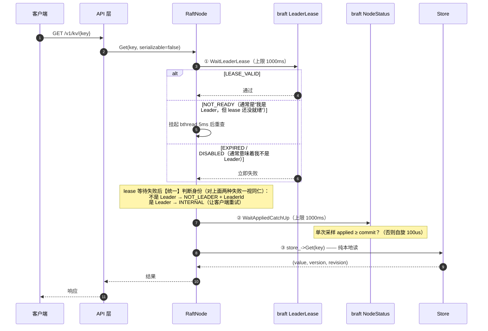
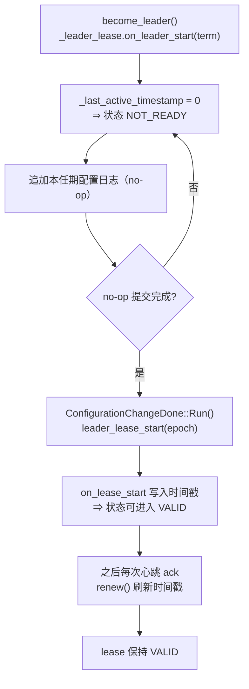

# 04 · 线性一致读

> 03 册解决了"写怎么保证一致"。本册解决另一半，也是整套资料里理论密度最高的一册：**读凭什么也能保证一致**。
>
> 为什么这件事比写难？因为写有"多数派确认"这个明确的动作作为凭据；而读什么都不做——它就是打开本地数据库看一眼。要证明这一眼看到的是最新的，需要一串推理。
>
> 主要文件：[src/raft/raft_node.cpp](../../src/raft/raft_node.cpp)（`Get` / `WaitLeaderLease` / `WaitAppliedCatchUp`）、[src/store/store.cpp](../../src/store/store.cpp)（CAS 实现）。

---

## 速览

1. **读不经过复制**——直接从本地状态机读，这是读吞吐能达到 27 万 QPS 的原因。代价是：正确性不能靠"复制"保证，必须靠别的手段。
2. **问题的本质不是"数据旧"，而是"我不知道自己是不是已经过期了"**。一个被网络分区隔离的旧 Leader 完全不知道自己已被取代，它会心安理得地用本地数据回答读请求。
3. **本项目的答案是 Leader Lease**：读之前先向 braft 确认 lease 有效——`LEASE_VALID` 同时给出"我仍是唯一 Leader"和"上一任期的写都已经在我手上"两个保证。
4. **然后是第二道闸门**：lease 只保证"这些写在我日志里"，不保证"已经进了我的状态机"。所以还要等 `applied ≥ commit`。
5. **两道闸门都过了才读本地**。任何一道没过，**返回失败而不是返回可能过期的值**——牺牲可用性，保住正确性。
6. **这套论证的承重墙是一个 braft 的实现细节**：Leader Lease 只有在"本任期的第一条配置日志（等价于 Raft 论文里的 no-op）提交完成"之后，才会从 NOT_READY 变成 VALID。这一条可以在 braft 源码里逐行验证。
7. **代价与边界**：这套方案依赖**节点间时钟漂移有界**，且要求**集群里所有节点都开启这个开关**（少一个都不安全）；Leader 刚切换后的短暂窗口内读会失败需要重试。相比之下，Raft 的 ReadIndex 方案不需要时钟假设——但 braft v1.1.2 没有提供它。

---

## 一、概念铺垫：四种一致性，用一个例子讲

与其背定义，不如看同一个场景在四种模型下的区别。

> **场景**：配置 `max_conn` 原本是 `100`，在 t1 时刻被改成 `200` 并返回成功。t2 时刻（t2 晚于 t1）发起一次读，能读到什么？

| 模型 | 直观含义 | t2 读到的结果 | 本项目 |
|---|---|---|---|
| **线性一致**（Linearizable） | 表现得像只有一份数据：**写一旦返回成功，之后开始的读一定能看到它**；所有操作能排成一个不违反真实时间的先后序 | 必然是 200 | **写**、以及默认的 `Get` |
| **顺序一致**（Sequential） | 所有客户端看到同一个操作顺序，但这个顺序**不必与真实时间一致** | 可能还是 100 | —（Raft 提供的比这更强） |
| **因果一致**（Causal） | 有因果关系的操作按因果序可见，无因果的可以乱序 | 可能读到 100 | — |
| **最终一致**（Eventual） | 不保证读到新值，只保证"不再写之后最终会收敛" | 可能读到旧值 | `serializable=true` 的降级读 |

**本项目对外承诺的完整清单**：

| 操作 | 一致性 | 靠什么实现 |
|---|---|---|
| 所有写 | 线性一致 | Raft 多数派提交 → `on_apply` 串行落库（03 册） |
| `Get`（默认） | 线性一致 | Leader Lease + 追平屏障，本册主题 |
| `Get`（`serializable=true`） | 可容忍过期 | 任意节点本地读，用于监控这类场景 |
| `Watch` | 有序、不丢、可续传 | 事件来自应用序列，按全局 revision 排序（05 册） |

> **一个容易搞混的点**：`serializable=true` 这个名字容易让人以为它更强，实际上它是**降级**选项——它放弃了线性一致，换来"任意节点都能读"。

---

## 二、背景与目标

### S · 问题：Leader 直接读本地，为什么不够

一个很自然的想法：Leader 手上有最新数据，让它直接读本地不就行了？

这个想法有两个洞，一个浅、一个深。

**浅的那个：日志提交了，不等于状态机执行了。**

03 册讲过，提交（多数派确认）和应用（执行到状态机）是两个分开的动作。一个刚当选的 Leader、或者一个刚从故障中恢复、正在追赶日志的节点，它的 `commit_index` 可能已经很大，但 `known_applied_index` 还远远落在后面。此时直接读本地，读到的是**一个还没把已提交写执行完的状态**。

这个洞好补：等 `applied ≥ commit` 就行。

**深的那个：我怎么知道我还是 Leader？**

考虑这个场景：

```text
    node1（自认为是 Leader）  ┊ 网络分区 ┊  node2, node3
                              ┊          ┊
                              ┊          └─ 等 node1 失联后发起选举
                              ┊             node2 当选，提交了一系列新写
                              ┊
      它完全不知道那边发生了  ┊
      什么，继续用本地数据    ┊
      回答读请求 → 读到旧值   ┊
```

**node1 不会报错，因为它不知道自己已经出局了。** 它会一直尝试把日志复制给 node2/node3（拿不到多数派响应，所以提交不了新写），但它的本地状态是完整的、可读的，于是它会心安理得地返回**过期的数据**。

这才是难点。补这个洞需要一种机制，让 Leader 在回答读之前，能确认"我仍然是被多数派认可的那个 Leader"。

### T · 目标

- 读**不走日志复制**（否则读吞吐会掉到写同一个量级，配置中心"读多写少"的形态就浪费了）。
- 读到的值保证是**线性一致的最新值**，或者干脆失败，**绝不返回可能过期的值**。
- 提供一个降级选项，供不在乎一致性的场景使用。

**明确不做**：不做跨数据中心的读（跨机房的一致性需要另一套机制）；不为了读而引入新的持久化结构。

---

## 三、为什么选 Lease，而不是 ReadIndex

Raft 社区解决"一致读"有两条主流路线，本项目只能选其中一条。

### 3.1 备选方案：ReadIndex（被否决）

ReadIndex 的思路是：Leader 在回答读之前，**向多数派发一轮探测**，确认"我仍然是 Leader"；同时记下当前的 `commit_index` 作为"读屏障"，等本地状态机应用到那个位置再读。

它的优点是**不依赖时钟假设**——只看多数派的回应，逻辑上更干净。

**本项目不能用它的原因非常直接：braft v1.1.2 没有提供 ReadIndex API**（全量搜索源码确认）。要自己造，就得改动框架的共识核心（协议级别的改动），而且要求集群里所有节点同步升级——在一个依赖版本已经锁定的项目里，这个风险不值得承担。

### 3.2 采用的方案：Leader Lease

Lease 的思路是"**用周期性心跳的回应，提前买下一段时间的证明**"：

- Leader 每次和多数派心跳交互，就刷新一次本地时间戳；
- 只要距离上次成功交互**还没超过一个期限（lease 期）**，Leader 就可以认定"在这段时间内，多数派不会选出新 Leader"——因为 Follower 在该期限内会遵守 lease、拒绝给新候选人投票。
- 于是这段时间内，Leader 可以**直接在本地回答读，不需要再问任何人**。

本质上，ReadIndex 是"每次读都问一次"，Lease 是"用心跳把询问摊薄成持续的证明"。

### 3.3 两条路线的对比

| 维度 | ReadIndex | Leader Lease（本项目采用） |
|---|---|---|
| 机制 | 每次读向多数派发一轮探测 | 复用周期性心跳的回应作为持续证明 |
| 安全性前提 | **只需要 Raft 本身，无时钟假设** | 需要所有节点开启该开关 + 一致的超时配置 + **时钟漂移有界** |
| 稳态读延迟 | 每次读 **+1 个网络往返** | 本地检查，**≈0 额外往返** |
| 对 Follower 的负担 | 每次读都扇出 RPC | 零额外负担 |

**取舍说明**：本项目是读延迟敏感的配置中心（读多写少），Lease 用心跳摊薄了探测成本，对读路径几乎零开销。代价是引入了时钟假设——我们在读路径上用三道措施把风险兜住：① 启动时强制打开开关；② 加 `applied ≥ commit` 屏障；③ lease 未就绪时有界等待后返回失败而不是降级。

---

## 四、两道闸门与正确性论证

### 4.1 读路径的全部代码

`RaftNode::Get` 的逻辑很短（[raft_node.cpp:166-199](../../src/raft/raft_node.cpp#L166-L199)）：

```cpp
if (!serializable) {                        // 默认路径：线性一致读
    if (!WaitLeaderLease(kLeaseWaitMs)) {   // 闸门一：等 lease 变 VALID（上限 1000ms）
        if (IsLeader()) {                   // ← "我是不是 Leader"在这里才判别
            out->code = INTERNAL;           //    我是 Leader 但 lease 未就绪 → 让客户端重试
            out->message = "leader not ready for linearizable read, retry";
            // 绝不填 out->leader_id = LeaderId()（那就是我自己，会造成死循环）
        } else {
            out->code = NOT_LEADER;         //    我不是 Leader → 附地址让客户端重定向
            out->leader_id = LeaderId();
        }
        return;
    }
    if (!WaitAppliedCatchUp(kCatchupWaitMs)) {  // 闸门二：等 applied ≥ commit（上限 1000ms）
        out->code = INTERNAL;
        out->message = "apply catch-up timeout";
        return;
    }
}
// serializable=true 会跳过上面整块，直接落到这里：降级读，任意节点本地读
KV kv; int32_t code = 0;
if (!store_->Get(key, &kv, &code)) { ... }      // 唯一的本地读出口
```

**注意控制流的一个细节**：`IsLeader()` 的判断**不在方法开头**，而是在 `WaitLeaderLease` 失败的 `if` 分支里面。所以真实顺序是：

```text
serializable 判定 → 等 lease →（失败时）判断我是不是 Leader → 等追平 → 本地读
```

这个顺序不是随意的：**Follower 调用 `WaitLeaderLease` 会立刻拿到 `EXPIRED`**（它那个 lease 对象的任期是 0），不会白白等满 1000ms。所以"先等 lease、再判身份"不会让打在 Follower 上的读请求付出额外的延迟；只有"确实是 Leader 但 lease 还没就绪"的情况，才会真的自旋等待。

> 很多讲解会把这一步画成"先判断是不是 Leader"。最终结果一样（Follower 都是拿到 `NOT_LEADER`），但**控制流不同**——按源码来。本册 6.1 的时序图也按真实顺序画。

**两道闸门各自负责什么**：

| 闸门 | 保证 | 没它能出什么问题 |
|---|---|---|
| ① Leader Lease | 我仍是唯一 Leader，且旧任期的已提交写都在我日志里 | 被隔离的旧 Leader 返回过期值（2 节的"深的那个洞"） |
| ② 应用追平 | 我日志里的已提交写，已经执行进我的状态机 | 刚当选/刚恢复的节点读到"欠账"的状态（2 节的"浅的那个洞"） |

**两个细节值得单独记**：

- **闸门一是自旋等待**：`LEASE_VALID` 直接过；`NOT_READY` 挂起 5ms 后重查；`EXPIRED` / `DISABLED` 立即返回失败（[raft_node.cpp:201-222](../../src/raft/raft_node.cpp#L201-L222)）。
- **闸门二是单次采样**：用**一次** `get_status` 同时取 `known_applied_index` 和 `committed_index` 再比较（[raft_node.cpp:224-242](../../src/raft/raft_node.cpp#L224-L242)）。分两次取会有问题——读到"较新的 applied + 较旧的 commit"会误判为已追上。

### 4.2 承重墙：lease 有效意味着什么

上面把 Lease 当成了"我没被取代"的证据。但这句话需要证明，否则整个方案是循环论证。

先看 braft 里 Leader Lease 的**状态判定逻辑**（braft v1.1.2 `lease.cpp:58-82`；braft 源码由构建脚本下载到 `third_party/src/braft/`，不在 git 仓库内，故以下按文件名与行号引用）：

```cpp
void LeaderLease::get_lease_info(LeaseInfo* lease_info) {
    if (!FLAGS_raft_enable_leader_lease) { state = DISABLED; return; }  // 开关没开 → DISABLED
    if (_term == 0)                       { state = EXPIRED;  return; }  // 不是 Leader → EXPIRED
    if (_last_active_timestamp == 0)      { state = NOT_READY; return; } // ← 关键状态
    if (now < _last_active_timestamp + _election_timeout_ms)
                                          { state = VALID;    return; }  // 在期限内 → VALID
    else                                  { state = SUSPECT; }
}
```

注意 **`NOT_READY` 的判定条件：`_last_active_timestamp == 0`**。也就是说，lease 变有效的前提是这个时间戳**被赋予了一个非零值**。那么它是被谁、在什么时候赋予的？

追溯这条线，就是整个论证的关键：

**第一步——当选时，lease 被主动清零。**

`become_leader()` 中会调用 `_leader_lease.on_leader_start(term)`（braft `node.cpp:1869`），其实现是（`lease.cpp:32-37`）：

```cpp
void LeaderLease::on_leader_start(int64_t term) {
    ++_lease_epoch;
    _term = term;
    _last_active_timestamp = 0;      // ← 置零 ⇒ 状态回到 NOT_READY
}
```

**刚当选的 Leader，lease 是无效的。**

**第二步——只有 no-op 提交完成，lease 才会被点亮。**

braft 在成为 Leader 后会追加一条本任期的配置日志（等价于 Raft 论文里的 no-op）。这条日志提交完成后，会触发 `ConfigurationChangeDone::Run()`（braft `node.cpp:87-98`）：

```cpp
void Run() {
    if (status().ok()) {
        _node->on_configuration_change_done(_term);
        if (_leader_start) {
            _node->leader_lease_start(_lease_epoch);   // ← lease 在这里才被点亮
            _node->_options.fsm->on_leader_start(_term);
        }
    }
    delete this;
}
```

`leader_lease_start` 最终调用 `LeaderLease::on_lease_start`，把 `_last_active_timestamp` 设成非零（`lease.cpp:45-51`）。**从这一刻起，lease 才可能进入 VALID。**

**第三步——此后靠心跳续期。**

每次与多数派心跳交互成功，都会调 `renew()` 刷新该时间戳（`lease.cpp:53-56`），让 lease 保持在 VALID。

### 4.3 完整论证链

现在可以把整条推理写清楚了。目标：**证明第 ④ 步的本地读，读到的状态等价于某个"覆盖了此前所有已提交写"的线性化点。**

**引理 A（no-op 已提交 ⟹ 旧任期的已提交写都在我的日志里）**
新 Leader 提交本任期 no-op 成功，意味着这条日志被多数派接受。由 Raft 的 **Leader 完备性**（选举时的 up-to-date 检查保证）：此前任何任期已提交的日志条目，必然出现在之后所有 Leader 的日志中。⇒ 我这个 Leader 的日志包含所有旧任期的已提交写。

**引理 B（LEASE_VALID ⟹ 本任期 no-op 已提交）**
由 4.2 的证据链直接得出：lease 在当选时被置零（`on_leader_start`）、只可能在 no-op 提交完成的回调里被点亮（`ConfigurationChangeDone::Run`）。所以 `LEASE_VALID` 蕴含"本任期 no-op 已提交"。⇒ 结合引理 A，我的日志包含一切此前已提交的写。

**引理 C（LEASE_VALID ⟹ 在 lease 期内我仍是唯一的 Leader）**
lease 靠多数派周期性确认续期；VALID 意味着最近与多数派交互过。而开启了 lease 的 Follower 在 lease 期内不参与选举——**多数派不会在我不知情的情况下选出一个新 Leader**。⇒ lease 有效期内，不存在一个提交了新写而我看不到的 Leader。

**引理 D（applied ≥ commit ⟹ 引理 A 那些写已经进了状态机）**
闸门二保证本地状态机已应用到 `commit_index`。⇒ 引理 A 说的"日志里有"变成了"状态机里有"。

**结论**：第 ④ 步本地读发生时，我的状态机已经包含了 lease 确立时刻之前的一切已提交写；且 lease 期内不会有别的 Leader 提交我未见的写。⇒ 读到的是线性一致的最新状态。

**反过来说**：如果 lease 失效、或者追不上对账，读**直接失败**（返回 `INTERNAL`），而不是退回本地读——**宁可拒绝服务，也不返回过期值**。这是这个设计最关键的取舍。

> **最容易漏的一环**：很多人会以为"等 `applied ≥ commit` 就等价于线性一致了"。不是。`applied ≥ commit` 只是**必要条件**——它保证"我读到的至少和我知道的一样新"，但"我知道的是不是全部"要靠引理 B/C 来保证。**承重墙是那个 no-op 配置条目，不是追平屏障。**

### 4.4 三个工程细节

**（1）为什么读也要重定向到 Leader？**
Follower 上既没有 lease（lease 是 Leader 的概念），也不保证自己状态机追上了 commit。要让它承担读，只能落到 `serializable=true` 的降级路径。所以强一致读必须打 Leader。

**（2）"我是 Leader 但 lease 还没就绪"，返回什么？**
这是极易讲反的一处。源码里的分支是（[raft_node.cpp:172-181](../../src/raft/raft_node.cpp#L172-L181)）：

```cpp
if (!WaitLeaderLease(...)) {
    if (IsLeader()) {                       // ← 我是 Leader，但 lease 未就绪
        out->code = INTERNAL;               //    返回 INTERNAL，让客户端重试
        out->message = "leader not ready for linearizable read, retry";
        // 注意：绝不填 out->leader_id = LeaderId()（那就是我自己）
    } else {                                // ← 我不是 Leader
        out->code = NOT_LEADER;
        out->leader_id = LeaderId();        //    填真实 Leader 地址，让客户端重定向
    }
    return;
}
```

**为什么"是 Leader"这一支不能返回自己的地址**：客户端拿到 `NOT_LEADER + leader=自己` 会**打回同一个节点**，而那个节点依然 lease 未就绪——形成死循环。所以这一支必须返回一个"稍后重试"的信号，而不是重定向信号。

**（3）读为什么不会阻塞写？**
读是在 Store 层用共享锁读的（见 06 册的并发模型），写发生在 braft 复制层。两者在 Store 层以读写锁共存，读与读之间完全并行。

---

## 五、CAS：另一种正确性——读-改-写的原子性

线性一致读解决的是"读到的值是不是最新"。还有一类需求是"**基于当前值做出决定，并原子地写回**"——典型场景是"只有当前值是 X 时才改成 Y"（乐观锁、分布式锁的基础）。

`CompareAndSwap(key, expect, value)` 就是干这个的。它的实现方式很值得说：**没有为 CAS 单独加任何锁，而是把它整体当作一条 Raft 指令**（[store_ops.cpp:79-97](../../src/store/store_ops.cpp#L79-L97)、[store.cpp:168-222](../../src/store/store.cpp#L168-L222)）。

```text
CAS{key, expect, value}
  → 序列化成一条 RaftCmd 进复制日志
  → 在 on_apply 里串行执行：
       读当前值 → 与 expect 比对
         匹配   → 像 Put 一样分配新 revision、写入
         不匹配 → 返回 CAS_FAILED，【不消耗 revision】
```

**原子性的来源是"串行"，不是"锁"**：所有写都经过 Raft 的串行应用，比较和写入发生在同一个串行点上，中间不可能插进另一个写。所以并发 N 个 CAS 同 key 同 expect，**恰好一个成功**——这不是概率问题，是日志序保证的必然。

三个细节：

| 细节 | 说明 |
|---|---|
| **比较的是值，不是版本号** | `expect` 是字符串，与当前值比较（[store.cpp:181-182](../../src/store/store.cpp#L181-L182)）。proto 里**没有** `expected_version` 这样的字段 |
| **`expect` 为空串 = 期望 key 不存在** | 包括 tombstone 也视为不存在。副作用是"期望值恰好是空串"这个语义无法表达——一处已知歧义（见第 01 册 4.6） |
| **失败不消耗 revision** | 先比较、后分配（[store.cpp:187](../../src/store/store.cpp#L187) 有注释）。失败的 CAS 不推进全局时钟、不产生 Watch 事件，避免无意义的存储膨胀 |

**验证方式**：`raft_cas_test` 特意起了**单节点 braft 组**（而不是用 `LocalNode`），16 线程同 key 同 expect 并发 CAS，断言"恰 1 个成功"。

为什么不能用 `LocalNode` 测？测试文件头的注释给了理由：`LocalNode::Apply` 是**直接同步调用**存储层，多线程并发调用会**违反存储层的单写者约定**（构成数据竞争）；而单节点 braft 组仍然会走完"提交 → `on_apply` 串行应用 → 比较-写入"的**完整链路**——这才是原子性最直接的证明。

> （补充一句演进：`LocalNode` 后来加了一把锁来解决那个数据竞争。但那把锁是它自己的，仍然证明不了"Raft 日志序保证并发原子"这件事。）

---

## 六、核心链路

### 6.1 一次线性一致读



### 6.2 为什么 `LEASE_VALID` 是个"强信号"



**这张图是 4.3 引理 B 的可视化**：从 `NOT_READY` 到 `VALID` 的路径，必须穿过"no-op 提交完成"这个节点。所以 `LEASE_VALID` 不是一个"我猜我还在"的模糊信号，而是一个有据可查的状态。

> 严谨起见补一句：braft 里还有**一条备用路径**会在没有新配置条目提交的情况下点亮 lease——leader 转移（transfer）超时后，`FSMCaller` 会重新调用 `leader_lease_start`。它只在"任期未变、本任期配置条目早已提交"的前提下触发，**因此不影响引理 B 的结论**。上图画的是项目实际会走的那条主路径。

---

## 七、关键接口与字段

### 7.1 读路径上的核心字段

| 字段 / 接口 | 位置 | 语义 | 设计要点 |
|---|---|---|---|
| `serializable` | [proto:38](../../proto/configraft.proto#L38) | 是否允许降级读 | **必须写成字面量 `true`** 才生效（第 01 册 6.3） |
| `WaitLeaderLease(timeout_ms)` | [raft_node.cpp:201](../../src/raft/raft_node.cpp#L201) | 等 lease 变 VALID | 返回 false 时上层要区分"我是 Leader"还是"我不是" |
| `kLeaseWaitMs = 1000` | [raft_node.cpp:22](../../src/raft/raft_node.cpp#L22) | lease 等待上限 | 与默认选举超时值相同，边界情况下可能误报 INTERNAL（已知低优先项） |
| `WaitAppliedCatchUp(timeout_ms)` | [raft_node.cpp:224](../../src/raft/raft_node.cpp#L224) | 等本地追平 commit | 单次采样两个指标，避免跨快照误判 |
| `kCatchupWaitMs = 1000` | [raft_node.cpp:23](../../src/raft/raft_node.cpp#L23) | 追平等待上限 | 同上 |
| `LeaderLeaseStatus` | braft `lease.cpp:58-82` | DISABLED / EXPIRED / NOT_READY / VALID / SUSPECT | 只有 VALID 放行；DISABLED 意味着部署配置错误 |
| `RaftCmd::CompareAndSwapCmd` | [proto:144](../../proto/configraft.proto#L144) | 三个字段：key / expect / value | `expect` 是值比较，无版本号字段 |

### 7.2 `FLAGS_raft_enable_leader_lease` 为什么必须强制打开

braft 的这个开关**默认是关的**（`lease.cpp:23`），而且注释写明了它的安全前提：

> *"only when all peers in a raft group set this configuration to true, leader lease check and vote are safe."*

也就是说：**少一个节点没开，安全性就不成立**。所以本项目的启动入口在解析完命令行参数之后**强制把它置为 true**（[server_main.cpp:29](../../src/main/server_main.cpp#L29)）——放在解析之后，是为了防止用户传 `--raft_enable_leader_lease=false` 把它覆盖掉、静默退回不安全的"Leader 直接读"模式。

---

## 八、结果：验证与代价

### 8.1 怎么验证它是对的

| 验证点 | 手段 |
|---|---|
| 写后立即读必得新值 | 混沌测试的 `verifier` 校验器：持续"写后立即读"，读到空或读到旧值记一次违例 |
| Leader 被 kill 后，读不返回过期值 | 混沌测试场景 A（kill Leader），持续读校验 |
| 网络分区下不出现"旧 Leader 返回过期值" | 混沌测试场景 C（`SIGSTOP` 模拟分区） |
| 并发 CAS 恰一个成功 | `raft_cas_test`（单节点 braft 组 + 16 线程） |
| CAS 失败不推进全局 revision | `raft_cas_test` 的 `CasFailureDoesNotAdvanceRevision` |

跑完全部场景后违例数必须为 0。

> **诚实的边界**：校验器是"写后立即读"的定向黑盒断言，能抓住读旧值、乱序、丢事件这类问题；但它**不是** Jepsen 那种记录全部并发历史并做严格线性化判定的工具。

### 8.2 代价

1. **依赖时钟漂移有界**。lease 的有效性判定是 `now < 上次活跃时刻 + 超时`——如果节点间时钟漂移超过预期，lease 的安全边界就不再可靠。braft 用"最大时钟漂移"参数（本项目 1000ms）来吸收这一点，代价是 Follower Lease 被拉长到 2000ms，故障恢复相应地变慢。
2. **所有节点必须一致开启**。如前所述，这是一个"全员到场才成立"的机制，任何节点的配置遗漏都会使安全性失效。强制的启动设置就是为了消除这个风险。
3. **Leader 刚切换后有短暂不可读窗口**。新 Leader 在 no-op 提交完成前 lease 是 NOT_READY，这段时间的强一致读会返回 `INTERNAL` 需要重试。读路径用 1000ms 的有界等待来吸收这个瞬态。
4. **不能读 Follower**。强一致读只能打 Leader，这意味着读压力无法通过增加 Follower 来分担（除非用降级读）。

---

## 九、通用知识

**一致性模型**
- 线性一致（Linearizable）：最强的一致性——所有操作能被排成一个与真实时间相容的全序。它关心的是"单个对象的读写在时间上是否原子"。
- 可串行化（Serializable）：最强的事务隔离级别——一组事务的并发执行等价于某个串行顺序。它关心的是"多个对象上的事务"，与线性一致是两个正交的维度。
- 顺序一致 vs 线性一致：前者只要求"大家看到同一个顺序"，后者还要求这个顺序与真实时间相容。
- 最终一致：只承诺收敛，不承诺何时。

**共识系统的读路径**
- ReadIndex：读前向多数派确认领导权，用一次网络往返换取"无时钟假设"的安全性。
- Leader Lease：用周期性心跳提前买下一段"不会换主"的时间窗口，代价是引入时钟假设。
- 两者的本质区别是**把成本放在读路径还是心跳路径**上，取决于系统是读密还是写密。

**异步系统的通病**
- "提交"与"生效"之间总有间隔，任何依赖最新状态的读都必须显式处理这个间隔。
- "自认为的状态"与"客观状态"可能不一致（旧的 Leader 不知道自己已出局），区分这两者需要外部证据（多数派确认），不能靠自省。
- 分布式系统中"宁可拒绝服务也不返回错误结果"（fail-stop）常常比"尽力返回"更安全——因为错误结果可能被下游当成正确值继续使用。

---

## 延伸阅读

| 主题 | 仓库内位置 |
|---|---|
| Lease 方案的设计与实测记录 | [docs/m5.md](../m5.md) |
| 读路径实现 | [src/raft/raft_node.cpp](../../src/raft/raft_node.cpp) |
| CAS 的存储实现 | [src/store/store.cpp](../../src/store/store.cpp) |
| CAS 的并发验证 | [tests/raft_cas_test.cpp](../../tests/raft_cas_test.cpp) |
| Raft 原理与 braft 源码精读 | [docs/raft-and-braft.md](../raft-and-braft.md) |
| 一致性模型判别（README 中的承诺表） | [README.md](../../README.md) |

---

**上一篇**：[03-一致性与写路径.md](03-一致性与写路径.md) · **下一篇**：[05-Watch实时推送.md](05-Watch实时推送.md)——写和读都一致了，那变更怎么实时送达订阅者？
