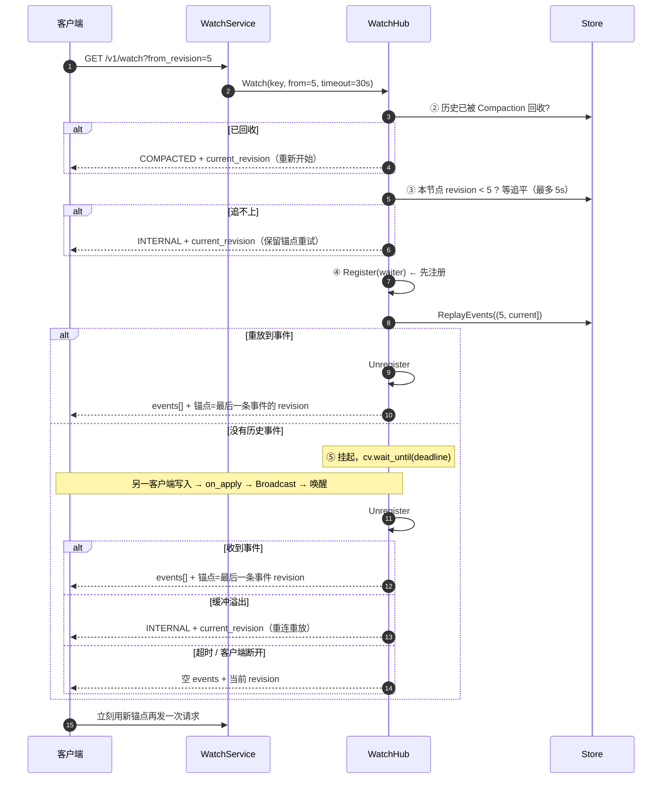
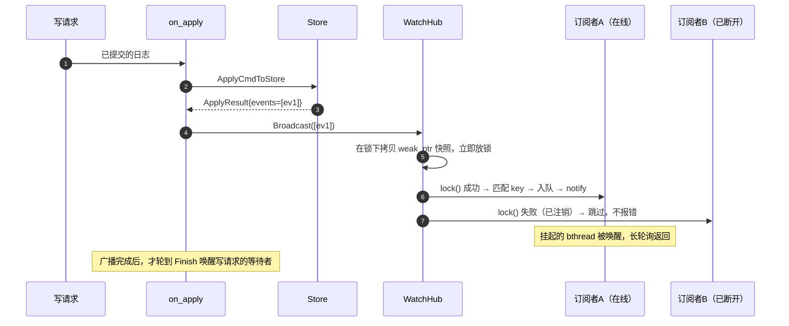

# 05 · Watch 实时推送

> 前两册解决了"写和读都一致"。本册解决最后一个核心能力：**配置变了，怎么让订阅者立刻知道**。
>
> 这块的主要难点不在"怎么推"，而在**边界条件**：断线重连之后会不会漏事件、重复事件？订阅者处理太慢会不会把写路径拖垮？节点刚刚重启、还在追赶日志时接到订阅请求，会发生什么？
>
> 主要文件：[src/watch/watch_hub.h](../../src/watch/watch_hub.h)、[src/watch/watch_hub.cpp](../../src/watch/watch_hub.cpp)、[src/server/watch_service_impl.cpp](../../src/server/watch_service_impl.cpp)。

---

## 速览

1. **Watch 的本质是"客户端订阅某个 key（或全部），一变就收到通知"**。配置中心如果没有它，配置的"实时生效"就要靠各服务定时轮询，延迟和开销都不可接受。
2. **本项目用 HTTP 长轮询实现**：请求发出去后服务端挂起不返回，有事件立即推、超时返回空，客户端收到响应后**立刻再发一次**。不是长连接、不是服务端主动推送。
3. **历史事件不靠内存缓存，靠 MVCC 重放**。客户端带上 `from_revision` 表示"我上次看到这里"，服务端从存储里扫出之后的事件——这样进程重启也不会丢断点。
4. **断点续传的锚点是"最后一条事件的 revision"，不是"当前存储的 revision"**。这是最容易被忽略、也最容易出错的一个细节。
5. **注册必须早于重放**。否则在"重放完毕"和"注册完成"之间到达的新事件会被漏掉——一个几微秒的窗口，但真实存在。
6. **慢消费者会被主动断开，而不是被容忍**。每个订阅者的缓冲上限是 1024 条，溢出就清空并返回当前锚点让它重连——因为广播是在写路径上同步执行的，**绝不能让一个慢订阅者拖住写**。
7. **代价与边界**：长轮询的实时性和吞吐都不如 gRPC 流（这是明确承认的工程权衡，etcd v2 也是长轮询、v3 才改流式）；每个订阅请求占用一个 bthread；广播的遍历是线性的，订阅者规模大时会成为瓶颈。

---

## 一、概念铺垫：让服务端把变化告诉客户端

客户端想知道"配置变了没有"，有三种实现方式：

| 方式 | 机制 | 实时性 | 开销 |
|---|---|---|---|
| **短轮询** | 客户端每隔 N 秒问一次"变了吗" | 差（最坏延迟 N 秒） | 大量空请求 |
| **长轮询**（本项目） | 客户端发请求，服务端**挂起**不返回，变了才返回、或超时返回空 | 好（事件到达即返回） | 每次连接占一个等待中的线程 |
| **长连接 / 流**（gRPC stream、WebSocket） | 建立一条持续连接，服务端主动推 | 最好 | 需要维护连接生命周期、心跳、重连 |

**长轮询的本质**：用一个"故意不返回"的 HTTP 请求，模拟出"服务端可以主动说话"的效果。它在两者之间取了个折中——不需要维护长连接的状态，又能做到近实时。

---

## 二、背景与目标

### S · 问题：为什么配置中心必须有推送

如果只有"读写"两个能力，配置变更的传播就只能靠使用方自己定时轮询。这带来两个问题：

- **延迟**：轮询间隔内发生的变更，最坏要等一整个周期才生效。对于"紧急开关"这类场景不可接受。
- **浪费**：绝大多数轮询都是"没变化"，白白消耗两端的资源。

所以"配置中心"这一类系统，Watch 是和读写并列的第三个核心能力。

### T · 目标

- **有序**：客户端收到的事件顺序，必须与它们实际发生的顺序一致。
- **不丢**：客户端短暂断开后重连，不能漏掉断开期间的事件。
- **不重**：重连后不应该重复收到已经处理过的事件。
- **不拖累写路径**：订阅者的处理速度不能影响写入。
- **可续传**：断点应该由客户端持有（一个 revision 号），而不是服务端的会话状态——这样客户端可以换节点重连。

**明确不做**：不做 gRPC 流式推送（理由见下一节）；不做服务端持久化的"投递保证"（不保证每条事件一定被某个客户端消费到，只保证客户端能自己追上来）；不做按正则/前缀的高级过滤（只支持精确 key 或"全部"）。

---

## 三、Watch 是怎么实现的

### 3.1 为什么选长轮询，而不是 gRPC 流

这个取舍值得单独讲，因为它是被明确承认的工程权衡，不是"没想到"。

| 维度 | HTTP 长轮询（本项目） | gRPC 流 / WebSocket |
|---|---|---|
| 实现复杂度 | 低：一次普通 HTTP 请求，服务端挂起即可 | 高：要维护连接状态、心跳、断线重连语义 |
| 连接成本 | 每次请求即用即走，无常驻连接 | 长连接常驻，服务端要为每个订阅者保存会话 |
| 可验证性 | **curl 就能演示**（这也是选择它的理由之一） | 需要专门的客户端 |
| 实时性 | 毫秒级（事件到达时挂起的请求立即返回） | 更优 |
| 大规模订阅 | 订阅者多时，挂起的请求会占用大量等待资源 | 更适合大规模 |

**结论**：配置变更本身是**低频事件**，而这个项目需要"可演示、可 curl 验证、实现清晰"。在这个前提下长轮询是合理的选择。etcd v2 正是长轮询、v3 才上 gRPC 流——这条演进路线本身也说明长轮询是一个合理的起点。

> **这个取舍值得明确记录**：换来的是实现简单和可验证，付出的是大规模订阅场景下的实时性与资源效率。

### 3.2 事件从哪来：WatchHub 的位置

`WatchHub` 是每个进程内的一个对象，它的定位是"**解耦事件的产生与消费**"（[watch_hub.h:40-51](../../src/watch/watch_hub.h#L40-L51)）：

```text
产生侧（写路径）：
    on_apply / LocalNode::Apply  →  ApplyCmdToStore 返回 events  →  hub.Broadcast(events)

消费侧（读路径）：
    一个 HTTP 长轮询请求  →  hub.Watch(...)  →  阻塞等待 / 重放历史  →  返回事件
```

**两个关键性质**：

1. **事件的唯一来源是写路径**。不存在"后台线程定期扫描变更"这种事——每次写成功，`ApplyCmdToStore` 顺手返回它产生的事件（第 03 册 3.3）。
2. **每个节点都有自己的一套**。因为 `on_apply` 在每个副本上都执行、都广播，所以每个节点都能独立服务长轮询——**Watch 可以挂在集群里的任意节点，不需要找 Leader**。

### 3.3 一次长轮询的五个阶段

`WatchHub::Watch` 是核心函数（[watch_hub.cpp:93-215](../../src/watch/watch_hub.cpp#L93-L215)）。它比一般的"挂起等待"要复杂，因为要处理多种退出路径：

```text
① 归一化：from_revision < 0 → 0；timeout_ms 钳制到 [1, 60000]
        ↓
② 快速判定：请求的历史已被 Compaction 回收？→ 直接返回 COMPACTED + 当前 revision
        ↓
③ 追平等待：本节点 revision 落后于 from_revision？→ 最多等 5 秒追平
        ↓（追不上 → INTERNAL + 当前 revision，让客户端保留锚点重试）
④ 先注册，后重放：Register(waiter) → ReplayEvents((from, current])
        ↓（重放到事件 → 立即返回，锚点 = 最后一条事件的 revision）
⑤ 长轮询等待：挂起直到 有事件 / 超时 / 客户端断开 / 缓冲溢出
```

**退出路径，以及各自返回什么**：

| 退出原因 | 返回 | 客户端应该做什么 |
|---|---|---|
| 有事件（重放或等待期间收到） | `events[]` + 锚点 | 用锚点立刻发起下一次请求 |
| 超时（默认 30 秒） | 空 `events` + 当前 revision | 同样立刻重连，保持订阅不中断 |
| 历史被回收 | `COMPACTED` + 当前 revision | 从新锚点重新开始（已经追不上旧历史了） |
| 缓冲溢出（慢消费者） | `INTERNAL` + 当前 revision | 用返回的 revision 重连重放 |
| **本地未追平**（落后节点） | `INTERNAL` + **本节点当前 revision** | **忽略这个值，保留自己的锚点稍后重试** |
| 客户端断开（追平等待期间） | 空结果，`current_revision` 保持初值 0 | 客户端已走，返回值无意义 |
| 客户端断开（长轮询等待期间） | 同"超时" | 同上 |

**两点需要注意**：

1. **除"追平期间断开"外，其余路径都会填 `current_revision`**，所以客户端的循环不会被卡死。
2. 但**"本地未追平"返回的那个值不能直接用**——它可能小于客户端请求的锚点（详见 3.7 的说明）。

### 3.4 断点续传：锚点为什么不能取"当前 revision"

这是整个 Watch 设计里最容易出错的一个细节。

客户端每次请求都带一个 `from_revision`，服务端返回一个 `current_revision` 作为下一次的起点。问题在于：**这个返回的锚点该取什么值？**

一个看起来很自然的答案是"取 store 当前的 revision"。**它是错的**，原因是：

```text
假设当前 store revision = 10，客户端 from_revision = 5

服务端重放 (5, 10] → 得到事件 6,7,8,9,10
                     ↑ 就在这一段代码执行的同时…
                     另一次写发生了 → revision 变成 11

如果锚点返回 "store 当前 revision" = 11
   → 客户端下次从 11 开始
   → 但事件 11 从来没被发出去过  ← 丢了！
```

**正确做法是锚点取"最后一条实际返回的事件的 revision"**（[watch_hub.cpp:157](../../src/watch/watch_hub.cpp#L157)、[:209](../../src/watch/watch_hub.cpp#L209)）：返回 6~10 这五条事件，锚点就是 10。下次从 10 开始，11 会被正常重放。

> 只有一种情况例外：**没有事件时（超时返回）**，锚点取当前 revision。因为什么都没发出去，从当前继续就是安全的。

### 3.5 先注册、后重放：关闭一个几微秒的窗口

阶段 ④ 里，注册和重放的顺序是刻意的（[watch_hub.cpp:139-144](../../src/watch/watch_hub.cpp#L139-L144) 有注释说明）：

```text
【错误的顺序】先重放，后注册
    重放 (from, 10] 完成 ────┐
                             │  ← 这个缝隙里发生了一次写（revision=11）
    注册 waiter ─────────────┘
    → 这次写的广播没有任何订阅者，事件 11 永久丢失

【正确的顺序】先注册，后重放
    注册 waiter ─────────────┐
                             │  ← 此刻到达的写会被广播进缓冲
    重放 (from, 10] 完成 ────┘
    → 注册前已提交的走重放、注册后到达的走广播
    → 两个集合不相交，并集完备  ✔
```

代价是可能收到**重复**：如果一次写恰好在"注册之后、重放之前"完成，它既会被广播进缓冲，又可能落在重放区间里。这个重复由客户端的锚点续传消化（客户端按 revision 去重是天然简单的），**而漏掉一个事件是无法补救的**——两害相权取轻。

> `from_revision = 0` 是一个特殊约定：表示"**从现在开始看**"，不重放任何历史（[watch_hub.cpp:141](../../src/watch/watch_hub.cpp#L141)）。项目文档称这与 etcd 的语义一致（etcd 本身的行为未在本仓库内验证）。

### 3.6 背压：为什么宁可断开慢消费者

`Broadcast` 是在写路径上**同步执行**的——它就在 `on_apply` 里（第 03 册 3.3）。这意味着**广播的速度会直接影响写吞吐**。

所以这里有一条铁律：**绝不让任何订阅者阻塞广播**。

具体做法是：每个订阅者有一个事件缓冲队列（上限 1024 条）。广播时如果发现某个订阅者的队列已满，就（[watch_hub.cpp:64-70](../../src/watch/watch_hub.cpp#L64-L70)）：

1. 给它打上 `overflow` 标记；
2. **清空它的缓冲**（避免返回不完整的事件序列）；
3. 跳过它，继续广播给下一个。

被标记的订阅者随后会收到 `INTERNAL` + 当前 revision，由客户端重连重放。

**清空而不是保留**是一个有意的选择：一个已经溢出的订阅者，它错过的事件数量是未知的（不只是溢出的那一条）。与其返回一段有洞的事件流，不如让它从当前 revision 重新开始——**明确地丢一次，好过悄悄地丢几条**。

### 3.7 追平等待：混沌测试抓出来的缺陷

阶段 ③ 那段"最多等 5 秒追平"的代码（[watch_hub.cpp:115-137](../../src/watch/watch_hub.cpp#L115-L137)）不是一开始就有的。它是一个真实缺陷的修复。

**现象**：混沌测试的校验器报出 `WATCH_ORDER_VIOLATION`——同一条事件被返回了两次，甚至出现"返回的 revision 比请求的还小"这种状态回退。

**根因**：一个节点（node1）被 kill 后重启，它的本地 revision 落后很多。在它追赶日志的过程中，会**重新应用（re-apply）历史日志**——而每次应用都会广播事件。此时如果有一个客户端带着 `from_revision=57` 连到这个还在追赶的节点，它就会收到节点本地重放出来的 revision 10~57 的旧事件。

**修复**：在进入重放/等待之前，**先等本节点追平到请求的 `from_revision`**（最多 5 秒）。追不平就返回 `INTERNAL`，让客户端稍后重试。

> **⚠️ 一处注释与实现不一致**（值得单独记下）：这段代码的注释写着"绝不返回低于 `from_revision` 的 `current_revision`"，但**实现并没有做到**——超时分支回填的正是本节点当前的 revision（[watch_hub.cpp:132](../../src/watch/watch_hub.cpp#L132)），而能进入这个分支的前提就是"本地 revision 落后于 `from_revision`"。所以客户端**必须忽略这个返回值、保留自己的锚点**，否则会倒退。这里**以代码为准，不以注释为准**。

> **这个缺陷的价值在于它是怎么被发现的**：它不是读代码读出来的，而是**混沌测试（自动化故障注入）跑出来的**。这印证了一件事：故障下的时序问题，光靠静态阅读很难发现。

### 3.8 订阅者的生命周期：`weak_ptr` 契约

`WatchHub` 的订阅表里存的是 `weak_ptr<Waiter>`，强引用在**阻塞在长轮询里的那个 bthread** 手上（[watch_hub.h:18-23](../../src/watch/watch_hub.h#L18-L23)）。

这个约定的作用是防悬垂，同时让广播方**不需要关心订阅者的死活**：

- 广播时先把 `weak_ptr` 列表**拷贝一份快照**、立刻放锁（[watch_hub.cpp:49-53](../../src/watch/watch_hub.cpp#L49-L53)），然后逐个 `lock()`——锁失败的直接跳过；
- 长轮询返回前，**先注销、再释放强引用**（[:193-195](../../src/watch/watch_hub.cpp#L193-L195)）。这样即使广播方手里还拿着旧快照，`lock()` 也只会失败跳过，不会访问已销毁的对象。

> 顺带一提：`Unregister` 目前是**线性扫描**删除（[watch_hub.cpp:34-40](../../src/watch/watch_hub.cpp#L34-L40)），源码注释里写明了这是基于"配置中心场景下活跃订阅者数量级小"的判断，并留了改进方向（per-key 索引或引用计数）。这是一处**有意识的、有注释的简化**，不是疏漏。

---

## 四、核心链路

### 4.1 一次长轮询的完整生命周期



### 4.2 一次写入如何变成推送



**这张图补上了 00 册没展开的一层**：广播方对订阅者的存活是"尽力而为"的——断开就跳过，绝不因此阻塞或报错。

---

## 五、关键接口与字段

### 5.1 核心结构与字段

| 字段 / 接口 | 位置 | 语义 | 设计要点 |
|---|---|---|---|
| `WatchRequest.from_revision` | [proto:89](../../proto/configraft.proto#L89) | 从该 revision **之后**开始 | 缺省 0 = 只看新事件、不重放历史 |
| `WatchRequest.timeout_ms` | [proto:90](../../proto/configraft.proto#L90) | 长轮询最长等待 | 服务端钳制到 [1, 60000]。**默认值 30000 只在 HTTP 入口注入**（[watch_service_impl.cpp:59](../../src/server/watch_service_impl.cpp#L59)）；gRPC 调用若不显式设置，proto3 的零值经钳制会落到 **1ms** 的下限 |
| `WatchResponse.current_revision` | [proto:104](../../proto/configraft.proto#L104) | **下一次请求的 from_revision** | 有事件时 = 最后一条事件的 revision；无事件时 = store 当前 revision |
| `WatchEvent.type` | [proto:98](../../proto/configraft.proto#L98) | `"PUT"` / `"DELETE"` | 由记录是否为 tombstone 决定（[store_ops.cpp:17](../../src/store/store_ops.cpp#L17)） |
| `Waiter.key_filter` | [watch_hub.h:27](../../src/watch/watch_hub.h#L27) | 空串 = 监听全部 | 只支持精确匹配，不支持前缀/正则 |
| `Waiter.events` | [watch_hub.h:28](../../src/watch/watch_hub.h#L28) | 事件缓冲（`std::deque`） | 上限即背压阈值 |
| `Waiter.overflow` | [watch_hub.h:29](../../src/watch/watch_hub.h#L29) | 溢出标记 | 置位时会清空缓冲并断开 |
| `kMaxWatchEvents = 1024` | [watch_hub.h:38](../../src/watch/watch_hub.h#L38) | 单订阅者缓冲上限 | 溢出即断开，保护写路径 |
| `waiters_` | [watch_hub.h:81](../../src/watch/watch_hub.h#L81) | 订阅表（`vector<weak_ptr>`） | 弱引用，强引用在长轮询线程 |
| 追平上限 `5000000us` | [watch_hub.cpp:121](../../src/watch/watch_hub.cpp#L121) | 落后节点等待上限 | 5 秒；受服务器截止时间收紧 |

### 5.2 三条不变量（值得单独记住）

1. **"本地未追平"时返回的 `current_revision` 可能小于请求的 `from_revision`**。客户端遇到这种 `INTERNAL` 时，**应当保留自己的锚点稍后重试，不要拿返回值去覆盖**。（源码注释声称"绝不返回低于 from_revision 的值"，但实现上并未兑现——见 3.7 的说明。）
2. **锁序恒为 `mu_` → `waiter->mu`**（[watch_hub.cpp:48](../../src/watch/watch_hub.cpp#L48) 注释）。任何反向加锁的路径都会与等待循环形成 ABBA 死锁。
3. **先改状态、后 notify**（[watch_hub.cpp:73](../../src/watch/watch_hub.cpp#L73)）。等待侧用的是带谓词的循环（`while (events.empty() && !overflow)`），所以即使发生伪唤醒也会重新检查条件。

---

## 六、结果：验证与代价

### 6.1 验证方式

| 验证点 | 手段 |
|---|---|
| 重放、过滤、续传、背压、COMPACTED 判定 | `watch_test`（15 个用例）——逻辑分支多，适合单测穷举 |
| 事件 revision 严格递增 | 混沌测试的 watch_verifier：持续长轮询续传，逐事件校验 revision 单调 |
| 落后节点追赶时的行为 | 混沌测试场景 D（重启节点）+ 那个"重放旧事件"缺陷的回归 |
| 订阅与写入的交互 | `http_test` 中的 watch 路由用例 |

### 6.2 代价

1. **实时性与吞吐不如流式推送**。这是长轮询的固有代价（3.1）。
2. **每个订阅请求占用一个等待中的 bthread**。虽然用的是会释放内核线程的 `bthread::ConditionVariable`，但订阅者数量大时，内存与调度成本仍然会累积。
3. **`Broadcast` 是 O(订阅者数) 的线性遍历**，且每次都拷贝一份 `weak_ptr` 快照。订阅规模大时这会成为写路径上的开销。
4. **`Unregister` 是线性扫描**，同样是基于"订阅者规模小"的假设。
5. **可能收到重复事件**。这是"先注册后重放"换来的（3.5），由客户端按 revision 去重消化。

> 第 3、4、5 条都不是缺陷，是**在"配置中心订阅规模通常很小"这个前提下做出的取舍**。如果这个前提不成立，需要改的是这两处数据结构（per-key 索引 / 引用计数），源码注释里已经标出了方向。

---

## 七、通用知识

**推送机制**
- 轮询 / 长轮询 / 长连接三种方式的本质区别，是"谁承担了'没有变化'这件事的成本"——短轮询由客户端不断问、长轮询由服务端挂起、长连接由连接本身维持。
- 长轮询是"用一个故意不返回的请求模拟服务端主动推送"，适合低频事件 + 追求实现简单的场景。

**消息系统的通用问题**
- **断点续传的锚点必须是"已确认送达的位置"，不能是"生产者的当前位置"**——后者会跳过中间产生的消息。这条规律在消息队列、日志同步、变更订阅里都成立。
- **注册与重放的顺序决定会不会漏消息**。凡是"先订阅历史、再接续实时"的系统，都要处理这个缝隙；代价通常是可能重复，而重复可以靠幂等或去重消化，漏掉却无法补救。
- **背压必须"断开"而不是"等待"**。如果一个慢消费者能让生产者停下来，那它就成了整个系统的单点——这在同步广播的场景下尤其危险。

**并发与生命周期**
- 用 `weak_ptr` 让广播方"尝试投递、失败即跳过"，是把"订阅者的死活"从生产者的责任里摘出去的标准手法。
- 锁序必须全局一致。两个锁的获取顺序只要有一处反转，就会在高并发下形成 ABBA 死锁，而且极难复现。

**可测试性**
- 用 curl 就能验证的接口设计，会显著降低沟通和演示成本——这是一个常被低估的工程收益。

---

## 延伸阅读

| 主题 | 仓库内位置 |
|---|---|
| Watch 的设计文档 | [docs/watch.md](../watch.md) |
| 订阅中心实现 | [src/watch/watch_hub.h](../../src/watch/watch_hub.h)、[watch_hub.cpp](../../src/watch/watch_hub.cpp) |
| HTTP 长轮询入口 | [src/server/watch_service_impl.cpp](../../src/server/watch_service_impl.cpp) |
| 事件重放的存储实现 | [src/store/store.cpp](../../src/store/store.cpp)（`ReplayEvents`） |
| 混沌测试脚本（含 watch 校验器） | [scripts/chaos_test.sh](../../scripts/chaos_test.sh) |

---

**上一篇**：[04-线性一致读.md](04-线性一致读.md) · **下一篇**：[06-存储层.md](06-存储层.md)——事件是靠扫描存储里的历史重放出来的，那么这份存储到底是怎么组织的、怎么回收的？
