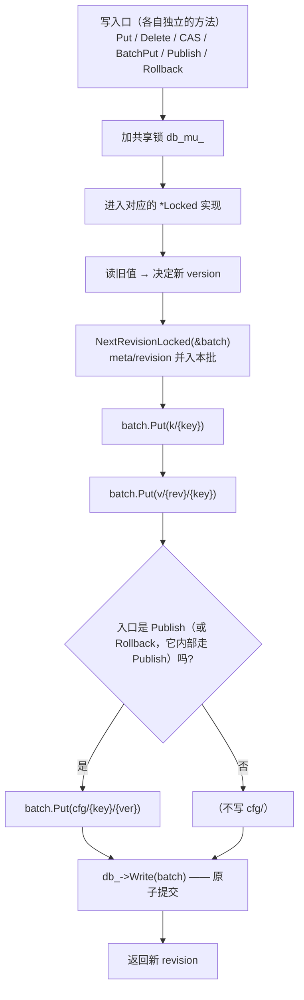
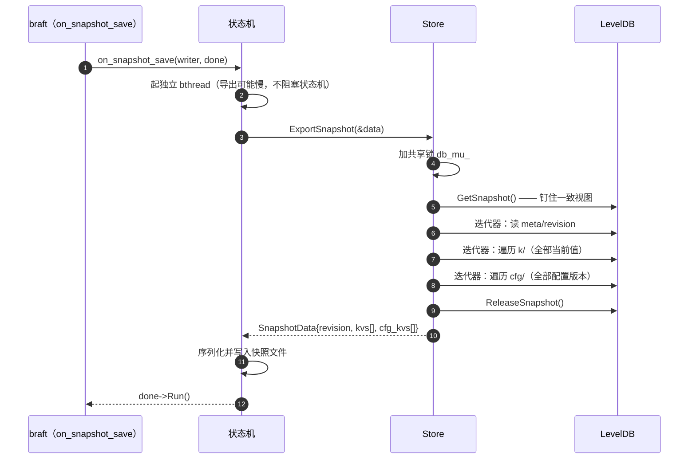

# 06 · 存储层

> 前五册反复提到"写进 LevelDB""从 `v/` 前缀重放""打一个快照"。本册把这些收拢起来，讲清楚这一层到底做了什么。
>
> 一个必须先说明的事实：**本项目没有自己实现存储引擎，也没有改造 LevelDB**。LevelDB 是被当作一个"能按 key 排序的裸 KV"来用的。所有 MVCC 语义、版本索引、回收策略，都是在这一层之上自己搭出来的。
>
> 主要文件：[src/store/store.h](../../src/store/store.h)、[src/store/store.cpp](../../src/store/store.cpp)、[src/common/storekey.h](../../src/common/storekey.h)。

---

## 速览

1. **LevelDB 是零改造使用的**——没有自定义比较器、没有合并算子。项目只是把它当一个"key 有序的 KV 存储"来用。
2. **MVCC 是自研的**：靠四个 key 前缀（`k/` `v/` `cfg/` `meta/`）+ 一个全局递增的 `revision`，在裸 KV 之上搭出了多版本语义。这部分是第 01 册的内容，本册讲它怎么被读写。
3. **每一次写都是一个 `WriteBatch`**：业务数据、历史版本、`meta/revision` 打包在一起原子提交。**`Publish` 与 `Rollback` 还会多写一个配置版本索引**（`Rollback` 内部就是"读出目标版本、再重新发布"），而 `Put` / `Delete` / `CAS` / `BatchPut` 不写 `cfg/`。这保证了不可能出现"时钟推进了但数据没落盘"的中间状态。
4. **并发模型是"写串行、读并行"**。写之所以不需要互斥，是因为 Raft 已经保证了串行应用；读之所以安全，是因为 LevelDB 的读本身线程安全。
5. **但"读并行"这个假设被一条路径打破了**：安装快照时要重建整个数据库（`db_.reset()` + 删目录 + 重开）。这条路径必须独占，否则并发读会访问到已释放的数据库句柄——这是一个真实发生过的崩溃，修复方式是一把 `shared_mutex`。
6. **本项目的 "Compaction" 与 LevelDB 的 "Compaction" 不是一回事**。前者是"回收 MVCC 历史版本"，后者是存储引擎内部的 SSTable 合并。项目只做前者，后者交给 LevelDB 自己。
7. **代价与边界**：同一份数据要写多个前缀（写放大）；历史回收是**全量扫描 + 逻辑删除**（另一次写放大）；回收水位是**全局的**，会导致历史较浅的 key 被保守地判定为"已回收"。

---

## 一、概念铺垫：LSM-Tree、LevelDB 与 MVCC

| 词 | 定义 | 在本项目里 |
|---|---|---|
| **LSM-Tree** | 一类存储结构：写入先进内存表、再顺序刷到磁盘，用"顺序写"替代"随机写"换取高写吞吐 | LevelDB 就是 LSM-Tree 实现 |
| **SSTable** | LSM-Tree 落盘后的不可变数据文件，按 key 有序 | LevelDB 内部管理，项目不接触 |
| **Compaction** | 把多个 SSTable 合并、丢弃被覆盖或删除的数据 | **LevelDB 内部的机制**，项目不控制 |
| **MVCC** | 多版本并发控制：写不覆盖旧值，而是产生新版本；读按版本取 | **项目自己实现的**，见下 |
| **快照（snapshot）** | 某一时刻数据的一致视图，不受此后的写入影响 | 两处用到：LevelDB 的 `GetSnapshot`、项目的 `SnapshotData` |
| **逻辑删除 / 墓碑** | 删除时不真删，而是写一个"已删除"标记 | 项目的 `deleted` 字段（第 01 册） |

> **最容易混淆的一对**：本项目里的 "Compaction"（`Store::Compaction`）指的是**回收 MVCC 历史版本**；而 LevelDB 内部也有一个 Compaction（合并 SSTable）。两者同名但完全不同——前者是业务语义，后者是存储引擎的物理整理。本册只用前者。

**为什么用 LevelDB 而不是 RocksDB**：两个直接原因。一是**串行写**——本项目的写全部由 Raft 的 `on_apply` 串行驱动，不需要存储引擎做复杂的并发写优化；二是**代码量小、便于从源码层面读懂**。RocksDB 功能更全（列族、更丰富的 compaction 策略），但在这个场景下用不到。

---

## 二、背景与目标

### S · 问题：有了 LevelDB，还缺什么

LevelDB 提供的是最基础的能力：`Put(key, value)` / `Get(key)` / 按键范围迭代 / 原子批量写。

一个配置中心需要的是这些：

- **历史版本**：回滚要能读到某个 key 以前的值 → LevelDB 只会覆盖
- **变更流水**：Watch 要能重放"某时刻之后的所有变更" → LevelDB 没有时间维度
- **版本索引**：要能列出某个 key 的所有版本 → LevelDB 没有二级索引
- **全局顺序**：所有变更要能排成一个全序 → LevelDB 没有全局时钟
- **历史回收**：历史不能无限增长 → LevelDB 不会主动清理

**这些全都要自己搭。**

### T · 目标

- 在裸 KV 之上提供 MVCC 语义，且**不改造 LevelDB**（保持对上游的可升级性）。
- 写入原子：一次逻辑写要么全生效要么全不生效。
- 读并发：读与读之间完全并行，不受写影响。
- 历史可回收，且回收不能破坏 Watch 的"不丢不重"。
- 支持快照导出与加载（braft 的成员变更、节点追赶依赖它）。

**明确不做**：不做跨机的数据分片（单机容量上限是已知边界）；不做事务（`BatchPut` 是一次原子批量写，不是通用事务）；不自定义 LevelDB 的比较器（意味着排序规则完全依赖 key 的字节序，所以才有第 01 册那套定长十六进制编码）。

---

## 三、存储层是怎么实现的

### 3.1 MVCC 是怎么落到前缀上的

这是第 01 册 4 节的存储视角版本。回顾三个前缀的分工：

| 前缀 | 承担什么查询 |
|---|---|
| `k/{key}` | 读当前值（一次 `Get`） |
| `v/{revision:16hex}/{key}` | 按 revision 顺序扫描（Watch 重放） |
| `cfg/{key}/{version:16hex}` | 按 key 前缀扫描（配置历史） |

**一次 `Publish` 会在同一个 `WriteBatch` 里写四样东西**（[store.cpp:287-306](../../src/store/store.cpp#L287-L306)）：

```cpp
leveldb::WriteBatch batch;
const int64_t rev = NextRevisionLocked(&batch);   // ① meta/revision ← rev（并入同批）
batch.Put(MainKey(key), serialized);              // ② k/{key}
batch.Put(VersionKey(rev, key), serialized);      // ③ v/{rev}/{key}
batch.Put(ConfigKey(key, new_kv.version()), ...); // ④ cfg/{key}/{ver}
db_->Write(leveldb::WriteOptions(), &batch);      // 一次原子提交
```

**为什么 `NextRevisionLocked` 要把新值 `Put` 进调用方的 batch，而不是自己单独写一次？**

因为如果分开写，就存在一个窗口：`meta/revision` 已经推进到 11，但业务数据还没落盘。此时如果进程崩溃，重启后系统会认为"已经写到第 11 条"，而第 11 条的数据并不存在——不同副本之间就此发生**永久性发散**。把它们放进同一个批次，LevelDB 保证"要么都写、要么都不写"。

> 这个坑是代码审查时发现并修复的（原始实现就是这样分开写的）。修复的要点是**改变函数的签名**——`NextRevisionLocked(WriteBatch*)` 接收批次作为参数，从类型上就没法再"自己写一次"了。

### 3.2 一个容易被忽略的细节：批量写不能逐条读时钟

`BatchPutLocked` 处理一批写（[store.cpp:232-275](../../src/store/store.cpp#L232-L275)）。它分配 revision 的方式与单条写不同：**用本地递增，而不是每写一条就去读一次 `meta/revision`**。

原因是显而易见的：这批数据**还没有提交**，读数据库是读不到自己刚写进批次里的内容的。所以只能用 `当前 revision + i` 的方式在内存里推算。

这是"批次语义"的一个典型陷阱：**在同一个事务/批次内部，你读不到自己未提交的写**。

### 3.3 并发模型：写串行、读并行，以及一条例外

`Store` 的注释把约定写得很清楚（[store.h:19-31](../../src/store/store.h#L19-L31)）：

> 源码注释的要点是：写路径仅在状态机 `on_apply` 中串行调用（单 Leader + 串行应用），因此写操作之间无需互斥；读路径是并发的。

**写为什么不需要锁**：因为调用方已经保证串行了——集群模式下是 braft 的 `on_apply`，单机模式下是 `LocalNode` 自己加的那把 `std::mutex`。存储层不必重复加锁。

> 顺带一提：单机模式的那把锁是**后补的**。原本假设"写一定串行"，但单机模式下 brpc 的多个 worker 会并发调用 `Apply`，导致 `revision` 的读-改-写竞态、产生重复值。这是审查发现的缺陷之一。

**但有一条路径打破了"写串行"的前提**：`LoadSnapshot`（安装快照）。它要：

1. `db_.reset()` —— 关闭当前数据库
2. 删除整个目录
3. 重新打开
4. 批量写入快照数据

**这四步期间，任何并发的读或 Compaction 都会访问到一个已经被重置的 `db_` 句柄——use-after-free。**

### 3.4 修复：一把 `shared_mutex` 和一条命名约定

修复方案是给 `db_` 的生命周期加一把读写锁（[store.h:138](../../src/store/store.h#L138)）：

| 操作 | 持锁方式 |
|---|---|
| 读（`Get` / `GetConfig` / `ReplayEvents` / …） | **共享锁** |
| 写（`Put` / `Publish` / …） | **共享锁**（写彼此串行由上层保证，锁只用来挡住 `LoadSnapshot`） |
| Compaction、快照导出 | **共享锁** |
| **`LoadSnapshot`** | **独占锁** |

于是"读写互不阻塞、重建数据库时独占"这个模型就成立了。

**但 `std::shared_mutex` 不可重入**——如果 `Public(…)` 加了共享锁，然后内部又调用另一个也加共享锁的 `Public(…)`，就是未定义行为。项目里确实存在这种调用链：

- `Rollback` → 内部要调 `GetConfig` 和 `Publish`
- `GetConfig` → 内部要调 `Get`
- `Compaction` → 内部要调 `CompactRev`

所以引入了一条命名约定：**私有方法一律以 `Locked` 结尾，表示"调用方已持锁，内部不得再加锁"**（[store.h:108-135](../../src/store/store.h#L108-L135)）。公开方法只负责加一次锁，然后转调 `*Locked` 版本。

> 这条约定是"用命名承载契约"的例子。它没有编译期强制（叫错了也不会报错），但配合注释，读代码时能立刻判断出"这个方法能不能直接调"。

### 3.5 Compaction：回收历史，以及一个全局水位线

后台线程每 60 秒跑一次 Compaction，每个 key 只保留最近 10 个版本（[server.cpp:43-44](../../src/server/server.cpp#L43-L44)）。实现是"**全量扫描 + 逻辑删除**"（[store.cpp:414-471](../../src/store/store.cpp#L414-L471)）：

```text
① 遍历整个 v/ 前缀，把记录按 key 分组，收集每条的 (revision, version)
② 对每个 key，超出的部分（记录数 - keep_versions）逐条：
     batch.Delete(v/{rev}/{key})
     batch.Delete(cfg/{key}/{ver})
     记录其中最大的 revision
③ 如果删了东西：把 meta/compact_rev 更新为「历史累计最大被删 revision」，与删除同批提交
```

**`meta/compact_rev` 是干什么的？** 它是 Watch 断点续传的**安全边界**：客户端说"我从 revision 5 开始"，服务端查一下 `compact_rev`，如果它大于 5，说明 revision 5 之后的某些历史已经被删了——重放会断档，只能返回 `COMPACTED`。

**为什么把 `compact_rev` 的更新与删除放在同一个批里？** 注释写得很清楚（[store.cpp:460-462](../../src/store/store.cpp#L460-L462)）：读者要么看到"记录已删 + 水位已更新"，要么两个都没看到。杜绝一种危险中间态——记录删了但水位没更新，此时 Watch 会以为历史完整，重放出一个有洞的事件流。

### 3.6 快照：导出与重建

braft 需要状态机支持"打快照"和"装快照"——新节点加入时通过快照追平，比从头重放日志快得多。

**导出**（`ExportSnapshot`，[store.cpp:598-633](../../src/store/store.cpp#L598-L633)）：

```cpp
leveldb::ReadOptions ro;
ro.snapshot = db_->GetSnapshot();        // ← 关键：钉住一个一致视图
// 在同一个 snapshot 下依次读：meta/revision、所有 k/、所有 cfg/
db_->ReleaseSnapshot(ro.snapshot);
```

**为什么必须用同一个 snapshot？** 因为如果"读 revision"和"读数据"是两次独立的操作，中间发生一次写，导出的快照就会出现"数据是新的、revision 是旧的"这种不一致——不同节点装了这个快照后，revision 编号会发散。

**加载**（`LoadSnapshot`，[store.cpp:635-679](../../src/store/store.cpp#L635-L679)）：独占锁 → 重置 DB → 删目录 → 重开 → 批量写入主索引 + 历史 + 配置索引 + revision。

加载时有一个特殊处理：**把 `compact_rev` 一并重置为快照的 revision**（[store.cpp:665-669](../../src/store/store.cpp#L665-L669)）。理由写在注释里：快照只保留主索引，历史版本是由后续日志重建的。所以任何"从快照 revision 之前续传"的请求，历史都是不完整的——必须报 `COMPACTED`，不能假装历史还在。

### 3.7 一次读重放的顺序不变量

`ReplayEventsLocked` 里有一个很讲究的细节（[store.cpp:542-549](../../src/store/store.cpp#L542-L549)）：

```text
先把迭代器建好（钉住 LevelDB 的版本集），再去读 compact_rev
```

这个顺序不能反。想象两种情况：

| 实际发生顺序 | 结果 |
|---|---|
| Compaction **先**提交（删除 + 水位在同一批） | 迭代器看不到被删记录，且读到新水位 → 报 `COMPACTED` ✔ |
| Compaction **后**提交 | 迭代器快照里还有记录，但可能读到新水位 → **保守地误报** `COMPACTED` ✔ |

两种情况下都不会出现"读到了不完整的重放却没有报错"。后者是一种**保守的误报**——牺牲一点点可用性，换来绝不返回有洞的数据。

---

## 四、核心链路

### 4.1 一次写在一个批次里做了什么



**关键在节点 E 与节点 K 的关系**：`meta/revision` 的推进（E）和业务数据（F/G/I）在同一个批次里，直到 K 才一次性落盘，所以中间**不存在"时钟已推进、数据还没写"的可见状态**。

### 4.2 快照导出的原子视图



**三次遍历用的是同一个 `snapshot`**，所以它们看到的是同一个时间点的数据。

---

## 五、关键接口与字段

### 5.1 `Store` 的公开接口分组

| 组 | 方法 | 说明 |
|---|---|---|
| 生命周期 | `Open` / `Close` | 打开与关闭 LevelDB |
| 写 | `Put` / `Delete` / `CompareAndSwap` / `BatchPut` | 基础写操作 |
| 配置语义 | `Publish` / `Rollback` / `GetConfig` / `GetHistory` | 版本化配置 |
| 读 | `Get` | 读当前值 |
| Watch | `ReplayEvents` / `CompactRev` | 事件重放与回收水位 |
| 元信息 | `CurrentRevision` | 当前全局时钟 |
| 维护 | `Compaction` | 回收历史版本 |
| 快照 | `ExportSnapshot` / `LoadSnapshot` | braft 快照支持 |

### 5.2 并发模型一览

| 成员 / 模式 | 说明 | 设计要点 |
|---|---|---|
| `db_mu_` | `mutable std::shared_mutex` | 保护的是**`db_` 的生命周期**，不是数据本身——数据的一致性由上层串行保证 |
| `*Locked` 私有方法 | 约定：调用方已持锁 | 规避 `shared_mutex` 不可重入；公开方法只加一次锁 |
| `db_` | `unique_ptr<leveldb::DB>` | 共享锁持有者可读；`LoadSnapshot` 独占才能重置它 |
| `data_dir_` | 字符串 | 快照重建时需要知道目录位置 |

### 5.3 三个必须记住的不变量

1. **`meta/revision` 永远与业务数据同批提交**。任何绕过批次单独写时钟的代码都是 bug。
2. **`meta/compact_rev` 与被删记录同批提交**。否则会出现"历史已删但水位没更新"的窗口。
3. **快照导出必须在一个 LevelDB snapshot 下完成**。分开读会导致跨节点 revision 编号发散。

---

## 六、结果：验证与代价

### 6.1 验证方式

| 验证点 | 手段 |
|---|---|
| MVCC 读写语义、revision/version 递增 | `store_test`（17 个用例，不依赖网络） |
| CAS 语义（成功 / 期望不匹配 / 失败不消耗 revision） | `store_test` + `raft_cas_test` |
| 重启后数据仍在 | `store_test` 的 `PersistenceAcrossReopen` |
| 层级 key 的历史隔离 | `http_test` 的前缀碰撞回归用例 |
| 快照装载后能按版本读配置 | 运行验证：`add_peer` 之后在 `node4` 上读 `GetConfig(v1..v5)` 全部可用 |
| 装快照与并发读不再崩溃 | 黑盒验证（这是修复 UAF 后的直接验证） |

### 6.2 代价

1. **写放大**。一份数据最多要写三个前缀（`k/` + `v/` + `cfg/`），再算上 Raft 日志本身，一次逻辑写落盘的字节数远超数据本身。
2. **Compaction 是"全量扫描 + 逻辑删除"**（[store.cpp:419-437](../../src/store/store.cpp#L419-L437)）。每次都要遍历整个 `v/` 前缀，而且删除只是写墓碑，真正的空间要等 LevelDB 自己的 compaction 才回收——**这是第二次写放大**。在历史数据量大时，这个循环本身会成为开销。
3. **`compact_rev` 是全局水位，不是 per-key**。这带来一个保守的副作用：如果某个 key 的历史很深、另一个 key 的历史很浅，回收后水位会取最大值，导致历史浅的那个 key 也被判定为"已回收"、Watch 续传被保守拒绝。这是**设计取舍而非缺陷**——per-key 水位需要额外的索引结构，代价更大。
4. **`LoadSnapshot` 是全量重建**：删目录、重开、全量写入。装载大快照时会长时间阻塞读写（独占锁），期间服务不可用。
5. **单机容量上限**。LevelDB 单机存储，没有分片——这是已知的能力边界。

---

## 七、通用知识

**存储引擎**
- LSM-Tree 用"顺序写 + 后台合并"换取高写吞吐，代价是读可能要查多层、空间回收有延迟。
- 存储引擎的 "Compaction"（合并数据文件）与业务层的"数据回收"是两个不同层次的概念，同名不同义。
- 在有序 KV 上做范围查询时，**key 的编码方式决定了查询效率**——把要范围扫描的字段放在 key 前面，就能用一次 Seek 完成。

**MVCC 的工程实现**
- MVCC 的核心是"用新版本代替覆盖"，代价是空间增长，所以必须配套回收机制。
- 回收会破坏"历史完整性"，因此需要一个**水位标记**告诉读者"从哪个点开始已经不可靠了"。
- 水位是全局还是 per-key，是一对明确的取舍：全局实现简单但会保守误报，per-key 精确但需要额外索引。

**原子性**
- 批量写（WriteBatch / 事务）的关键性质是"要么全生效要么全不生效"，因此**任何有依赖关系的写都必须放进同一个批次**——包括计数器的推进。
- 批次内部的写**读不到自己**，这是绝大多数存储引擎的共同行为，写批内逻辑时容易踩。

**并发安全**
- `shared_mutex` 保护的是"资源的生命周期"（对象什么时候被销毁/重建），而不只是"数据的读写"。判断该用共享锁还是独占锁，要看这段代码是否可能让其他持有者访问到失效的资源。
- 不可重入的锁要求调用方明确"谁负责加锁"，常见做法是引入命名约定（如 `*Locked` 后缀）把契约写进接口名。

---

## 延伸阅读

| 主题 | 仓库内位置 |
|---|---|
| 存储接口与线程安全约定 | [src/store/store.h](../../src/store/store.h) |
| 读写、Compaction、快照实现 | [src/store/store.cpp](../../src/store/store.cpp) |
| Key 编码 | [src/common/storekey.h](../../src/common/storekey.h) |
| LevelDB / LSM-Tree 学习笔记 | [docs/LevelDB.md](../LevelDB.md) |
| 安全审查报告（含存储层修复项） | [docs/安全审查报告.md](../安全审查报告.md) |
| 假死与 UAF 的完整发现过程 | 本套资料第 07 册 |

---

**上一篇**：[05-Watch实时推送.md](05-Watch实时推送.md) · **下一篇**：[07-可靠性与验证.md](07-可靠性与验证.md)——这些设计和取舍，在真实故障下站得住吗？踩过哪些坑？
